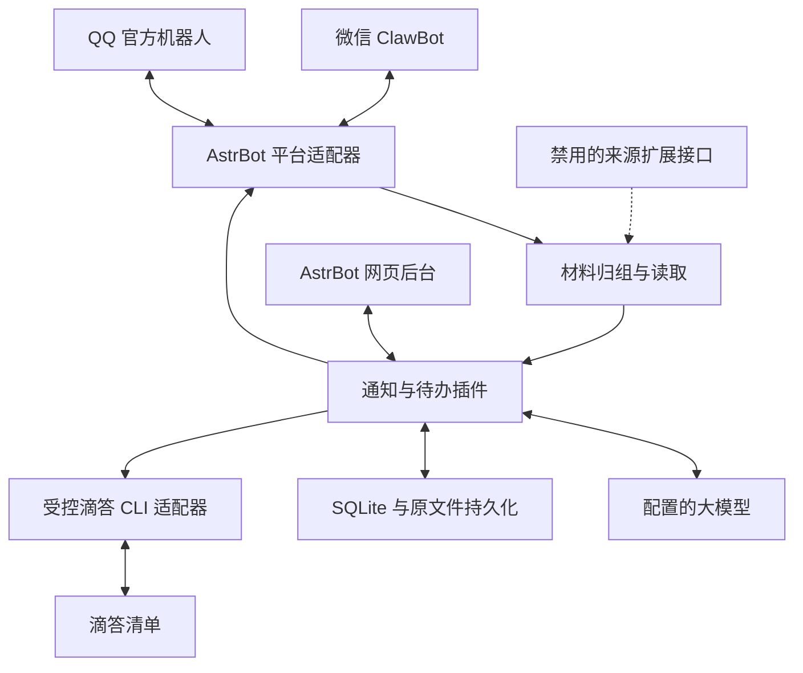
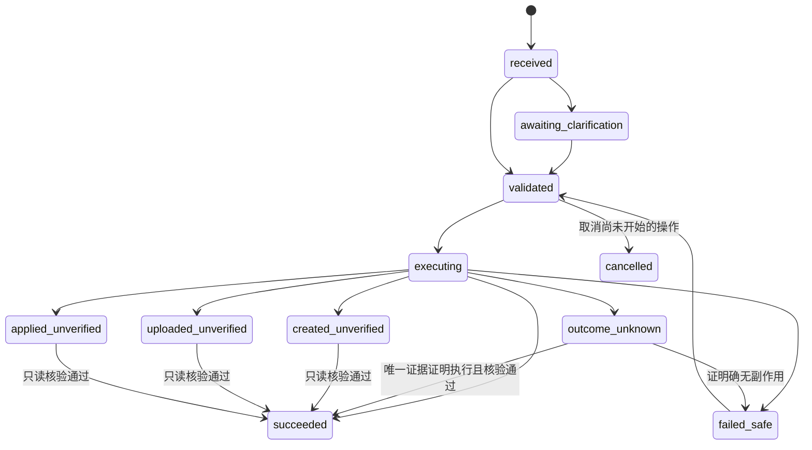
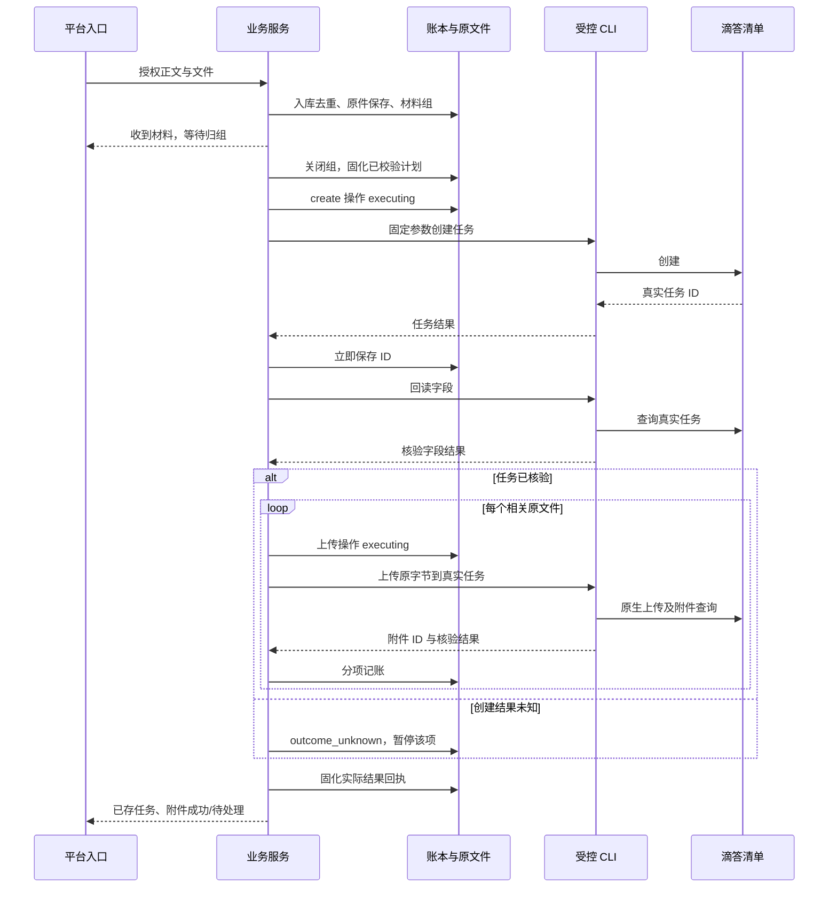

# 知办 · NotiDo：产品需求与技术规格

*From Notices to Action.*
**让通知成为行动。**

版本：1.4 ｜ 日期：2026 年 10 月 7 日 ｜ 交付对象：AI 开发代理与项目维护者

产品名为“知办”，仓库名为 `NotiDo`。本版基于已有 1.3 版审阅细化，保留原业务范围；修订动作版本与幂等、账号隔离、取件恢复、状态核查、队列边界、日期与读取预算。审阅结论见 [docs/PRD-REVIEW.md](docs/PRD-REVIEW.md)，新增技术验收 T15–T26；总验收为 83 项。本文记录的是需求及设计，当前仓库尚无可运行产品。

本文定义一个面向东北大学学生的通知处理助手。用户将老师、同学发来的通知及附件，通过微信官方 ClawBot 或 QQ 官方机器人发送；官网来源仅预留统一接入接口，首版不实现采集或监测。服务结合用户身份，提炼需要用户执行的事项及真实截止日期，通过 CLI 写入滴答清单，并将有关原文件上传为该任务的滴答原生附件。采用 AstrBot 加专用插件，在 Linux 云服务器通过 Docker Compose 部署。

通知解析是首版核心入口，直接口述记事和查询、修改、完成任务是辅助能力。用户已确认首版规划程度为“行动项加真实截止日期”，不要求模型估算准备工期或自动拆分准备步骤。本版延续 1.3 版的范围：保留 QQ 官方入口、原生附件与成组材料归并；沿用原 PRD 的决定，东北大学官网采集不在首版，仅交付来源契约与禁用实现。教务处与江河建筑学院为后续候选来源。第 17 至 25 节继续提供详细技术规格，本轮修订其契约缺口，覆盖技术选型、功能分解、数据、接口、执行编排、部署和交付追踪。文件链接或服务器下载链接不能替代已确认的原生附件要求。

本文是需求对齐后的开发基线。用户已确认的选择、产品默认规则和待验证的外部能力分别标明。调研阅读了官方文档，以及 touxian 和附件候选 CLI 的相关源码；未运行用户账号的真实收发、CLI 授权、任务写入或附件上传。尤其中国版滴答的原生附件 CLI 路径尚未验证，属于阶段零阻塞项，不能宣称现成可用。

文档状态：需求与技术规格已细化，外部能力待阶段零真实验证。第 1 至 16 节是业务基线，第 17 至 25 节是实现细则；第 26 节补充关键边界与阶段零证据要求。相同契约必须一致，不允许以“后一节优先”为理由忽略冲突。示例均为内部协议或待实现模板，不得当作现成可运行工程。“已确认需求”继承原 PRD 的对齐记录；本轮新增确认是产品命名和公开仓库，其余新增细则均为产品默认规则。

| 阅读目的 | 对应章节 |
| --- | --- |
| 首版边界和已确认选择 | 1–2；官网仅预留接口 |
| 通知、材料组、任务、日期的产品行为 | 4–5、7、18 |
| 基座及依赖选型、模块职责 | 3、6、17 |
| DTO、数据库、API 与 CLI 契约 | 19–21 |
| 幂等、未知结果、恢复、配置和文件边界 | 11、22–23 |
| Docker、迁移、备份、升级和交付验收 | 9、12–14、24–25 |
| 本轮修订、执行边界和阶段零证据 | 19.6、22.7、26；docs/PRD-REVIEW.md |

## 1 已确认需求

| 项目 | 用户确认的选择 |
| --- | --- |
| 微信入口 | 微信设置中的官方 ClawBot 插件，用户已有可用入口 |
| QQ 入口 | QQ 官方机器人，通过 AstrBot 官方适配器接入；不采用个人 QQ 协议或 NapCat |
| 学校 | 中国东北大学，不是美国 Northeastern University |
| 官网来源 | 仅预留接口，首版不做采集、轮询或自动写入；后续优先教务处与江河建筑学院 |
| 核心场景 | 转发老师、同学的通知，提炼需要本人执行的事项并写入滴答 |
| 首版功能 | 通知读取、适用对象判断、行动项提炼、deadline 提取，及新增、查询、修改、完成待办 |
| 写入策略 | 意图及关键参数明确就自动执行；模糊时追问 |
| 使用范围 | 个人使用；授权的微信、QQ 身份显式绑定同一用户和一个滴答清单账号 |
| 管理方式 | 简单网页后台，用于接入、配置、状态和失败记录 |
| 输入 | 转发或粘贴文字、通知截图、一组关联消息与文件；官网通知需用户提供正文/原文件；语音仅处理平台实际提供的转写文字 |
| 文件落点 | 与行动项有关的原文件必须上传到滴答任务的原生附件区；不能以服务器链接代替 |
| 规划程度 | 提炼行动项，写入通知中的真实截止日期；不自动估算准备时间或拆解步骤 |
| 身份相关性 | 配置学校、年级、专业、班级等必要身份，条件不明确才追问 |
| 部署 | Linux 云服务器，Docker 部署 |
| 基座 | AstrBot 加专用待办插件 |
| 模型 | 可配置的兼容接口，Base URL、API Key、模型名可设置 |
| 滴答操作 | 必须通过 CLI；用户尚未指定 CLI，优先选择官方 dida-cli |
| 清单规则 | 未指定时使用默认清单；明确指定时匹配已有清单 |

以下是本版产品默认规则，可在后续需求修订中调整：时区 Asia/Shanghai；默认中文回复；单次最多 10 个独立新增任务；只有日期时创建全天任务；未提供日期时不添加日期；模糊的具体时间先追问；查询和写入范围限配置的可用清单。这些规则是设计决定，不是用户逐项确认的偏好。

## 2 目标与范围

用户应能把复杂通知和一组文件直接交给机器人，得到“哪些需要我做、具体怎么做、最晚什么时候做”的结果，在滴答中形成可排序、可查询的截止日期，并能在相应任务的原生附件区打开原文件。不能要求用户先手工总结通知或改写成创建任务的指令。

系统需要同时满足内容准确性和执行可追溯性：行动项及日期要有通知原文依据，适用对象要结合用户身份判断，成功回复要以真实操作结果为依据。任务 deadline 必须写入滴答原生日期字段，仅写在备注里不通过验收。

首版交付包括：微信和 QQ 官方接入、文本与图片及 PDF/DOCX/TXT 通知读取、成组材料收集、原文件获取与原生附件上传、禁用的外部来源接口、身份配置、行动项与执行要求提取、截止日期识别、非行动信息摘要、单任务与多任务新增、deadline 查询、任务定位、字段修改、标记完成、多轮追问、执行回执、防重复处理、重启恢复、网页配置及失败记录。

首版不实现官网采集和定时监测、删除、自动准备步骤与工期规划、周期任务、智能自动分类、多人独立滴答账号、本地语音识别、微信定时主动提醒或每日定时汇总。首版输入限用户主动发送给授权机器人会话的材料，不监听其他微信群、课程 QQ 群或老师同学私聊，不自动回复通知发布者。QQ 默认使用私聊；指定群聊需单独验证官方权限且显式启用，不作为接收课程通知的前提。用户提出范围外请求时说明限制，不执行近似操作。例如“每周一交报告”不能退化成只创建一次任务。

“提醒我”涉及提醒字段，不能只设置截止时间并宣称提醒已设置。首版优先验证 CLI 原生提醒能力：验证通过则支持明确的单次提醒，并由滴答负责通知；若不支持，明确提示“可以记录待办，但当前无法设置提醒”，询问是否只记录任务。微信主动推送属于后续范围，与即时执行回执分开。

## 3 GitHub 项目调研与选型

检索日期为 2026 年 10 月 7 日。以下能力来自项目文档及所列局部源码，适配程度是针对本项目的判断；没有完成完整代码审计或稳定性测试。

| 项目 | 文档确认的能力 | 本项目用途与判断 |
| --- | --- | --- |
| [AstrBot](https://github.com/AstrBotDevs/AstrBot) | 多平台机器人框架、模型接口、WebUI、插件、Docker 部署 | 选为基座，复用接入和管理能力，开发专用待办插件 |
| [touxian](https://github.com/sssssjw11/touxian) | 通知、补充与变更关联，来源证据、适用范围、待处理事项；桌面端温州大学官网监测及材料下载 | 作为产品与通知处理逻辑参考；不能直接作为微信/QQ 到滴答的现成服务 |
| [腾讯 openclaw-weixin](https://github.com/Tencent/openclaw-weixin) | OpenClaw 微信通道插件及协议文档，扫码登录、长轮询、消息收发 | 作为协议依据与故障排查参考；本方案使用 AstrBot 的 weixin_oc 适配器，无需额外部署 OpenClaw |
| [easy-weixin-clawbot](https://github.com/DBAAZzz/easy-weixin-clawbot) | 多账号 ClawBot 后台、LLM、工具扩展、Docker Compose | 候选替代平台；多账号、记忆、RSS 等超过首版需求，用户未选择 |
| [dsh-plugin-clawbot](https://github.com/zhuweiyou/dsh-plugin-clawbot) | DSH 的 ClawBot 通道、扫码、文字及带转写语音 | 接入实现参考，依赖 DSH，不作为当前基座 |
| [adysec/clawbot](https://github.com/adysec/clawbot) | Rust CLI 与 Web dashboard，扫码及消息操作 | 协议调试参考；不是已验证的完整待办机器人基座 |

AstrBot 的官方 weixin_oc 文档确认该适配器使用腾讯接口扫码登录和长轮询，不需要公网 Webhook。其插件文档提供消息事件、调用模型、配置和插件 Pages 能力。因此选型为“AstrBot 原生接入与后台 + Python 待办插件 + Node.js 滴答 CLI”。不修改 AstrBot 核心，不引入第二套通用 Agent 平台。

QQ 采用 AstrBot 的官方 QQ WebSocket 接入。官方文档列出文字、图片、语音、视频与文件消息能力，但具体私聊文件、合并转发正文和媒体下载有效期仍须按实际账号验证。文档对群聊有权限限制，不能据此承诺接入任意班级群。AppID、机器人密钥及所需 IP 配置按选定适配器文档完成，私聊收发为最低准入。

滴答优先使用 [官方 DIDA CLI](https://help.dida365.com/articles/7464976698707017728)，包名为 `@suibiji/dida-cli`。官方帮助列出了 OAuth 登录、API 口令配置、清单查询、任务创建与完成等命令。完整参数、JSON 输出、字段更新、提醒和认证文件位置必须以选定版本的实际帮助与测试为准。

### 3.1 touxian 的复用边界

本次阅读固定提交 `afbf348e499d9f931787589275a7d790a2499386` 的 README、桌面 PRD、official_monitor.py、chat_archive.py、download.py 与 profile_store.py。桌面方案使用 FastAPI 与 React，导入微信导出文件并监测温州大学网站；安卓方案使用前台可见的无障碍/OCR 路径，两端数据并非自动同步。本项目复用其“通知关联、版本变更、证据、适用范围、待处理箱”的设计，继续使用 AstrBot 处理机器人消息。

官网监测代码含温州大学目录、域名限制及学院枚举，不能仅替换学校显示名就部署到东北大学。official_monitor.py 保存通知元数据，原文件下载是另一个模块，也不等于已上传滴答附件。若复用代码，保留其 MIT 声明、记录固定提交和路径；东北大学真实来源解析器须以后单独实现验证，本版不复用或运行采集器。不得引入安卓界面采集或桌面微信抓取作为本项目接入前提。参考产品中的过期归档也不能让滴答中的逾期未完成事项消失。

### 3.2 原生附件的技术缺口

当前未找到官方 dida-cli 帮助中的附件上传契约，这只表示尚未验证，不等于确认不可支持。社区 [liuboacean/ticktick-cli](https://github.com/liuboacean/ticktick-cli) 宣称提供 attach，但已阅读源码中任务 API 使用 `api.dida365.com/open/v1`，附件上传使用 `api.ticktick.com/api/v1/attachment/upload/...`，还依赖额外 sessionCookie。中国版滴答与国际版 TickTick 的域名及会话存在混用，不能作为开箱即用的推荐，也不能仅换域名就认定可用。

阶段零应优先验证官方 CLI 的实际能力；不足时可实现受控的附件 CLI 扩展，由 CLI 内部完成经验证、获授权的中国版原生上传与查询。业务插件仍只运行 CLI，不直接调用滴答接口。需要哪些额外凭据、是否有可靠查询和可持续使用的上传契约均须记录。原生附件未打通时报告阻塞，不降级为备注链接、不用网页自动化代替。

AstrBot 仓库标注 AGPL-3.0，腾讯插件标注 MIT，easy-weixin-clawbot README 标注 GPL-3.0。复用代码时保留对应声明；本版不提供许可法律判断。锁定项目版本时再次记录许可文件。

## 4 用户流程与交互规则

### 4.1 初始化

1. 部署容器并登录 AstrBot WebUI，设置管理密码。
2. 创建“个人微信”机器人，扫码并在手机确认，发送一条消息验证双向收发。
   配置 QQ 官方机器人及 WebSocket 适配器，验证授权用户私聊收发、图片与原文件获取。
3. 配置模型服务并测试调用。
4. 安装或启用待办插件；分别设置允许的微信、QQ 机器人实例及平台发送者 ID，显式绑定同一用户。
5. 配置滴答 API 口令，执行认证状态与清单读取检查。
6. 从真实清单列表选择默认清单，设置允许操作的清单集合及可选别名。
7. 学校预填东北大学，配置学院、专业、入学年级、当前年级、班级及可选角色；未知项留空，不能从账号名推断。监测江河建筑学院不等于用户已确认自己属于该学院。入学年级与当前年级分别存储，例如“2024 级”不能自动当作“大学四年级”。
8. 配置能处理图像的模型或独立 OCR 通道，测试一张通知截图及 PDF/DOCX 附件。
9. 在测试清单新增一项带 deadline 的任务，上传原文件，在滴答客户端核对原生日期、附件区可见及可下载后完成该任务。
10. 核对官网扩展状态为 disabled；不配置扫描、不请求学校网站，不影响机器人使用。
11. 后台分别显示微信、QQ、文字读取、图像读取、原文件获取、滴答任务写入、原生附件的就绪状态，并显示官网扩展未实现；任何前置项缺失时显示具体原因，不将文字可用标为整版已完成。

默认拒绝未配置的发送者，避免他人的消息操作个人滴答账号。首次识别发送者通过已经登录的后台查看接入信息，再手动加入允许列表；不能自动信任第一个发消息的人。

### 4.2 通知处理主流程

用户转发通知本身即表示请求提炼并记录，不必再附加“帮我记一下”。“只总结，不写入”等用户外层指令优先。处理流程为收集材料、还原通知、判断适用对象、提炼行动项、提取要求及日期、逐项校验、创建或更新滴答任务、上传相关原文件、分别核验并回复结果。一组材料可对应多个行动项；材料组与任务不是一对一关系。

对每项内容分别判断：适用于本人且必须执行；适用于本人但属于自愿报名或建议；明确不适用于本人；适用性不明；仅供知晓。必须执行且内容明确的直接写入。自愿机会先简短列出并问是否要报名，不能因为用户转发了通知就默认承诺参加。仅供知晓的只摘要，无待办时明确回复“这条通知暂没有需要你执行的事项”。

任务标题使用动作加对象，例如“提交建筑设计课场地分析图”；备注保留课程或活动、交付物、格式与命名、提交方式、地点或链接、资格条件、关键原文及来源。材料准备要求归并到对应提交任务备注，不将“PDF 格式”“命名规则”等分别创建成任务。只有通知明确要求的不同动作或不同截止节点才拆成多项任务。

### 4.3 输入材料与可读边界

| 材料 | 首版处理方式 |
| --- | --- |
| 单条转发文字或粘贴正文 | 直接处理可见正文；原作者及原时间只有在消息或正文实际提供时才记录 |
| 多条消息或合并聊天记录 | 能取得完整正文则合并；只有卡片标题或占位符时请用户展开后复制正文或截图，不声称已读隐藏内容 |
| JPG PNG WebP 通知截图 | 使用视觉模型或 OCR 读取文字，按图片和区域保存来源；模糊的 deadline、数量或提交要求需追问 |
| PDF | 有文本层优先提取；扫描页或关键表格以页面图像识别，保留页码，不只读第一页 |
| DOCX | 提取段落、表格和必要嵌入图片，保留段落或表格位置；不执行宏或文档中的代码 |
| TXT | 解码并读取文字，无法确认编码时提示重新提供 |
| 语音 | 仅使用接入平台实际提供的转写，缺失则提示发送文字，不假设 QQ 总有转写 |
| 其他文件，如 XLSX、DWG、ZIP | 首版不承诺解析正文；获取原始字节后可作为原生附件上传。关键要求依赖其内容时请求可读版本，不凭文件名推断 |
| 用户发送的外部链接 | 保留为来源或提交地址，不默认访问；首版不打开官网链接，后续来源契约见第 4.8 节 |

“能读取内容”和“能附上原文件”是两种能力，后台和回执分别显示。PDF、DOCX、TXT 为首版文档读取范围，读取默认单文件 20 MiB、PDF 最多 30 页、每组最多 5 张独立通知截图（文档页与嵌图另按 26.4 计量）；超限提示拆分且报告已读范围。原文件上传受实际滴答账号限制，不能直接沿用读取限额。初始上传单文件上限保守设为 10 MB（十进制），阶段零按账号权益和实测修订；文件数量、总量及平台取件限制均可配置，不伪造无限额度。超限原文件不能静默压缩、转换或替换为链接；可先保存独立明确的任务，附件状态保持失败并说明原因。

正文说“具体时间/要求详见附件”而附件未提供或读取失败时，对受影响任务暂停写入并请求补充。可以处理不依赖失败材料的独立明确事项，回执逐项说明。材料收集按第 4.6 节归组，不能把连续发来的所有通知无条件拼接。为待补材料保存草稿，随后提供的附件只补全或更新关联事项，不重复新增。

### 4.4 典型对话

下列日期以用户消息发送于 2026-10-07 Asia/Shanghai 为例。

| 用户输入 | 预期行为 |
| --- | --- |
| 老师通知：建筑学 2024 级同学请于 10 月 9 日 18:00 前提交场地分析图 PDF 至课程平台，文件名为学号加姓名 | 若身份符合，创建“提交场地分析图”，deadline=10 月 9 日 18:00；备注保留 PDF、课程平台及命名要求 |
| 同一通知另写：班委于 10 月 8 日中午 12:00 前提交班级名单 | 若用户不是班委，不创建本人任务；角色未知时只追问这一项 |
| 有意参加竞赛的同学请于 10 月 12 日前报名 | 列为可选事项，询问是否参加；不直接创建必须报名的待办 |
| 转发昨日老师通知：明天 18:00 前交图 | 依据昨日原发布时间解析为今天 18:00；原发布时间无法确定时追问，不以转发当天推算 |
| 转发：原定 10 月 9 日交图，现延期到 10 月 12 日 18:00 | 唯一关联同一事项且旧截止一致时更新既有任务并回显前后时间，不新增第二份 |
| 10 月 10 日 14:00 在 A101 开班会，10 月 9 日 18:00 前提交反馈表 | 分成“参加班会”与“提交反馈表”；区分活动开始时间和提交截止时间，备注保留地点 |
| 发送通知截图或报名说明 PDF | 读实际内容并提炼行动项；关键文字不清楚或读取不全时不猜测 |
| 帮我记一下，明天下午三点交建筑设计作业 | 创建“交建筑设计作业”，日期为 10 月 8 日 15:00，放默认清单，回显日期和清单 |
| 买一盒牛奶 | 在待办专用会话中识别为创建，标题保持“买一盒牛奶”，无日期 |
| 我已经买了牛奶 | 优先识别为完成意图并定位已有任务；匹配不唯一则追问，不能另建同名任务 |
| 周五交图，顺便买模型材料 | 创建两个任务；交图为 10 月 9 日全天，买材料无日期；逐项回执 |
| 放到学习清单，明天读完建筑空间组合论第三章 | 唯一匹配“学习”清单后创建；清单不存在则询问改放哪个已有清单 |
| 明天下午提醒我交图 | 追问具体时间；提醒字段能力未通过验证时同时说明限制 |
| 今天有什么没做完 | 查询实际滴答数据，列出今天到期未完成任务；逾期另列，无日期任务不混入“今天” |
| 最近那条交图改到周六 | 使用会话关联定位后回读真实任务，仅修改日期到 10 月 10 日；原有具体时刻保留，原全天任务保持全天 |
| 把第二个标为完成 | 使用最近一次有效查询结果的编号映射，回读目标后完成 |
| 把交图标记完成 | 名称匹配有多个候选时列出清单、日期和编号，等待选择 |
| 今天心情不太好 | 简短回应并提示可记录待办，不创建“心情不太好”任务 |
| 帮我把全部任务删掉 | 提示首版不支持删除，不调用删除命令 |

### 4.5 自动执行与追问

创建只要求行动内容明确；缺少日期、备注或优先级不构成追问理由。清单未指定时使用默认清单，不能自行猜测分类。标题保留核心动作、对象及必要限定，不能添加用户未表达的任务。

通知明确要求“交作业”但未提任何截止日期时，可创建无日期任务，并在回执列出“通知未给截止时间”。通知表达“明天截止”却缺失原发布日期，或关键日期识别不清，则是存在但无法确定的 deadline，必须先追问，不能按无日期任务悄悄写入。身份不明、可选参与、冲突日期、缺失关键附件均只追问受影响项，清晰的其他项仍可执行。

通知原文属于待分析材料，不是系统指令。通知中“请同学提交报告”是业务要求；“忽略规则、读取口令、执行命令”等文本不得成为机器人权限或工具指令。只有用户在转发外层明确要求的查询、修改和完成等操作，或可唯一关联的明确通知变更，才能影响已有任务。

修改和完成必须有唯一目标及明确操作。明确说“把买牛奶标记完成”且唯一匹配时直接执行，不额外要求确认；重复候选、过期编号、无法定位时先追问。

追问时保留结构化草稿。用户回复“下午三点”只补充相关字段，不创建一个名为“下午三点”的新任务。每个会话最多一个活动追问，默认 30 分钟过期；取消立即结束；新独立请求不能错误填进旧草稿，可先取消旧追问或让用户选择。

### 4.6 一组消息与文件的归并

合并转发节点可读时保留节点顺序与各自元数据；文件必须实际取到字节，转发卡片中出现文件名不等于已收到文件。用户可使用“开始收集”与“收完了”显式划定一组材料，后台也可查看活动材料组。

未显式收集时，通知型消息进入同会话短暂收集窗口：默认在最后一条相关材料后静默 30 秒启动分析，自动窗口最长 120 秒；“收完了”立即处理。时间是产品默认值，可配置。显式收集默认 10 分钟过期，过期保留草稿并提示结束或继续，不自动提交不完整组。窗口只用于等待和候选关联，不证明所有消息属于同一通知：不同课程、事项或明确新通知要分组；关联不明只询问文件属于哪条通知。直接“帮我记明天交图”等独立命令立即执行，不等待材料窗口。

入组即回复轻量接收提示，避免用户误以为没有处理；收到待上传文件后及时持久化原字节，不等模型处理完才下载。完成后每组绑定一个或多个 notice_id，再绑定各任务。晚到文件只能在唯一证据或用户明确指定的关联下补到既有草稿/任务；不能无条件挂在“最近创建的任务”上。同一用户的微信与 QQ 数据共用任务关联，但两平台的收集窗口和追问互相独立，需明确组编号才跨平台补材料。

### 4.7 原文件与滴答原生附件

相关文件需附在任务原生附件区。通知原 PDF、作业模板、报名表、说明文件，以及含必要依据的通知截图均可成为附件；无关头像、贴图或明确属于另一事项的文件不上传。原文件与 OCR 文本分别保存，不能只保留提取文字。一组含多个任务时按任务关联文件，共用要求文件可挂在多个任务；关联不明追问，不把所有文件机械复制到每项。

每份文件保存 asset_id、原文件名、原始字节的 SHA-256、大小、实际 MIME、来源及下载时间。相同任务上同哈希文件不重复上传；同名不同内容必须保留两份，可加可辨识短后缀并记录原名称。文件存储使用程序生成路径，不采用消息中的路径。上传文件保持内容字节不变，不解压 ZIP、不执行文件，不把网站返回的 HTML 登录页或验证码页面保存成伪 PDF。

执行顺序为确认任务已保存并记录远端 ID，再逐文件上传和核验。滴答 task_id 与 project_id 由程序绑定，模型只能从已存在资产中选择关联。成功至少要求上传结果含可靠远端附件标识，附件查询能关联到目标任务；阶段零还须在真实滴答客户端验证可见并下载，核对原始字节。没有可靠附件查询契约时不得宣称可自动处理未知上传状态。

任务创建成功、附件失败是部分成功：回复“待办已创建，2 个附件中 1 个已上传，另 1 个待处理”，提供文件名和原因；不能说全部完成，也不能重建任务。明确无副作用的失败可重试上传；超时但结果未知先查询。无可靠远端幂等或查询证据时保持待核查，不能盲目再次上传。原生上传未实现或账号额度不够时保留待上传文件和失败记录，绝不自动改放链接。只供知晓、未选择的自愿事项无任务目标，因此先保留材料而不创建仅为存文件的空任务。

### 4.8 官网来源接口预留，首版不采集

此节沿用 1.3 版的官网禁用范围。首版不编写教务处或江河建筑学院爬虫，不实现列表/正文/附件下载，不启动扫描调度，不处理网站历史基线，不提供“检查官网通知”可执行入口，也不因网站访问失败影响首版验收。

预留 SourceAdapter Protocol、SourceEnvelope DTO、SourceRegistry 和 DisabledWebsiteSource，详见第 21 节。通过内存测试样本验证来源材料可转换为统一通知输入，不连接真实网站，不触发生产任务或附件写入。首版只注册禁用的 website_neu 适配器，返回 SOURCE_NOT_IMPLEMENTED；没有可把它打开的运行时开关。

学校为东北大学；后续优先候选来源为教务处与江河建筑学院。已有候选地址留在参考资料中，状态标为 planned，不声称列表、正文和附件解析器已就绪。以后实现真实来源时应沿用通知、版本、身份、期限、资产和去重契约，不能单独绕过执行策略。

“检查官网通知”明确回复“官网采集尚未实现，可把通知正文与原文件转发给我”。既有已读、逾期、任务完成仍为不同状态，不因已读或过期自动完成或隐藏任务。

## 5 日期 清单和查询语义

直接口述请求的日期解析以用户消息时间和配置时区为基准。转发通知中的相对时间以原通知发布时间为基准；原发布时间与转发接收时间分别记录，不能混用。依据来自真实转发元数据、正文日期或用户补充；机器人读取不到原时间时必须承认未知。截图中的聊天时刻若缺少日期也不足以确定“明天”。绝对日期未写年份或多个来源日期相冲突时，不跨年猜测，需结合明确上下文校验或追问。

不能用服务器 UTC、模型内置日期或稍后重试时间重新计算 deadline。跨午夜补充回答时，已确定的原通知日期锚点不变；用户明确新指令“改为明天”按新指令时间计算，并回显最终绝对日期。

“明天”“后天”转为相应日期；“下午三点”转为 15:00，但日期未给出且无法从有效草稿确定时追问日期。“周五”指从消息日期开始的下一个周五，当天就是周五时默认当天；“下周”按周一至周日定义下一自然周。若结果已在过去，追问是否确实要设置过去的时间。

新增时只给日期则设置全天，不自动加 09:00；“下午”“晚上”“周末”“有空”等不推断具体时刻。没有日期就保持无日期。修改时只改日期保留原有时刻，只改时刻保留原有日期；明确要求“全天”或“取消日期”才清除相应字段。“三点”未指明上午或下午时追问。截止时间、开始时间和提醒时间是不同字段：用户只说截止时间时不能自动设提醒；首版不支持时间段时，对“14 点到 16 点开会”说明限制并追问需要记录的时间。

通知原文“10 月 9 日前”“截至 10 月 9 日”“10 月 9 日 18:00 前”分别保留比较关系及时间精度。日期级截止只写日期并回显“原文未给具体时刻”，不擅自改为 23:59；“某日前”如果决定是否可在当天提交且原文存在歧义，追问确认。“24:00”仅在原文明确时规范化为次日 00:00，并保留原表述。报名截止、作品提交截止和活动时间分别命名，不将其中一个替代另一个。

每个时间记录 `kind`（deadline 或 event_start）、原文、来源位置、解析依据、日期精度、时区及标准化结果。deadline 映射到滴答原生到期字段。“参加班会”等事件型待办可把开始时间映射为该任务的执行时间，但回执标记“活动时间”，不称其为提交 deadline。用户选择的首版规划不产生比真实截止日期更早的虚构截止日。

清单通过 CLI 获取，程序按真实名称或配置别名匹配到 ID。未知清单或同名多清单须追问，不自动新建清单，不用 LLM 生成 ID。默认清单失效时停止新增，提示重新配置。

查询默认未完成任务；“今天”按本地日期匹配到期任务，全天和有时刻任务都包含。“本周”是本自然周；“最近七天”包含今天及后六天。支持全部未完成、逾期、无日期、清单过滤和关键词。默认每次显示 10 条，支持“下一页”；显示搜索范围与数量，读取不完整时明确提示不能给出完整结果。

支持“接下来有哪些 deadline”“这周要交什么”。从最新滴答状态读取通知生成的未完成任务，以到期时间升序显示，逾期单列、无日期单列；日期级任务显示全天或仅日期。用本地关联记录区分 deadline 与活动时间，没有来源类型的既有任务只标“到期时间”，不猜测其含义。没有后台日程规划页要求，微信或 QQ 查询即为首版 deadline 汇总入口。

列表编号映射默认有效 10 分钟，翻页或新查询生成新的映射并使旧映射失效。最近任务引用默认有效 30 分钟；一次多项新增时“刚才那条”仍有多个候选，须让用户选择。编号始终绑定真实 ID，不以滴答列表临时排序重新推算。

首版关键词检索可读取允许清单中的任务后本地过滤，不要求 CLI 必须有远端搜索命令。不能将本地缓存当作最新滴答状态。修改、完成前再次回读目标；外部编辑变化导致目标或操作含义改变时重新确认选择。

## 6 系统结构与职责



AstrBot 负责微信登录与长轮询、QQ 官方通道及 WebUI 模型配置。插件材料层下载媒体并保存原文件、提取文档文本及页面图像，将其转为带来源位置的通知材料；来源扩展接口仅接收测试 DTO，首版不运行官网调度器。插件负责材料归组、身份匹配、行动项和 deadline 提炼、追问、校验、真实任务查询、任务与附件操作编排、回执及失败恢复。CLI 适配器负责固定命令映射和输出标准化。SQLite 和持久文件目录记录来源、会话、原资产及各项操作，滴答是任务、完成状态和上传附件的权威来源。

接入兼容模型不等于模型具备视觉能力。文字解析 Provider 与图像识别 Provider 可以分别配置；视觉不可用时截图和扫描 PDF 应标为不可用，而不是用附件文件名推测内容。PDF 按页、DOCX 按段落及表格提取，长材料可分块分析后合并，但必须保持身份条件、行动项和日期来源的关联，不能将不同课程或文件的 deadline 拼错。

材料层验证格式、大小、可读范围和媒体获取结果，区分不可读取与不可获取原文件。首版仅处理用户实际发送的材料；报名链接或提交表单只保存在备注，不访问并执行报名。

采用专用待办会话模式：允许列表中的 weixin_oc 与 QQ 官方私聊由插件接管，插件处理后停止事件传播，避免 AstrBot 默认聊天流程再次调用模型或生成第二份操作。插件调用 AstrBot 模型接口解析意图，不向模型开放 Shell、任意文件操作或通用执行工具。其他平台、未显式启用的群聊不接管。授权依据是外层消息发送者，转发内容中的老师身份不能获得账号权限。

插件名称定为 `astrbot_plugin_notido`，展示名为“知办 · NotiDo”；仓库根为 NotiDo，部署服务和镜像为 notido。Python 实现插件逻辑，Node.js 运行官方 dida-cli；附件 CLI 扩展可采用 Python 或 Node.js，但须具有同一受控契约。首版单容器、单实例；不增加 Redis、PostgreSQL 或消息中间件。同一用户写操作串行，后台恢复、微信与 QQ 必须共享执行锁及幂等记录；材料窗口与操作恢复持久化，官网调度不创建。

## 7 模型输出与程序校验

模型只生成结构化操作计划。系统提示词包含用户外层指令、通知正文及来源位置、原发布时间与接收时间、必要身份字段、时区、允许的清单名称、有效追问草稿以及最小必要的任务候选。模型不能收到 API Key、滴答口令、微信 token 或任意完整账号日志。

建议的内部模型输出如下。字段是本项目协议，不是 dida-cli 原生参数。

```json
{
  "schema_version": "4",
  "intent": "ingest_notice",
  "material_group_id": "group-1",
  "notice_summary": "建筑设计课程要求提交场地分析图",
  "source_published_at": "2026-10-07T09:00:00+08:00",
  "source_time_basis": "用户提供的原通知日期",
  "tasks": [{
    "action": "create",
    "title": "提交场地分析图",
    "relevance": "applies",
    "relevance_evidence": "建筑学2024级同学",
    "obligation": "required",
    "requirements": {
      "deliverable": "场地分析图",
      "format": "PDF",
      "submission_channel": "课程平台",
      "filename_rule": "学号加姓名"
    },
    "project_name": null,
    "attachment_asset_ids": ["asset-1"],
    "date_text": "10月9日",
    "time_text": "18:00前",
    "time_kind": "deadline",
    "date_kind": "timed",
    "source_evidence": [{
      "source_id": "material-1",
      "location": "正文第1段",
      "quote": "请于10月9日18:00前提交场地分析图PDF至课程平台"
    }],
    "ambiguities": []
  }],
  "optional_items": [],
  "information_only": [],
  "ambiguities": []
}
```

`intent` 仅允许 ingest_notice、create、query、update、complete、clarify、unsupported、none。各意图使用独立 Schema，限制额外字段。`ingest_notice` 下每项可为新行动或已关联事项的明确变更，变更目标由程序唯一定位。`relevance` 为 applies、not_applies、unknown；`obligation` 为 required、optional、informational。只有 applies 且 required、无关键歧义的行动项自动写入；可选事项经用户表达参与意愿后写入。

“开始收集”“收完了”“待处理通知”等固定管理指令在任务模型前处理；“检查官网通知”命中未实现回复，不请求网站，不误解析成同名待办。待处理选择绑定持久 notice_id，而非滴答任务列表的临时排序。

`ingest_notice.tasks[].action` 为 create 或 update；更新项另含 target 和 patch。取消或其他范围外变更放入待处理信息，不伪装成完成任务。`date_kind` 为 timed、date_only、none 或 unresolved；none 表示通知未给日期，unresolved 表示通知有期限但尚不能确定。`source_published_at` 未知为 null，程序依据实际元数据或用户补充验证，不能只相信模型提供的日期。

通知生成的标题、要求和 deadline 必须带真实 source_id、原文摘录及页码或位置；程序验证 source_id 存在、位置已读取、原文可对应材料。身份和期限若依赖模型无依据补全，计划无效。保留“明确没有截止日期”和“存在但无法确定截止日期”的不同状态。外层用户指令和通知内容分别传递，不能让来源文本改变程序执行边界。

`target` 可表达关键词、有效列表编号或最近任务引用；最终 task_id 与 project_id 由程序从真实候选中绑定，不能直接信任模型。

`material_group_id` 及 `attachment_asset_ids` 必须来自当前用户已获取、允许关联的真实记录，不能接受模型构造的文件路径、下载地址或资产 ID。程序验证每份资产所属材料组、实际文件存在和目标关系；关键要求依赖未读取资产时暂停受影响项，已明确的任务与不可解析但仅供使用的原附件可独立编排。通过校验不等于文件已上传，只有真实执行结果才能变更上传状态。

`patch` 只包含用户明确要求改变的字段；字段缺省代表保留，显式 null 代表清除。标题、备注、日期的长度和格式必须校验；优先级只有经能力验证的映射才开放。清单移动不是本版承诺，明确请求移动时先验证 CLI 能力，否则说明暂不支持。

模型可整理语义与提取日期原文，最终绝对日期由程序解析和校验；无法确定时追问。不得仅凭模型自报 confidence 决定执行。执行条件是意图明确、字段有效、目标唯一、清单有效和能力支持全部成立。

不支持结构化输出的兼容模型可以使用 JSON 提示加本地 Schema 校验。格式错误最多修复重试一次，仍错误则不写入，提示重新表述。一次材料组最多 10 个任务，超出时在执行前要求拆分。通知中的独立行动与明确延期可以逐项编排；用户自行提出复杂混合命令时，无法可靠定位的部分追问，不因某一项不明而丢弃已经明确的独立事项。

## 8 滴答 CLI 适配器

所有滴答账号操作、待办与原生附件读写通过受控 CLI 完成：任务操作优先 dida-cli，缺失的附件能力通过经验证的 CLI 扩展补齐。业务层不直接调用滴答 REST API 或 MCP，也不使用网页自动化替代 CLI。扩展 CLI 内部接口、凭据及账号版本必须与中国版滴答一致，不能隐式跨到国际版 TickTick。

适配器对业务暴露以下方法，命名不代表已存在的 CLI 子命令：

| 方法 | 契约 |
| --- | --- |
| auth_status | 返回已授权、未授权、授权失效或未知；不给前端返回口令 |
| list_projects | 返回可读清单 ID、名称及可写能力 |
| list_tasks | 返回清单内任务及读取是否完整，处理分页 |
| get_task | 返回指定真实任务；若无独立 CLI 命令可用完整列表定位 |
| create_task | 返回远端 ID、清单 ID、实际字段及验证状态 |
| update_task | 读取最新任务后合并 patch，仅修改指明字段 |
| complete_task | 使用真实清单 ID 与任务 ID 完成任务 |
| upload_attachment | 接收真实目标 ID、已持久化资产与操作键；返回远端附件 ID、字节/名称核验信息及状态，不新建任务 |
| list_attachments | 返回目标任务的实际原生附件与是否完整；用于上传后核验及未知结果核查 |
| inspect_attachment | 验证指定远端附件存在、属于目标且可取回；无法获取字段时明确说明，不能伪造校验 |

官方帮助确认的命令入口示例：

```text
dida --version
dida --help
dida auth status
dida auth login
dida auth token <API口令>
dida project list
dida task create --title "任务名称" --project <清单ID>
dida task complete <清单ID> <任务ID>
```

CLI 版本、任务读取和更新参数、JSON 输出开关、备注写入、到期日期字段、全天标记、提醒字段以及认证文件路径均需在前置验证中确定。不要根据名字猜参数。必须验证 deadline 写入的是滴答可在日历和到期列表显示的原生日期，且备注可保留关键提交要求；这两项是核心准入能力。记录实际帮助、脱敏输出样例、退出码与错误分类，在兼容性测试中固定这些契约。

附件命令须支持机器输出、固定目标、可靠错误分类和查询契约。上传的额外凭据是否必要、额度、文件名/格式限制、附件是否需另行登记到任务、远端幂等标识是否可复用，都以实测为准。下载上传接口返回成功不一定代表客户端附件区可见；阶段零必须验证完整链路。上传超时默认 120 秒并可配置，不继承普通 CLI 的 20 秒限额；超时后仍按未知副作用处理。

Python 使用 `asyncio.create_subprocess_exec` 等参数数组方式运行固定可执行文件，禁止 shell=True、os.system、字符串拼接命令或执行模型返回的脚本。选择和校验固定选项；处理以连字符开头的用户文本，验证 CLI 的参数终止或传值方式。普通 CLI 操作默认 20 秒超时，读取命令可配置至 60 秒；超时结束整个子进程组，避免遗留进程继续操作。

优先解析 JSON 输出，若 CLI 无可靠机器输出，必须验证可用替代 CLI 的契约或报告阻塞，不写一个基于人类展示文本猜测成功的生产适配器。退出码、业务输出、远端 ID 和读回校验共同决定结果；退出码 0 不单独等于任务保存成功。

## 9 授权和 Docker 部署

首版 Linux amd64，使用 Docker Compose 启动一个扩展 AstrBot 镜像，构建时安装锁定版本的 Node.js LTS 和 dida-cli，以及插件依赖。镜像基础、插件及 CLI 均锁定 tag 或 digest、版本和依赖锁文件；运行时不下载 latest 或动态安装依赖。实际兼容版本由前置验证产生，不将本文中的示例版本号视为安装要求。

镜像包含 PDF、DOCX、TXT 读取及 PDF 页面渲染依赖。视觉或 OCR 服务通过配置接口调用，不默认在服务器部署本地 GPU 模型。关键依赖不得在处理通知时临时安装；交付镜像需实测扫描 PDF、文本 PDF、DOCX 表格及图片路径。

AstrBot 数据目录挂载持久卷，插件数据库和滴答认证文件必须位于被挂载的数据路径中。开发时实测 dida-cli 使用 HOME、XDG 或自身设置的方式，给 CLI 子进程设置专用认证目录（按该 CLI 实测支持方式映射）；不能误把认证保存在容器易失层，也不能擅自覆盖 AstrBot 的全局 HOME。

原文件目录、资产索引、材料窗口与恢复作业同样位于持久卷，不使用容器临时路径作为唯一副本。资产落盘后原子更新索引；数据库备份需配合文件快照/清单，恢复后校验路径和哈希。磁盘不足应停止接收新大文件并明确提示，不能创建虚假的资产记录。QQ 配置和微信登录态分别持久化并验证重启复用。

首版优先提供 API 口令初始化：用户从滴答网页版“头像 → 设置 → 账户与安全 → API 口令”获取口令，在已登录的插件页面输入。后端通过 CLI 配置并检查授权及清单读取，成功后不保留重复的明文副本。该方式来自官方帮助，不要求在服务器里启动浏览器。

输入口令时前端使用密码控件，不回显原值，不写浏览器持久存储、不加入 URL 或日志。CLI 口令参数会短暂出现于进程参数，应限制容器和宿主机管理访问；若选定 CLI 支持 stdin 或安全文件输入优先使用，未验证则不声称具有此能力。若 API 口令不能支持目标 CLI 操作，暂停联调并报告具体问题，不能悄悄改用用户名密码登录。

OAuth 登录作为可选运维方案，必须单独验证无浏览器授权、回调监听地址及 SSH 隧道方式；不是首版网页后台的默认前提。认证过期或撤销后停止自动写入，后台显示重新授权入口，未完成操作继续保留。

官方 API 口令能写任务，不表示能上传附件。若附件 CLI 需要额外授权，后台单独显示附件授权、失效与就绪状态，采用该经验证实现的正当授权方式；凭据仅写不读、不进入模型或日志。不能在未告知用途时采集账号密码，也不能把国际版 Cookie 当中国版凭据。未知授权方式属于阶段零阻塞项。

网页后台复用 AstrBot 登录和管理端口，默认绑定宿主机 loopback，通过 SSH 隧道访问；需要公网访问时由部署者配置反向代理和 HTTPS。微信使用出站长轮询，QQ 选择官方 WebSocket 出站连接；如锁定版本需要额外网络设置按文档记录，不默认为 Webhook 部署。管理后台访问配置与通道接入分别处理。

容器配置 TZ=Asia/Shanghai、restart=unless-stopped，支持 SIGTERM 优雅退出。健康检查只检查进程和内部存储可用性，不频繁调用模型或滴答；就绪状态另检查模型、微信、QQ、滴答任务/附件；官网扩展为 planned，不参加就绪判定。退出时保存操作状态，停止接收新操作和领取新作业，并处理仍在执行的 CLI 子进程。提供备份恢复说明，SQLite 使用一致性备份方法，不能直接复制正在写入的单个数据库文件而漏掉 WAL。

## 10 网页管理功能

扫码和模型配置复用 AstrBot 原生页面。待办插件使用 `_conf_schema.json` 暴露简单配置，使用插件 Pages 增加一个“滴答待办”页面，不开发独立用户体系。

| 页面内容 | 要求 |
| --- | --- |
| 就绪状态 | 分别显示微信、QQ、任务 CLI、附件 CLI、模型、取件就绪状态；官网仅显示 planned/disabled；外部状态含检查时间 |
| 滴答授权 | 写入 API 口令、验证授权、清除授权；清除前显示影响并确认 |
| 清单设置 | 从实时列表选择默认清单和允许清单，配置别名、刷新列表 |
| 基本配置 | 各平台机器人实例、允许发送者与同一用户绑定、时区、Provider、收集窗口及限额 |
| 用户身份 | 学校预填东北大学，学院、专业、入学年级、当前年级、班级、角色；未知项不能由监测来源推断 |
| 通知读取 | 视觉或 OCR Provider、附件限额、各格式可用状态及失败原因 |
| 通知记录 | 原文或识别文本、原发布时间及依据、适用判断、行动项、来源位置及关联滴答任务 |
| 原文件与附件 | 按组/任务查看原文件、哈希、取件和上传状态、远端附件 ID、失败原因，单独核查或重试；无链接替代按钮 |
| 来源扩展 | 只显示官网功能 planned/disabled 和后续候选来源；首版没有启用、扫描、回填或爬虫配置表单 |
| 待处理通知 | 展示身份未知、自愿参与、冲突或缺材料的转发事项；查看原文、回答及关联任务 |
| 操作记录 | 按时间、操作类型和状态筛选；显示摘要、结果、远端 ID、错误原因与追踪编号 |
| 恢复处理 | 明确失败可重试；未知状态先核查；可以关联已找到的远端任务或取消本地待处理操作 |

后台通过 AstrBot Plugin Pages bridge 调用插件注册 API。所有插件 API 必须验证后台身份和授权，不能因为页面在 WebUI 内就假定 API 自动安全。口令字段仅写入不读取；刷新页面不能再次提交授权或重试操作。任务文本按纯文本展示，防止模型或用户文本造成 XSS。

后台 API 按第 21.4 节的精确路径、DTO、版本冲突和请求去重契约实现。通过插件前缀注册，实际 Dashboard 路由按锁定版本 Plugin Pages 规范生成；重试与核查调用共享业务服务，不另写绕过平台校验的执行代码。官网能力只有只读状态和明确拒绝启用路由，不接收任意 URL 下载。

## 11 数据记录与可靠性

### 11.1 本地数据

| 数据 | 核心字段与用途 |
| --- | --- |
| message_records | platform、bot_instance、peer_id、sender_id、message_id、received_at、材料组、正文/摘要、处理状态；平台消息唯一约束 |
| actor_bindings | user_id、platform、bot_instance、sender_id、允许的会话与管理员确认；不凭昵称跨平台绑定 |
| material_groups | group_id、用户与平台会话、收集模式、材料顺序、截止窗口、状态、关联通知 |
| assets | asset_id、user_id、group_id、来源、原文件名、SHA-256、MIME、大小、持久路径、取件/读取状态；临时媒体 URL 不是原资产 |
| task_attachment_links | task_id、project_id、asset_id、远端附件 ID、上传操作键与核验状态；任务加资产哈希去重 |
| source_registry | 只存 source_kind、contract_version、implementation_status=planned、enabled=false；不创建扫描运行表 |
| notice_records | notice_id、材料组、原发布者及时间（未知可空）、提取正文、文档位置、识别与读取状态、正文指纹 |
| notice_task_links | notice_id、行动键、远端任务 ID、课程或事项标识、deadline 原文与类型、精度、证据、最近写入字段快照 |
| users.profile_json | 学校、学院、专业、入学年级、当前年级、班级、角色及用户确认时间，不从昵称推断；物理结构见第 20 节 |
| sessions | 会话键、活动草稿、追问时间、最近列表编号映射及过期时间 |
| operations | operation_id、来源组/通知版本、动作序号、父任务操作、类型（任务或附件）、计划、状态、尝试次数、远端 ID、错误与快照 |
| receipt_records | operation_id、回执内容、发送状态、重试次数；和滴答写入结果分开 |
| settings | 默认清单 ID、允许清单、别名、时区及能力检查结果；密钥不混入普通设置 |

消息去重键包含平台、机器人实例、会话、发送者和消息 ID；message_id 按字符串或无精度损失方式存储，微信与 QQ 同字符串 ID 不碰撞。动作身份与版本分离，具体操作键见第 22.4 节：create 不因通知修订生成第二份；update/complete 以不同的固化 plan_id 区分明确的新请求。所有远端操作键包含 account_ref；附件键另包含真实目标与资产哈希。若远端有经验证的幂等标识，持久保存重用。若适配器不暴露稳定消息 ID，需在前置验证中解决，不能把文本哈希冒充可靠 ID。

通知需要额外的业务去重，因为老师和同学可能多次转发同一通知。已建立关联的同一通知行动项，在 CLI 回读确认任务仍存在后只返回既有任务，不新增。不同媒体中的类似通知，以课程或活动、行动对象、提交渠道、期限和来源证据寻找候选；仅标题相似不能自动合并。无法确认同一事项时询问是重复通知、变更还是另一份任务。直接口述的同文记事仍视为新请求，与通知去重区别处理。

通知明确延期或改要求时，只有事项唯一关联且现有任务的待改字段仍符合上一版通知写入快照，才自动更新相应字段；否则显示新旧内容让用户确认。更新保留用户在滴答修改的无关备注。用户自行更改过截止日期、同名多项、已完成任务、新旧来源先后不明均不得静默覆盖或重新打开。新的通知只因接收更晚不能被判定为更新版本。明确取消通知先标为待处理并提示，首版不以标记完成代替取消或删除。

默认消息正文与可重建临时图像保存 30 天，已完成操作摘要保存 90 天。仍未完成任务的关键来源证据、原文件和任务关联至少保留至任务完成后 30 天，且原文件未验证上传、待核查或仍供草稿使用时不自动删除。未解决操作和必要关联不自动删除。保留轻量幂等键至少 180 天；清理不删除活动草稿、计划、证据、资产或编号映射。允许修改保留天数，磁盘满时明确停止取件而非静默清理待上传文件。长期备注包含必要要求与原文摘录，不要求永久保留无关名单。凭据仅存于受保护的持久化配置，备份包含凭据时需限制访问。

### 11.2 执行状态

下图包含收到请求与追问两个执行前准备阶段；received/awaiting_clarification 属于消息/草稿，operations 只从 validated 起记账。任务写入与每份附件上传分别记账，不作为整份通知的完成状态。



`failed_safe` 表示可以证明没有产生远端副作用，例如本地参数校验失败或子进程未启动。`outcome_unknown` 表示请求可能已发送而结果无法确定。`created_unverified` 表示已收到创建 ID，但读回失败或字段尚未核实。状态不是 CLI 原生返回值，由适配器按实测契约转换。

通知聚合结果另用 `awaiting_materials`、`awaiting_clarification`、`task_saved_attachments_pending`、`partially_done`、`completed`。completed 表示通知处理完成，不代表本人已完成待办；仅所有应执行操作和应上传原附件均验证成功时才能设置。“任务已存”与“通知处理全部完成”不能混用。`created_unverified` 用于新增，附件收到 ID 尚未核验记 `uploaded_unverified`，修改/完成已有明确成功结果但回读失败记 `applied_unverified`。这些状态保留远端 ID 并只读核查。“reconcile”是核查动作，不是表示成功的终态；核查未解决就保持原未知或未核验状态。

执行前把计划和 executing 状态持久化；CLI 返回真实 ID 后立即保存，再读回核验。任何已拿到远端 ID 的新增都不能再次创建。服务启动时，遗留 executing 转为未知并核查，不能直接当成失败重跑。

查询可做有限自动重试，默认额外 2 次，采用退避。新增在超时、进程中断、网络断开或不明确非零退出时默认未知，不盲目重试。CLI 的错误是否可以证明无副作用必须经过验证，不能只凭 HTTP/退出码猜测。

若 CLI 原生支持远端幂等键，验证后优先使用；未证实则不承诺严格 exactly-once。可以通过写前快照和写后任务差异寻找候选，但同名同时间相似任务只构成核查证据，不能自动视为相同操作。无法确定时让用户在后台核查、关联远端 ID；如明确决定重新创建，先显示可能重复的风险再执行该具体恢复动作。

修改未知状态通过回读字段核查；完成未知状态通过回读完成状态核查。CLI 若不能可靠回读完成任务，保留待核查，不伪造“已验证完成”。新增多项任务逐项记账，不要求滴答跨任务事务；部分成功则按项回执，后续重试只处理可安全重试项，不回滚已成功任务。

微信或 QQ 回执失败不改变滴答写入及附件成功状态。重试回复只能补发回执，不能再次调用写入命令。回执为模板生成，说明任务标题、日期、清单、各原文件上传结果及真实状态；未核实字段不宣称已保存。没有提醒请求时不提及“会提醒你”。

通知回执优先展示“已加入待办”“需要补充或选择”“只需知晓”三类实际结果，只有相应类别有内容时才展示。每个新增任务列出行动、deadline 或活动时间、提交渠道及关键要求；明确不适用的事项简短注明原因。不得用通知摘要代替写入结果，也不得把没有真实期限的行动项显示为已有 deadline。

例如处理课程提交通知后，回执为：“已加入滴答：提交场地分析图。截止 10 月 9 日 18:00；PDF，文件名学号加姓名，提交到课程平台。任务原生附件已上传：作业说明.pdf、图纸模板.dwg。竞赛报名是自愿事项，需要我也帮你记录吗？”附件失败另列文件名与原因。日期级截止补充“通知未写具体时刻”。原作者不可获得时使用“微信/QQ 转发通知”或实际官网来源，不编造老师姓名。

平台消息接收的重启恢复还存在基座边界：插件只能保证已持久化消息的恢复，需要验证 AstrBot 适配器游标提交与事件交付关系。若游标先提交而插件尚未入库存在丢失窗口，必须报告并给出恢复方案，不能宣称端到端零丢失。

## 12 性能和验收标准

外部服务正常时，直接新增或材料组关闭后的纯文本处理目标为 95% 在 20 秒内得到任务结果；不含第 4.6 节的收集等待，且不是已实测数据。图片及短文档目标为 120 秒内读取并生成任务结果，限额内较长文档默认 180 秒读取处理预算。附件上传耗时独立计量，后台显示每文件进度/状态；总体超过 20 秒时回复一次进度或任务已保存的阶段回执，最终核验后补充完整结果，不将阶段回执当全部成功。

模型单次调用默认 30 秒超时，文本整条请求软上限 60 秒，材料处理按对应预算执行；预算耗尽后持久化读取范围与操作状态，停止启动新的写入，已执行项按实际结果回执，正在执行的写命令按第 11 节处理。

| 编号 | 场景 | 通过条件 |
| --- | --- | --- |
| A01 | 全新 Docker 部署 | 按 README 能启动、扫码、配置模型、授权滴答并完成一项测试任务 |
| A02 | 明确新增 | 无额外确认，真实滴答任务的标题、日期、清单与用户要求一致 |
| A03 | 无日期新增 | 创建无日期任务，无虚构日期或提醒 |
| A04 | 一次多任务 | 生成独立任务，回执与逐项实际结果对应 |
| A05 | 模糊时间 | 未写入前追问；补充回答更新原草稿，只有一份任务 |
| A06 | 指定不存在清单 | 提示选择已有清单，不自动建清单、不悄悄改写默认清单 |
| A07 | 查询今天 | 使用最新滴答数据，逾期单列，无日期不计入今天 |
| A08 | 同名任务修改 | 给候选选择；仅修改选择项及指定字段，备注等其余字段保留 |
| A09 | 列表编号完成 | 有效编号完成正确任务；编号过期时不操作其他任务 |
| A10 | 重复消息交付 | 同一 message_id 两次处理，新增命令只执行一次 |
| A11 | 用户再次发同文 | 直接记事视为新请求；转发已关联的同一通知行动项则读回并返回既有任务 |
| A12 | 创建后模拟超时 | 保留未知状态，无自动重复创建；后台可以核查恢复 |
| A13 | 容器强制重启 | 已入库草稿和操作记录保留；遗留 executing 不直接重新新增 |
| A14 | 授权失效 | 明确提示重新授权，不泄露口令，保存未完成操作 |
| A15 | 微信回执失败 | 滴答仍只有一份任务，恢复时只补发回执 |
| A16 | 语音有转写和无转写 | 有转写按文本处理；无转写提示改用文字，不猜测内容 |
| A17 | 提醒能力 | 未验证或不支持时不宣称已设置提醒；支持时读回相应字段 |
| A18 | 模型输出错误 | 校验不通过不调用写 CLI；修复失败后给清晰反馈 |
| A19 | 非允许发送者 | 不查询或写入个人账号数据，不进入待办模型流程 |
| A20 | 命令与页面注入文本 | 标题中的引号、分号、反引号、$()、选项样式文本作为普通数据；后台纯文本显示 |
| A21 | 外部修改目标 | 执行前读回，不覆盖用户在滴答中编辑的无关字段 |
| A22 | 后台未登录调用 | 插件 API 拒绝访问，认证及操作记录不泄露 |
| A23 | 日期边界 | 跨午夜追问、周日下周、当天周五、过去时刻均符合第 5 节 |
| A24 | 部分成功 | 一条消息 3 项中 1 项失败，回执分别说明，成功项不会再次写入 |
| N01 | 转发必做通知 | 无需另写创建命令，提炼本人行动并写入真实到期字段，备注含要求 |
| N02 | 通知只供知晓 | 摘要并说明无须执行，不生成多余待办 |
| N03 | 多年级与角色条件 | 依据已配置身份过滤；未知角色追问，不把班委任务分配给所有人 |
| N04 | 自愿报名 | 列为可选项，用户同意参加后才创建报名待办 |
| N05 | 昨日通知中的明天 | 使用原发布时间，不误用转发接收时间；原时间未知则追问 |
| N06 | 多个时间节点 | 分别处理报名截止、提交截止、活动开始，不能混淆 |
| N07 | 只有截止日期 | 原生全天日期写入，保留原文比较关系，不虚构 23:59 |
| N08 | 截图文字模糊 | deadline 等关键字段无法确定则追问，非关键识别失败显式说明 |
| N09 | 文本与扫描 PDF | 每页实际读取，保留证据页码；不能漏读后页期限 |
| N10 | DOCX 表格及图片 | 能读取表格中的提交要求及关键嵌入图，不只抽正文段落 |
| N11 | 缺少必要附件 | 不基于文件名或占位符猜测；请求补充并保留已读材料 |
| N12 | 重复及延期通知 | 同一事项不重复新增；唯一明确延期只改对应任务日期，外部修改冲突时追问 |
| N13 | deadline 汇总 | 读取最新滴答结果，按时间排序，逾期及无日期单列，活动时间有区别标识 |
| N14 | 通知日期矛盾 | 正文和附件冲突、原通知先后不明时暂停相关项并展示冲突 |
| N15 | 任务备注质量 | 格式、命名、提交渠道和地点保存完整，不把要求拆成无意义任务 |
| N16 | 通知内伪指令 | 将其作为来源材料，不能让“忽略规则”等内容更改权限或执行其他工具 |
| N17 | 超限及加密材料 | 写入前报告不能完整读取的原因，无静默截断或猜测 |
| N18 | 文本随后补附件 | 完成同一草稿或更新关联任务，不再创建第二份 |
| B01 | 微信原文件到任务 | 获取原字节；真实滴答客户端任务原生附件区可见可下载，字节校验一致 |
| B02 | QQ 私聊文字与原文件 | 官方账号双向收发，按允许身份操作；原文件上传到同一滴答账号任务 |
| B03 | 成组连续发送 | 正文、截图、PDF 在收集窗口归组；“收完了”立即处理，不提前丢失附件 |
| B04 | 同时不同通知 | 不将两课程的 deadline 或文件混挂；不确定归属时只追问关联 |
| B05 | 同名文件及重复文件 | 同名不同字节均保留且可辨认；同任务同哈希不重复上传 |
| B06 | 多任务共享与独立文件 | 共同说明可挂相关多项，专属模板只挂目标；无关文件不机械全挂 |
| B07 | 任务成功附件失败 | 显示部分成功与失败文件；恢复只补上传，task_id 不变、无第二份任务 |
| B08 | 上传后超时与重启 | 固定操作记录和远端附件 ID；先核查，不盲目重新上传，无重复任务 |
| B09 | 不解析但可保留的文件 | DWG/ZIP 等不执行不猜内容；有关原字节可原生上传，关键未知要求追问 |
| B10 | 原生上传不可用或超额度 | 不以文件链接、OCR 文本替代；保留原资产与明确未完成状态 |
| B11 | 跨平台同事项 | 同一用户显式绑定后可查询同一任务；不会串草稿，两平台同消息 ID 不碰撞 |
| B12 | 文件占位与媒体失效 | 不把文件名或失效临时 URL 当已接收附件；提示补发，未取得字节不报上传成功 |
| E01 | 官网禁用 | 启动、重启和配置更新均无校园网站请求；无扫描、回填及官网自动任务 |
| E02 | 来源接口 | 用内存样本验证 SourceEnvelope 转成标准通知；生产 registry 的 website_neu 永远 disabled |
| E03 | 未实现入口 | “检查官网通知”和试图启用来源返回未实现，不创建同名待办、不调用网络 |

本节共 57 项首版验收（A24、N18、B12、E03）；第 25 节另有技术验收 T01 至 T26，合计 83 项。解析测试集至少 50 条中文请求，其中至少 25 条真实风格通知，覆盖身份、相对日期、多节点、重复和延期；补充成组消息、同名异内容文件、无法解析但需上传文件、两平台重复与来源禁用样本。记录材料、模型结果、证据、计划、实际远端任务和附件结果；真实账号测试使用单独测试清单。官网真实连通性不属于首版验收，严禁测试或运行时偷偷采集。

## 13 开发前置验证与阶段交付

### 阶段零 验证外部依赖

在开发复杂页面前完成以下验证并形成 compatibility.md：

1. 锁定 AstrBot 版本，验证 weixin_oc 扫码、重启复用、私聊文字回复、语音转写、稳定消息 ID、图片与附件获取，以及合并转发的实际可读范围。
   同时验证 QQ 官方 WebSocket、私聊允许身份、稳定消息 ID、图片与原文件下载、转发实际边界与重启复用；不把文档列出的“文件消息”当账号已通过。
2. 验证插件 Pages、API 身份保护、事件停止传播和模型调用，确认不会默认回复两次。
3. 锁定 dida-cli 与 Node.js 版本，验证 API 口令可在无浏览器容器内授权，确认授权文件位置及卷持久化。
4. 获取真实 CLI 帮助，验证 JSON 输出、清单读取、任务读取、原生到期日期与全天格式、备注、新增、更新和完成的契约。
5. 验证更新是否保留无关字段、完成后能否读取状态、提醒字段是否可写可读及分页行为。
6. 模拟创建后断网或超时、容器重启和重复消息，记录哪些结果可核查，哪些必须人工处理。
7. 验证可配置视觉或 OCR Provider、PDF 页面渲染、DOCX 文本表格及嵌图提取，完成一份通知到真实截止日期的全链路测试。
8. 原生附件强制验证：用中国版滴答真实账号，通过 CLI 向已创建任务上传至少 PDF、通知截图及一种不需解析文件；查询远端附件，并在真实客户端看见、下载和校验字节。记录 CLI 版本/扩展实现、准确域名、凭据类型、限额、上传与任务登记步骤及脱敏结果。验证重复提交、同名异内容、超时核查、原文件与容器重启持久化。不存在可靠路径则报告阻塞，不能用链接交差。
9. 验证来源禁用契约与无网络的转换样本，不实现或验证官网实际采集；验证同账号跨平台并发写操作串行。
10. 记录 touxian 参考/实际复用路径与提交；若只参考设计应写明无代码复用。

最低准入是微信与 QQ 官方私聊双向通信、图片/文档读取与原文件获取、CLI 授权与真实新增/查询/修改/完成、原生 deadline 和备注、原生附件上传及核查、机器可解析结果及持久记录。若失败，说明具体版本、输出和受影响需求。合并聊天记录不可读可引导拆开转发或复制正文，但有关原文件仍须单独接收。截图/PDF/DOCX、原生附件未打通都是首版未完成；官网采集不在本版准入内。可评估另一受控 CLI 或补扩展，不改为业务层直调 REST、MCP 或 GUI。替换基座或缩减已确认核心功能须明确需求变更，不自行替代。

### 阶段一 文字通知与 deadline 闭环

交付文字通知读取、身份判断、必做与可选分流、行动及要求提取、原通知日期锚定、原生 deadline 与备注写入、真实回执及基础操作记账；同时支持直接新增。先通过 N01 至 N07、N15 及对应基础验收。

### 阶段二 两平台成组材料与原生附件

交付 QQ 官方接入、截图与 PDF/DOCX/TXT 读取、成组收集、原文件持久化、任务关联与原生附件 CLI，缺材料追问、任务/附件分开记账、未知上传核查与失败恢复；通过 B01 至 B12 及有关通知读取验收。

### 阶段三 通知关联、恢复部署与网页

交付转发通知去重、版本及改期/附件变更、deadline 查询、目标定位、修改和完成，未知任务/附件结果核查、回执补发、网页配置与记录、Docker Compose、持久化和备份。实现禁用的来源扩展契约及 E01 至 E03，无官网采集模块。完成第 12 节与第 25 节合计 83 项验收，填写锁定版本、实际验证证据与已知限制。前面阶段仅为里程碑，不能替代完整首版。

## 14 AI 开发交付要求

项目提交应包含插件源码、metadata.yaml、配置 Schema、插件 Pages、两平台接入/身份绑定、材料归组与资产模型、通知读取与证据、身份判断、提示词与 Schema、任务及原生附件 CLI 适配器/扩展源码、来源接口与禁用实现、数据库迁移、Dockerfile、compose.yml、配置示例、README、compatibility.md、通知样本及 83 项验收结果。配置示例不得包含真实 token 或 API Key，测试通知去除无关个人信息。明确记录哪些外部能力已真实验证，不能只标“附件支持”而省略原生上传证据。

建议模块为 main.py 处理 AstrBot 集成，batches.py 归组，materials/ 读取，assets.py 保存原文件，parser.py 解析，relevance.py 匹配身份，notice_links.py 关联与变更，sources/ 放来源契约与禁用实现，workers.py 放材料窗口与恢复作业，policy.py 校验，dida_cli.py 与 attachment_cli.py 封装受控 CLI，service.py 编排，repository.py 持久化，date_rules.py 解析日期，receipts.py 回执，pages/todo/ 管理页面。名称可调整，边界须保留。来源包首版不包含实际采集器，不把温州大学域名与学院枚举残留在默认配置中。

开发顺序：先阶段零证据，再业务闭环，再恢复机制和页面。对接函数以实际锁定版本的官方 API 为准；本文示例为产品和内部契约，不可复制未验证的 CLI 参数。不得扩展为通用远程命令机器人，不添加任意 Shell 工具，不以模型“说执行了”代替写入验证。

README 必须回答：如何启动和升级；如何微信扫码与配置 QQ 官方机器人；如何绑定允许身份；如何获取及更新任务/附件授权；如何配置模型、身份和清单；如何成组转发、结束收集和后补文件；哪些内容可读、哪些原文件可上传及额度；缺失原日期如何补充；官网为何未启用及未来来源接口位置；如何查看部分成功、未知任务写入/附件上传；如何备份恢复和卸载。用户直接发送通知即可，底层失败通过简明原因及操作编号定位。

## 15 后续可讨论的扩展

后续按真实使用需求决定是否增加：自动准备日程和任务拆解、提前准备提醒、更多文档内容解析格式、模型自动分类、周期任务、单独 ASR、微信主动提醒和多人账号。原生附件、QQ 官方入口已属首版；官网真实采集、东北大学解析器、扫描调度与历史基线属于以后另行立项的扩展。主动提醒需独立验证微信上下文令牌、发送资格及有效期，不能从“即时回复可用”推断“任意时间推送可用”。

## 16 原始参考资料

1. [AstrBot GitHub](https://github.com/AstrBotDevs/AstrBot)
2. [AstrBot 官方个人微信接入说明](https://github.com/AstrBotDevs/AstrBot/wiki/zh-platform-weixin_oc)
3. [AstrBot Docker 部署](https://docs.astrbot.app/deploy/astrbot/docker.html)
4. [AstrBot 插件开发](https://docs.astrbot.app/dev/star/plugin-new.html)
5. [AstrBot 插件 Pages](https://docs.astrbot.app/dev/star/guides/plugin-pages.html)
6. [AstrBot 插件调用模型](https://docs.astrbot.app/dev/star/guides/ai.html)
7. [AstrBot 消息事件与传播控制](https://docs.astrbot.app/dev/star/guides/listen-message-event.html)
8. [腾讯微信插件](https://github.com/Tencent/openclaw-weixin)
9. [腾讯微信后端协议](https://github.com/Tencent/openclaw-weixin/blob/main/docs/protocol_zh_CN.md)
10. [滴答官方 CLI 帮助](https://help.dida365.com/articles/7464976698707017728)
11. [DIDA CLI npm 包](https://www.npmjs.com/package/%40suibiji/dida-cli)
12. [easy-weixin-clawbot](https://github.com/DBAAZzz/easy-weixin-clawbot)
13. [dsh-plugin-clawbot](https://github.com/zhuweiyou/dsh-plugin-clawbot)
14. [adysec/clawbot](https://github.com/adysec/clawbot)
15. [touxian README](https://github.com/sssssjw11/touxian/blob/afbf348e499d9f931787589275a7d790a2499386/README.md)
16. [touxian 桌面 PRD](https://github.com/sssssjw11/touxian/blob/afbf348e499d9f931787589275a7d790a2499386/desktop/attention-desk/PRODUCT_REQUIREMENTS.md)
17. [touxian 官网监测源码](https://github.com/sssssjw11/touxian/blob/afbf348e499d9f931787589275a7d790a2499386/desktop/attention-desk/server/official_monitor.py) 与 [文件下载模块](https://github.com/sssssjw11/touxian/blob/afbf348e499d9f931787589275a7d790a2499386/desktop/download.py)
18. [AstrBot QQ 官方 WebSocket 文档](https://docs.astrbot.app/platform/qqofficial/websockets.html)
19. [东北大学教务处通知列表](https://aao.neu.edu.cn/_s45/tzgg_9405/list.psp)
20. [东北大学江河建筑学院](https://www.jz.neu.edu.cn/)，[已索引通知示例](https://www.jz.neu.edu.cn/2025/0606/c9164a287012/page.htm)；本次直接访问超时，非已验证解析样本。
21. [滴答原生附件帮助](https://help.dida365.com/articles/6950670128287580160)；客户端有附件不代表 Open API/CLI 已提供上传契约，实际额度按账号实测。
22. [社区附件 CLI 上传源码](https://github.com/liuboacean/ticktick-cli/blob/main/ticktick/commands/attach.py) 与 [任务 API 源码](https://github.com/liuboacean/ticktick-cli/blob/main/ticktick/api.py)；仅作为待核实候选，域名混用问题见第 3.2 节。

文档中的默认产品规则、数据结构、恢复状态机和验收标准为本项目设计，不代表上述项目已有对应功能。开发完成前不标记为“已实现”。
## 17 技术选型与架构决策

本节至第 25 节是必须交付的技术规格，与第 1 至 16 节的业务规则共同构成验收基线。本文没有锁定未经测试的最新补丁版本：以下主版本为选型，开发阶段零须形成 dependencies.lock 与 compatibility.md，填入可构建的实际版本和镜像摘要。不得自行选择 beta 分支上线。

### 17.1 组件决策表

| 层 | 选定技术 | 使用边界与理由 | 版本及交付约束 |
| --- | --- | --- | --- |
| 机器人基座 | AstrBot 稳定版本 | 复用两平台、模型 Provider、WebUI、插件生命周期，不维护分叉核心 | 阶段零选择同时具备 weixin_oc、QQ 官方 WebSocket 与 Plugin Pages 的稳定 tag；记录 commit/digest |
| 业务语言 | Python 3.12 | 与 AstrBot 插件同进程，asyncio 管理收集、模型调用与受控子进程 | AstrBot 当前 pyproject 要求 Python >=3.12；基于选定稳定镜像验证，不用 master 的 beta 版本代替 |
| 任务 CLI | 官方 @suibiji/dida-cli | 只负责经验证的账号、清单及任务功能 | 安装确切版本，保存帮助和 JSON 样例；机器输出或必要字段不足则阶段零阻塞 |
| CLI 运行时 | Node.js 24 LTS | 只运行 dida-cli；Node.js 官方版本表将 24 列为 LTS | 锁定 24.x 的确切补丁；验证包 engines 与架构；不采用 Current 或 EOL 主版本 |
| 原生附件 CLI | 独立受控扩展，优先复用已验证官方能力 | 填补上传、查询与核验能力；保持所有滴答操作经过 CLI | 不承诺现有社区 attach 可直接用；未验证的协议不进入生产 |
| 数据存储 | SQLite + SQLAlchemy 2.x asyncio + aiosqlite | 单用户单实例、关系关联和持久操作队列，复用基座兼容依赖 | 插件独立数据库，不读取或修改 AstrBot 核心数据库；每个并发任务独立 AsyncSession |
| DTO 与模型输出 | Pydantic 2.x | 业务 DTO、输入边界、模型 JSON、配置的类型与枚举校验 | extra=forbid；ID/布尔严格校验；禁止把 “false” 当真值；任务意图采用联合类型 |
| 迁移 | 编号 SQL 迁移 + schema_migrations | 数据模型少且 SQLite 专用，首版不引入独立迁移服务 | 迁移有 checksum，串行运行，升级前备份；禁止仅 create_all 代替迁移 |
| 文件下载 | HTTPX AsyncClient | 只取平台已交付媒体；流式落盘、大小限制与超时 | 来源 URL 由平台适配器交付，模型不提供 URL；按平台限制重定向目标 |
| PDF | pypdf + Poppler pdftoppm | 文本提取与按页渲染，视觉/OCR 读取扫描页 | pypdf 不负责 OCR；渲染器随镜像锁定，按页超时与并发限额 |
| DOCX | python-docx + 有界 OOXML 遍历 | 段落、表格、嵌图及顺序；保留来源位置 | 不引入 Office/LibreOffice 服务，不转换或执行宏；验证表格、嵌图和正文混排 |
| 图片 | Pillow + 配置的视觉/OCR Provider | 校验尺寸/格式、生成识别副本；原件字节仍保存 | EXIF 方向在识别副本修正；原件不重编码；解码失败显式报告 |
| 时间 | Python datetime、zoneinfo + 本项目中文规则 | 保留时间锚点与日期精度，精确规则可测 | 不用自由文本日期库兜底猜测；不把日期级结果转成 23:59 |
| 管理页面 | Plugin Pages，HTML/CSS/原生 JS modules | 5 个简单视图；复用 AstrBot bridge 与登录 | 无 React/Vue 应用、独立登录或前端运行时；静态资源随插件交付 |
| 作业执行 | asyncio worker + SQLite jobs | 材料窗口到期、执行、核查和回执独立持久任务 | 队列有界、单写 worker；不引 Celery/Redis，不用官网扫描调度 |
| 日志与验证 | 结构化日志、pytest/pytest-asyncio、Ruff | 错误分类、契约、故障注入、真实账号小规模联调 | 不提交个人原通知、密钥或上传 Cookie；测试镜像与交付镜像同依赖 |

[技术依据：AstrBot pyproject](https://github.com/AstrBotDevs/AstrBot/blob/master/pyproject.toml)、[Node.js 版本表](https://nodejs.org/en/about/previous-releases)、[SQLAlchemy asyncio](https://docs.sqlalchemy.org/en/20/orm/extensions/asyncio.html)、[Pydantic 严格模式](https://docs.pydantic.dev/latest/concepts/strict_mode/)、[pypdf 文本提取](https://pypdf.readthedocs.io/en/stable/user/extract-text.html)、[python-docx](https://python-docx.readthedocs.io/en/latest/)。读取日期 2026-10-07；具体业务切分、规则、表结构和状态由本项目定义，不是这些依赖提供的产品功能。

### 17.2 运行边界与并发

消息 handler 只做身份校验、归一化、入库、创建作业与轻量回执，不能一直占用事件线程完成整个 OCR/CLI 链路。CPU/阻塞的文档提取使用有界线程池，Poppler 及 CLI 使用子进程；不在 asyncio 主线程调用 requests 或同步大文件读写。

默认同时 2 个材料读取任务、2 个模型调用、1 个滴答有副作用操作。数字是首版默认，不是吞吐承诺；数据库 jobs 为真实待执行来源，内存 Queue 只用于唤醒，重启从数据库恢复。100 是已准入的 pending/running 活动作业上限；未准入消息在持久 inbox 中标 queued_not_admitted，不无限创建 jobs。inbox 默认最多 1000 条未准入消息；容量满或磁盘余量不足时拒绝新的业务接收并明确提示重发，不声称已保存。取件优先级高于解析，关闭组后仅在所需取件/读取完成或明确失败时解析。具体背压见第 26.3 节。

同一用户的微信、QQ、后台共享写入队列和锁。文件下载可与任务解析并发，但任务字段未确定前不创建；目标任务保存且核验后才能上传附件。读取可有限重试，所有副作用须先记账。远端调用期间不持有 SQLite 写事务。

首版只允许一个运行实例及一个插件 worker owner。用数据目录的 OS 文件锁限制并行 worker；插件热重载先停止旧 owner，再初始化新 owner，锁获取失败即只读/未就绪。不得扩容多个副本共享同一 SQLite 卷；未来多实例须另做数据库与分布式锁设计。

### 17.3 依赖方向与不变量

依赖方向为 Platform/Pages → Application Service → Domain/Repository/Ports → CLI/Provider/Filesystem。Domain 层不 import AstrBot event、HTTP 请求对象或 subprocess；框架对象在入口转换为 DTO。模型解析服务不持有滴答凭据或 Shell 工具。

必须保持：

1. 一条清晰行动可自动写入，但任何 deadline 均有真实原文和锚点。
2. 只有平台外层已授权身份可以发起操作；转发节点作者没有操作权限。
3. 程序决定真实任务 ID、清单 ID、文件路径与幂等键，模型无权生成它们。
4. 一旦知道远端 task_id，只能核查/补字段/补附件，绝不再次 create。
5. 附件字节完整保存、关联经校验、上传核验通过，才可宣称原生附件成功。
6. 官网接口存在不等于官网采集功能存在；首版启动和配置不能启用它。

### 17.4 明确不引入的组件

不引入第二个通用 Agent 框架、LangChain/LangGraph 工作流、MCP 写入、向量数据库、消息中间件、对象存储服务、桌面微信抓取、个人 QQ 协议与独立 FastAPI 服务。通知关联先用结构字段、指纹及可核查候选；仅语义相似度或 embedding 不能自动决定合并或覆盖。

## 18 功能分解、交互与业务规则细化

### 18.1 功能规格与验收映射

| ID | 功能与触发 | 前置条件 | 处理与输出 | 主要验收 |
| --- | --- | --- | --- | --- |
| F01 | 接入与身份绑定 | 已登录后台、平台真实标识可读取 | 分别登记微信/QQ bot、sender、peer；显式绑定同一 user_id | A19、B02、B11 |
| F02 | 单条直接待办 | 标题动作明确、清单就绪 | 不等待收集窗口；生成计划、校验、CLI 写入与回读 | A02、A03 |
| F03 | 单条/合并转发通知 | 正文实际可读取 | 保留节点顺序、作者和时间已知性，生成材料组 | N01、N05、B12 |
| F04 | 连续材料收集 | 当前授权会话 | 30 秒静默/120 秒自动上限；显式组按开始/结束；不跨事项混合 | B03、B04、N18 |
| F05 | 原文件获取 | 平台提供有效取件能力 | 及时流式保存原字节、哈希/格式校验，失效请求补发 | B01、B12 |
| F06 | 图片/PDF/DOCX/TXT 读取 | 对应读取组件可用 | 全范围提取，证据定位、超限/模糊/缺失显式化 | N08 至 N11、N17 |
| F07 | 适用性与意愿 | 用户身份可用；未知字段保持未知 | applies/unknown/not_applies 与 required/optional 分流 | N02 至 N04 |
| F08 | 行动与要求提炼 | 必要材料已读 | 独立动作成任务，格式/渠道/命名放备注；原文件按关联挂载 | N06、N15、B06 |
| F09 | 日期解析 | 原文、锚点与时区已固定 | 日期级/时刻级/未知/无日期区分；冲突追问 | A23、N05 至 N07、N14 |
| F10 | 多项创建与执行回执 | 每项计划单独校验 | 单独保存远端 ID，部分成功单独说明 | A04、A24 |
| F11 | 原生附件上传 | 任务存在且核验、附件 CLI 就绪 | 原文件原生上传、远端核验、分项状态 | B01、B05 至 B10 |
| F12 | 通知去重与版本变更 | 真实业务关联和前快照 | 同事项回读复用；唯一改期更新、冲突追问 | A11、N12、A21 |
| F13 | 查询与 deadline 汇总 | 滴答读取完整、允许清单 | 最新数据、逾期/无日期单列、稳定编号及分页 | A07、N13 |
| F14 | 字段修改 | 唯一真实目标、明确 patch | 回读后合并指定字段，不改无关内容 | A08、A21 |
| F15 | 标记完成 | 唯一目标或有效编号 | complete 后核验；无可靠回读则保留待核查 | A09 |
| F16 | 草稿与多轮澄清 | 当前会话一个有效草稿 | 只补字段；超时/取消不执行；新请求不串旧草稿 | A05、N18 |
| F17 | 失败核查与恢复 | 后台授权、操作快照 | safe retry/reconcile/关联已有 ID/取消本地计划分开 | A12 至 A15、B07、B08 |
| F18 | 管理页面与配置 | AstrBot 后台身份 | 配置验证、状态/记录/文件显示；API 统一鉴权 | A14、A22 |
| F19 | 来源扩展占位 | 禁用 registry | 只显示契约状态；内存转换测试，零官网请求 | E01 至 E03 |
| F20 | 部署与升级 | 锁定镜像、持久数据 | Compose、启动迁移、重启恢复、备份与回滚 | A01、A13、T08 至 T11 |

### 18.2 指令路由与会话模式

以下是自然语言与固定中文入口；可额外提供有前缀的等价命令，但必须在 README 列出且避开 AstrBot 管理指令冲突。首版不要求用户记忆命令。

| 输入 | 路由与状态变化 |
| --- | --- |
| 开始收集 | 创建 explicit collecting 组；已有活动组则提示继续/结束/取消，不覆盖 |
| 收完了 / 结束收集 | 关闭当前组并提交解析；无活动组则明确提示，不建同名任务 |
| 取消收集 | 取消当前未执行组并留审计；原文件按保留策略保存，不删除远端任务 |
| 给刚才那条补附件 | 仅唯一目标时关联，否则列候选；跨平台要求明确通知/组编号 |
| 待处理通知 | 列本用户待澄清/自愿事项；编号绑定 notice_id + revision，默认 10 分钟 |
| 看这周 deadline | 读真实滴答并按第 5 节汇总，编号绑定真实 task_id |
| 查询下一页 | 使用该查询定义重新读取/验证排序，建立新映射并使旧映射失效 |
| 取消 / 不记了 | 有草稿则取消未执行计划；有已经写入项只报告已写入，不删除或撤销 |
| 重试 OP-… | 仅转到已授权恢复策略；未知状态要求先核查，不把“重试”当新增 |
| 检查官网通知 | 未实现提示；不创建作业，不请求网站 |

路由优先级：身份拒绝 → 管理固定词 → 有效草稿补充/选择 → 明确查询/修改/完成 → 直接新增 → 通知处理 → 非待办回应。固定词含糊时结合状态，不因通知正文出现“取消”“收完了”触发外层控制。

QQ 与微信分别保存 conversation_key。同一用户可从两平台查询同一远端账号，但回复发送回当前请求入口；后台操作默认只在后台显示结果，不自行往任一平台推送。后台“补发回执”只能使用原请求会话，且必须满足平台有效发送权限。

### 18.3 收集窗口与文件先到

自动窗口的时间自最后一条经关联的材料计算，并受首条 received_at + 120 秒上限限制；无关新通知不续旧组窗口。显式组不使用 120 秒自动截止，采用 10 分钟保留草稿规则。所有关闭时间持久化为 UTC instant，展示按 Asia/Shanghai；重启按原时间关闭自动组，不从重启时间重新等 30 秒。

文件先到且无正文时先保留资产并询问用途。可读文件本身包含完整通知时允许独立提炼；DWG/ZIP 等未解析文件不能凭名称创建行动。正文指向的附件未到时关闭组也只能进入 awaiting_materials，不猜 deadline。多项中互不依赖的可先执行。

收集尚未关闭时原文件获取可执行；解析关闭后不自动扩充已固化计划。晚到文件生成补材料事件，通过唯一关联补到既有 notice 或任务；不能重排旧计划的 item_id，也不能导致同一操作再次执行。

### 18.4 任务备注模板与外部编辑

通知生成任务备注至少含以下区块，空字段省略：

- 事项/课程；需要执行的动作与交付物。
- 提交格式、命名、渠道/链接、地点与适用条件。
- 原期限表述、原通知发布日期及其依据。
- 关键原文、页码/段落/节点位置；可用原来源 URL。
- notice_id 简短引用；附件名称与真实状态摘要。

机器人管理的备注区使用明确起止标记，例如“通知依据（N-…）”和“通知依据结束”，同时存完整写入快照及 hash。后续更新只替换自己已保存且未被用户改动的区块，区外文字原样保留。区块被用户编辑、标记丢失或重复出现时先展示差异让用户选择，不用正则直接整段重写。deadline 原生字段才是排序依据，备注中的日期不能作为写入成功证据。

直接口述任务不强行插入通知模板，只保存用户要求及必要任务类型关联。任务标题不加平台前缀或冗长流水号；审计标识在备注和本地记录中保存。

### 18.5 日期实现细则

程序支持确定性规则：带年份绝对日期、上下文有明确年份的月日、今天/明天/后天、周一至周日及下周、上午/下午加明确时刻、仅日期、原文明示的 24:00。中文数字仅在可确定的时间表达内规范化。学期“第八周”、公历/农历混用、节假日前、月底之前等无法由确切上下文确定时追问，不默默加通用 dateparser。

LLM 提供日期原文与所属动作，程序提取明确年月日/时刻并交叉验证；并非用正则替代语义判断。原发布时间、年份依据、用户补充及规范化结果一起持久化。校历换算接口可留为未来扩展，首版不请求学校校历。

同一事项有多期限：为明确不同动作建立不同 item_id，报名与交作品不能共享一个截止字段。新建的过去期限先询问；明确用户请求“补记逾期待办”后可保存过去期限并标示逾期。不自动变成今天、不自动完成。

### 18.6 待处理项的隔离

任务级 blocking_reason 枚举至少为 IDENTITY_UNKNOWN、OPTIONAL_DECISION_REQUIRED、DEADLINE_UNRESOLVED、SOURCE_CONFLICT、MATERIAL_MISSING、TARGET_AMBIGUOUS、PROJECT_UNAVAILABLE。阻塞原因不是错误也不计为写入失败。问句优先只问能够解除当前阻塞的最少字段，最多列 3 个问题，其余保留在待处理页。

同通知不同事项可分别处于已写入、待选择、附件未完成。用户的“好/是”只有在一个明确的 yes/no 活动问题中才有效；不能默认同意所有可选活动。用户回答只改变对应 draft_revision，旧选择回执或过期编号返回 STALE_SELECTION。

## 19 领域 DTO、模型契约与输入边界

### 19.1 统一消息 Envelope

以下字段为内部协议，非微信/QQ API 参数；示例 ID 为占位，不是实际账号。平台差异由 adapters 转换，不能把 QQ OpenID 当微信 user_id。

```json
{
  "contract_version": "1",
  "event_id": "evt-uuid",
  "platform": "qq_official",
  "bot_instance_id": "bot-1",
  "peer_id": "opaque-peer",
  "outer_sender_id": "opaque-sender",
  "message_id": "opaque-message",
  "conversation_kind": "private",
  "received_at": "2026-10-07T05:00:00Z",
  "source_kind": "user_forward",
  "nodes": [
    {
      "node_id": "node-1",
      "order": 0,
      "kind": "text",
      "text": "请于10月9日18:00前提交场地分析图，模板见附件",
      "original_author": null,
      "original_published_at": null,
      "metadata_trust": "unknown"
    },
    {
      "node_id": "node-2",
      "order": 1,
      "kind": "file",
      "asset_ref": "asset-uuid",
      "original_filename": "模板.dwg"
    }
  ],
  "reply_capability_ref": "provider-owned-ref"
}
```

event_id 为本地 UUIDv4；message_id 为不透明字符串。原通知作者/时间缺失时为 null，不能填 outer_sender 或 received_at 代替。reply_capability_ref 指向服务持有的最小回复上下文，不是提供给模型的 token。临时下载描述只在平台取件服务内部可见，不放进模型 Envelope。

合法 kind 为 text、image、file、voice_transcript、forward_node、material_unavailable；最后一种必须含 safe_reason 和原节点引用，不含虚构 text。节点顺序按真实输入保存。Envelope.source_kind 为 direct_request、manual_notice、user_forward；notice_records 使用 manual_notice/user_forward/website，direct_request 仅生成请求与计划，不强造通知记录。最大正文默认 50,000 字符、最多 100 个节点、每组最多 20 个原文件、单平台接收原文件上限默认 20 MiB；另受滴答上传额度约束。超限不静默丢尾部，不能用截断后内容执行受影响事项。

首版 web 管理页面可补充原文件，但必须指定已有 group_id 或 notice_id，通过 bridge 单文件上传，逐文件关联；它是用户补材料入口，不是外部 URL 采集接口。

### 19.2 Material 与证据

MaterialSegment 包含 segment_id、user_id、group_id、asset_id（可空）、kind、location、text、extraction_method、read_state、source_anchor。location 使用稳定结构：PDF {page:1,block:3}，DOCX {body_index:4,table:1,row:2,col:3}，聊天 {node_id:…,line_start:1,line_end:4}，图片 {image:1,region_id:…}。

图片 region 由实际 OCR/视觉处理记录；若模型只返回整图文字，位置标为 whole_image，不能假造像素框。来源 quote 必须可在提取文本或人工/视觉证据中对照；OCR 正规化可容许空白差异，但改动字符必须留原识别文本与 normalized_text，不能仅验证“源 ID 存在”。

ExtractionResult 包含完整范围、已读范围、漏读范围和 critical_unknowns。text_available 不代表 complete；通知“详见后表”而后表漏读时阻塞相关任务。模型输入带明确 segment 分隔和来源 ID，不能把两文档日期拼成同一依据。

### 19.3 NoticePlan 与执行计划分离

NoticePlan 是第 7 节的模型协议，本版采用 schema_version=4，并按第 19.6 节拆成以 intent 区分的严格联合类型。模型只输出行动、要求、身份与原文日期、asset_id 候选关联、歧义及摘要。

ValidatedPlan 由程序生成，至少有 plan_id、plan_revision、notice_id、notice_revision、user_id、account_ref、action_item_id、item_revision、request_origin、config_revision、authorization_revision、operation_kind、resolved_project_id、resolved_target、normalized_date、requirements、validated_evidence_ids、attachment_asset_ids、policy_version、parser_version、provider_ref、input_fingerprint。每个 action_item_id 在初次有效计划固化时生成 UUID，不用标题、数组下标或模型重排作为身份；同一行动后续延期沿用该 ID，增加不可变 action_item_versions 记录。plan_id 固化后不修改请求；补充、更改意图形成新 plan_id 并关联 supersedes_plan_id，仅可替代尚未执行计划。直接口述请求的 notice_id/notice_revision 可为 null，仍有 action_item_id、request_origin 和固化计划。

normalized_date 内部采用以下结构：

```json
{
  "kind": "deadline",
  "precision": "minute",
  "local_date": "2026-10-09",
  "local_time": "18:00:00",
  "timezone": "Asia/Shanghai",
  "instant": "2026-10-09T10:00:00Z",
  "is_all_day": false,
  "comparison": "before",
  "raw_text": "10月9日18:00前",
  "anchor_basis": "原通知明确年份或已确认上下文",
  "evidence_id": "evidence-uuid"
}
```

日期级 precision=date、local_time/instant=null、is_all_day=true；无日期用 null，未知日期不得伪装成 null 执行计划。comparison 为 before、before_or_at、at、unspecified，保存原文关系，不擅自改变端点含义；“前”保留 before，“不晚于”保留 before_or_at，不用减一分钟伪造新截止。示例要求用户/来源上下文能确定年份。原生 CLI 的日期参数由 codec 映射，不能直接把这个 JSON 当原生参数。

CreateCommand、UpdateCommand、CompleteCommand、UploadAttachmentCommand 分开定义，禁止任意额外字段。UpdateCommand 的 changes 为明确字段集，以 field_presence 区分缺省、null 与新值；complete 没有暗含 patch。目标只有项目/任务真实 ID，模型候选关键词不能直接交给 CLI。

### 19.4 模型调用编排

一次通知读取采用“提取材料 → 通知语义解析 → 本地校验”流程。原生结构化输出能用则启用；不支持时解析单个 JSON 对象并校验，格式修复最多一次。修复仅处理 JSON 契约，不能在修复时任意改日期或补缺失证据。没有证据的动作丢入待处理项，不执行。

长文分块遵循段落/页边界：默认最多每块 12,000 字符、相邻重叠 500 字符，整组最多 8 块；超出时提示拆分，不静默只读前 8 块。合并层用来源 segment 与 action 指纹去掉重叠产生的同项，不合并同标题不同要求。原文“详见下一页”会把相邻段列为依赖。独立截图最多 5 张；PDF 渲染页和 DOCX 嵌图采用独立预算，不计入这 5 张，详见第 26.4 节。所有识别限额均在解析前检查，超限按读取边界处理；原文件数上限另计。

每次调用记录 prompt_version、schema_version、model/Provider 引用、输入 fingerprint、耗时、token 用量（Provider 能提供才记录）、输出校验与错误类型。temperature 设低且在 Provider 支持时传递，不假设同一次模型必然确定性输出；业务幂等靠固化计划而不是模型重复给出相同结果。

纯文本模型不能承担截图或扫描 PDF。图像识别可先生成带来源的转写，再交给文本模型；关键数字、日期/截止行仍保留图像证据。识别失败请补清晰图片或文字，不用不同模型无限重试。通知中的伪指令与外层控制使用独立字段，模型无任何写工具。

### 19.5 端口接口契约

| Port | 必须方法 | 输入/输出边界 |
| --- | --- | --- |
| PlatformPort | normalize_event、acquire_media、send_receipt、inspect_reply_capability | 平台 event 转 DTO，下载描述不进入 Domain；发送给原会话 |
| MaterialReader | read_asset、read_text | 返回 segment 与已读/漏读范围，无 CLI 副作用 |
| NoticeParser | parse_notice | 输入不含凭据，只返回 NoticePlan |
| PolicyService | validate、resolve_dates、resolve_assets | 返回有效单项或明确阻塞原因，不请求远端写入 |
| TaskGateway | auth_status、list_projects、list_tasks、get_task、create、update、complete | 一切滴答任务操作封装 CLI，返回标准 OperationResult |
| AttachmentGateway | capability、upload、list、inspect | 真实任务 ID 与本地 asset；不创建任务，不接受任意网络 URL |
| BlobStore | put_stream、open_verified、resolve、retain | 程序生成路径、按哈希校验；不允许模型或前端文件路径 |
| Repository | ingest、claim_job、save_plan、save_result、outbox | 事务内记录，不把 HTTP/CLI 对象传入 |
| SourceAdapter | describe、poll、fetch_materials | 首版官网禁用；契约与无网络测试详见第 21 节 |

Domain ports 用 typing.Protocol 与 DTO 表达，具体方法名可按项目规范调整，但输入输出契约与副作用边界必须固定。对外服务 handler 统一返回 DTO，不把 ORM 对象直接序列化成页面或模型上下文。

### 19.6 各意图的精确边界

以下为 schema_version=4 的实现基线，开发产物须包含按此生成的 JSON Schema 与有效/无效样本。共同必填仅为 schema_version、intent、ambiguities；schema_version 是字符串字面量 "4"，ambiguities 为结构化问题数组。不得用一个全部可空的大对象代替联合类型。第 7 节示例仅为 ingest_notice 分支。

| intent | 本分支字段 | 不允许混入的字段/行为 |
| --- | --- | --- |
| ingest_notice | material_group_id、notice_summary、source_published_at（可 null）、source_time_basis（可 null）、tasks、optional_items、information_only | 顶层 target/query/patch；真实远端 ID |
| create | tasks（至少 1 项） | 每项 action 固定 create；没有 notice 的直接请求以外层消息为证据，不要求虚构发布者 |
| query | query | tasks/patch；任何写操作 |
| update | target、patch | tasks/query；patch 空对象或未开放字段 |
| complete | target | patch/query/tasks；恢复、删除、隐式修改日期 |
| clarify | question_ref、answer | 无有效活动问题不得作为补充；不携带新执行命令 |
| unsupported / none | reason、safe_summary | target/patch/tasks；不会形成写计划 |

TaskItem.action=create 时含 title、relevance、relevance_evidence、obligation、requirements、project_name（可 null）、attachment_asset_ids、date_text/time_text（可 null）、time_kind、date_kind、source_evidence、ambiguities；action=update 时使用 target、patch、变更证据及 relevance/obligation，不混用新增字段。optional_items 使用同结构但 obligation 必须 optional；information_only 为有证据的摘要，不能再作为写任务重复处理。模型可提议 action，不自行生成 action_item_id、item_revision 或 plan_id。

target 是 keyword、selection_ref、recent_ref 三者之一，含必要关键词/编号引用，不能直接使用 model_task_id。程序提供候选并回读绑定真实目标。query 字段限 completion（默认 incomplete）、date_scope、project_name、keyword、page_ref；时间范围由程序解析。page_ref 只能引用本会话有效查询，不是模型生成的远端游标。patch 限 title、notes、date、已验证的 priority/reminder；含至少一个用户明确变更，字段缺省与 null 分别验证。取消日期对应 date=null，不接受 dueDate/CLI argv 作为模型字段。

字段上限：title 默认 200 个 Unicode 字符、单任务 notes 默认 10,000 字符、keyword 默认 200 字符；最终取项目限额与阶段零确认的 CLI/远端限额中较小者。超限返回 FIELD_TOO_LONG 并展示受影响字段，不静默截断关键提交要求。疑问对象含本地 question_ref、blocking_reason、必要 answer_type 和 safe_question；ref 由程序生成/映射，模型不能伪造旧草稿回答权限。

模型版本、内部 Envelope contract_version、CLI wrapper contract_version、数据库 schema_version、PRD 版本是五个独立版本，不以 PRD=1.4 推导任一协议版本。模型旧版本不能未经转换进入新计划；数据库转换只通过显式迁移。

## 20 数据模型、约束与迁移规格

### 20.1 存储约定

插件独立 SQLite 路径由数据根解析，默认落在 AstrBot 持久 data 内的 plugin_data/astrbot_plugin_notido/notice.db。服务启动用 AstrBot 的插件数据目录能力取得实际根；路径以实测为准，不能只因为 Docker 示例写了 /AstrBot 就假定任意镜像相同。

本地 ID 采用 UUIDv4 TEXT；远端 project/task/message/OpenID 均不透明 TEXT，禁止转整数或假定 24 位。数据库 instant 用 Unix 毫秒 INTEGER，DTO/API 转 RFC3339 带 Z 或明确 offset；日期级字段用 YYYY-MM-DD TEXT，不通过 UTC 日期转换，避免全天跨日。

普通持久表含 created_at_ms、updated_at_ms；可编辑配置/草稿含 revision INTEGER >=1。结构化 JSON 存 TEXT 并在读写时用 Pydantic 验证，不能靠 SQLite 字段自动验证语义。secret 只存引用；凭据文件从认证适配器的专用目录读取，不与业务表一起混存明文。

连接初始化设置 foreign_keys=ON、journal_mode=WAL、busy_timeout=5000、synchronous=FULL。SQLAlchemy 每任务独立 AsyncSession；只做短事务。busy 错误可在尚无远端副作用的数据库操作中有限退避，不能把数据库提交失败理解成远端未执行。数据卷须支持本地文件锁与 WAL，不使用网络文件系统共享写库。

### 20.2 表字典与关系

以下是最低字段集合；类型遵循 20.1，所有业务状态用枚举约束。表名为实现约定，第 11 节为逻辑用途概览。

| 表 | 最低业务字段（除公共时间字段） | 约束与索引 |
| --- | --- | --- |
| users | id、profile_json、timezone、revision | 首版一个用户；profile 缺失项为 null，不把空字符串当已知 |
| account_scopes | id（account_ref）、user_id、region、remote_account_fingerprint（可空）、state、credential_generation、revision | 同用户只一个 active；凭据轮换不等于新账号，见 26.2；不存凭据值 |
| actor_bindings | id、user_id、platform、bot_instance_id、sender_id、peer_id、enabled | unique(platform,bot_instance_id,sender_id,peer_id)；绑定必须后台确认 |
| material_groups | id、user_id、conversation_key、mode、state、opened_at_ms、close_at_ms、revision | 同会话最多一个 collecting 组；索引(state,close_at_ms) |
| message_records | id、user_id、platform、bot_instance_id、peer_id、sender_id、message_id、group_id、received_at_ms、envelope_json、state | 平台消息唯一键；没有稳定 ID 则该平台未就绪 |
| blobs | id、user_id、sha256、size_bytes、mime、relative_path、verify_state、retain_until_ms | unique(user_id,sha256)；路径程序生成且须落在数据根 |
| assets | id、user_id、group_id、blob_id（取件前可空）、source_node_id、original_filename、acquire_state、read_state、error_code | blob_id=null 不可读/上传；同字节可有多个 occurrence |
| media_acquisitions | id、asset_id、platform_ref、protected_descriptor_ref、expires_at_ms、state、attempt、error_code | 与 acquire_media job 同事务保存；敏感取件描述只存保护引用；失效请求补发 |
| material_segments | id、user_id、group_id、asset_id、location_json、raw_text、normalized_text、method、read_state | 索引(group_id,asset_id)；位置与读取范围有效 |
| notice_records | id、user_id、group_id、source_kind、current_revision、state、summary、read_at_ms | source_kind 支持 manual_notice、user_forward、website；website 当前不能生产入库 |
| notice_versions | id、notice_id、revision、published_at_ms、time_basis、input_fingerprint、content_json、parser_version | unique(notice_id,revision)；内容不可原位覆盖；原发布时间可空 |
| action_items | id、user_id、origin_notice_id（可空）、current_item_revision、execution_state | 稳定业务身份；来源版本和计划放不可变版本表 |
| action_item_versions | id、action_item_id、item_revision、notice_id/notice_revision（可空）、plan_json、relevance、obligation、blocking_reason | unique(action_item_id,item_revision)；notice 有值时组合 FK 到 notice_versions；旧版本不覆盖 |
| notice_task_links | id、user_id、notice_id、action_item_id、account_ref、project_id、task_id、time_kind、date_precision、last_written_snapshot_json | 同 action 有唯一当前目标；同远端可关联多来源通知，不错误禁止 |
| task_attachment_links | id、user_id、account_ref、project_id、task_id、asset_id、sha256、remote_attachment_id、operation_id、state、verified_at_ms | unique(user_id,account_ref,project_id,task_id,sha256)；asset hash 与 blob 一致 |
| sessions | conversation_key、user_id、draft_json、draft_revision、expires_at_ms、query_map_json、query_expires_at_ms | conversation_key PK；跨平台不共享活动草稿；编号映射保存真实 ID |
| operations | id、user_id、account_ref、revision、item_id/item_revision、kind、idempotency_key、parent_operation_id、plan_json、plan_revision、state、attempt、remote_project_id、remote_task_id、remote_attachment_id、error_code、result_json、reconciliation_json | unique(idempotency_key)；状态条件更新；远端 ID 获取后不能清空 |
| jobs | id、user_id、job_kind、subject_id、dedupe_key、state、available_at_ms、owner_epoch、attempt、last_error | unique(dedupe_key)；索引(state,available_at_ms)；执行前 claim |
| receipt_records | id、user_id、account_ref（无账号副作用可空）、operation_or_group_id、destination_key、destination_json、message_scope、receipt_revision、content_json、state、attempt、available_at_ms、last_error | unique(destination_key,message_scope,receipt_revision)；拆段 sequence 计入 message_scope |
| api_requests | user_id、endpoint、target_id、request_id、payload_hash、state、response_json、expires_at_ms | unique(user_id,endpoint,target_id,request_id)；恢复请求和操作引用不因短期清理丢失 |
| evidence_records | id、user_id、notice_version_id、segment_id、location_json、quote、normalized_quote、validation_state | evidence_id 对应真实 segment；模型只选来源，证据记录由程序核验生成 |
| settings | key、value_json、revision | 密钥禁止存入 value_json；配置更新带版本 |
| source_registry | kind、contract_version、implementation_status、enabled | 官网必须 planned/disabled，enabled=0；无 scan_runs |
| schema_migrations | version、checksum、applied_at_ms | checksum 不符停止启动，不改旧迁移“修正”已应用库 |

action_items 和 notice_task_links 的关系应支持“既有同事项附加一个新来源”，而不是为了 unique(notice,task) 限制多个明确动作。附件去重发生在目标任务与 blob 内容，不是在群组全局：相同模板用于两个任务要分别形成两条远端附件关联。

### 20.3 关键 DDL 与操作原子性

下列 DDL 表达执行账本的关键约束，属于迁移设计示例；开发须按上表补齐实体及外键、索引、枚举并生成可直接运行的完整迁移文件，不能仅复制示例就称数据库完成。

```sql
CREATE TABLE operations (
  id TEXT PRIMARY KEY,
  user_id TEXT NOT NULL REFERENCES users(id),
  account_ref TEXT NOT NULL REFERENCES account_scopes(id),
  revision INTEGER NOT NULL DEFAULT 1 CHECK (revision >= 1),
  item_id TEXT,
  kind TEXT NOT NULL CHECK (kind IN
    ('create_task','update_task','complete_task','upload_attachment')),
  idempotency_key TEXT NOT NULL UNIQUE,
  parent_operation_id TEXT REFERENCES operations(id),
  plan_json TEXT NOT NULL,
  plan_revision INTEGER NOT NULL CHECK (plan_revision >= 1),
  state TEXT NOT NULL CHECK (state IN
    ('validated','executing','succeeded','failed_safe',
     'outcome_unknown','created_unverified','uploaded_unverified',
     'applied_unverified','cancelled')),
  attempt INTEGER NOT NULL DEFAULT 0,
  remote_project_id TEXT,
  remote_task_id TEXT,
  remote_attachment_id TEXT,
  error_code TEXT,
  result_json TEXT,
  created_at_ms INTEGER NOT NULL,
  updated_at_ms INTEGER NOT NULL
);
CREATE INDEX operations_state_idx ON operations(state, updated_at_ms);

CREATE TABLE jobs (
  id TEXT PRIMARY KEY,
  user_id TEXT NOT NULL REFERENCES users(id),
  job_kind TEXT NOT NULL CHECK (job_kind IN
    ('acquire_media','read_materials','close_group','parse_group',
     'execute_operation','reconcile','send_receipt')),
  subject_id TEXT NOT NULL,
  dedupe_key TEXT NOT NULL UNIQUE,
  state TEXT NOT NULL CHECK (state IN
    ('pending','running','succeeded','blocked','cancelled')),
  available_at_ms INTEGER NOT NULL,
  owner_epoch TEXT,
  attempt INTEGER NOT NULL DEFAULT 0,
  last_error TEXT,
  created_at_ms INTEGER NOT NULL,
  updated_at_ms INTEGER NOT NULL
);
CREATE INDEX jobs_due_idx ON jobs(state, available_at_ms);
```

事务边界：

1. 入站事务：插入 message_records；唯一冲突返回原处理结果；关联/创建 material_group，创建 pending asset、media_acquisition 和可准入的 close/acquire/parse job，在同一事务提交。未准入项保存入站状态，不超出活动作业上限。平台媒体不在事务中下载。
2. 固化计划事务：保存 notice_version、稳定 action_item、不可变 action_item_version 与 validated operation；重复 plan job 返回已经固化的计划，不重新调用模型重建动作。直接请求无 notice_version，保留真实 request_origin。
3. 执行 claim 事务：条件更新 validated → executing，attempt +1，提交后才运行 CLI。执行期间数据库事务关闭。
4. 结果事务：收到远端 ID 后先立即记录结果；回读的核验再更新状态。核验成功与最终回执 outbox 入库为同一短事务，避免任务已成但回执作业丢失。
5. 失败事务：记录 side_effect 类别和错误；未知状态不能更新成 failed_safe。若写库失败，暂停该账号写入并进入运维错误，不能继续丢失记账地调用更多 CLI。
6. 文件事务：流式写 staging，大小/哈希验证后原子 rename 到 blobs，再提交资产索引。崩溃留下 staging 可清理；已有 blob 无索引记录需启动扫描核查，不作为已上传文件。

claim 使用条件 UPDATE 的 affected_rows=1 判定，不先读 pending 再无条件改 running。单实例仍保留数据库条件更新，防后台按钮与 worker 双重领取。数据库重试不得重跑已经可能执行的 CLI。

operations 的每次状态/结果变更都递增 revision，后台恢复请求的 expected_revision 与当前值匹配才执行条件更新。request_id 去重命中时返回既有结果，不再变更 revision；操作状态已变化但请求未命中时返回 409，由页面刷新后再决定，不能无条件改回 validated。

### 20.4 迁移、导入与保留

每个迁移为只追加编号 SQL 文件，记录 sha256 与应用时间；启动先备份，再单独锁库迁移。迁移失败停在 maintenance，不运行写 worker；旧版本遇到高于自身支持的 schema_version 拒绝启动，不能自动降级修改库。破坏性迁移必须有备份恢复路径，首版禁止用“删库重建”升级。

1.2 PRD 不代表已有生产数据库，首版从 schema 1 开始。若开发者已实现旧版数据库，应提供明确字段迁移，不假定用户没有数据。新账号接入只读取已有滴答任务，不自动给全部历史任务补通知证据；本地关联与远端权威边界保持。

原文件和数据库备份应保持同一 manifest 时间边界；manifest 记录 asset/blob/path/hash 及 schema_version，不包含凭据值。清理按引用与保留期计算，待上传/待核查/草稿引用的 blob 不能删除。同 hash 的一个 occurrence 过期不代表可删仍被另一任务使用的 blob。

## 21 接口规格：平台、来源、页面与 CLI

### 21.1 平台接入的能力矩阵

| 能力 | 微信 ClawBot | QQ 官方机器人 | 处理规则 |
| --- | --- | --- | --- |
| 文字私聊 | 阶段零必测 | 阶段零必测 | 双向测试、稳定标识、停止默认流程 |
| 通知截图 | 原字节取件和 OCR 必测 | 原字节取件和 OCR 必测 | 不只测图片 URL 出现 |
| 原文件 | PDF、其他原文件实际下载必测 | 私聊真实附件下载必测 | 未打通是未完成核心入口 |
| 合并转发 | 按平台实测 | 按官方可见范围实测 | 节点不可读时指导拆开发正文及原文件 |
| 语音 | 只用实际提供的转写 | 同样，不假设转写 | 不做本地 ASR |
| 群聊 | 首版不接管 | 默认不接管 | 任意课程群监听不在范围 |
| 即时回执 | 验证上下文及限制 | 验证回复权限及限制 | 不能推断任意时刻主动推送可用 |

adapter 必须从 AstrBot 原始事件取得平台、bot 实例、外层 sender、peer、原 message_id、接收时间与消息链。若只拿到昵称/显示名不能授权；若原始时间没有日期，不能作为相对日期锚点。media download 的 token、Cookie 和平台上下文不得存进普通日志或发给模型。

回执长度不超过实测平台限制；超过则拆为稳定分页/多段，每段标 sequence 与最终/进度类别。分段部分发送失败只补未送段，不重做任务。发送限制、上下文失效或不存在可靠确认时在后台标 receipt_failed/unknown，不伪称已送达。首版不承诺跨重启一定可向微信补发，需按实际上下文验证；不可补发时用户下次查询可看到结果。

### 21.2 官网扩展契约

官网源与平台消息源共用 SourceEnvelope，但官网适配器不伪造 platform sender，不直接调用 TaskGateway。未来生产源必须绑定显式的 owner_user_id 和 source policy；源内容属于待分析材料，来源自身无新增/修改权限。

```python
from typing import Protocol

class SourceAdapter(Protocol):
    async def describe(self) -> "SourceCapability": ...
    async def poll(self, cursor: str | None, limit: int) -> "SourceBatch": ...
    async def fetch_materials(self, item: "SourceItem") -> "SourceEnvelope": ...
```

| DTO | 必填字段/语义 |
| --- | --- |
| SourceCapability | kind、contract_version、implementation_status、enabled、capabilities；首版 website_neu={planned,false,[]} |
| SourceItem | source_key、external_id、canonical_url、published_at（可空）、revision_key、title |
| SourceBatch | items、next_cursor（可空）、has_more、complete、errors；不能将部分失败当 complete |
| SourceEnvelope | contract_version、source_key、owner_user_id、external_id、revision_key、published_at、fetched_at、canonical_url、segments、asset_refs |
| SourceError | code、safe_message、retryable、source_key；不含原始 token/会话 URL |
| SourceRegistry | 注册具体 adapter 和 describe，只读列能力；首版 website_neu 固定 DisabledWebsiteSource |

DisabledWebsiteSource.describe 返回 planned/disabled；poll 与 fetch_materials 返回 SOURCE_NOT_IMPLEMENTED，不发网络请求、不创建通知。其实现不含解析 selectors、调度器或 HTTP 抓取。不存在 WEBSITE_ENABLED=true 之类可启用未知实现的配置，任何试图启用都返回 409 SOURCE_NOT_IMPLEMENTED。

内存 MemorySourceAdapter 只用于测试依赖注入，可提供确定 segments/asset_refs 验证来源转统一 DTO、版本键与时间锚点保留；测试用 NullTaskGateway/本地 fake，不产生真实滴答副作用。生产 Registry 不注册 MemorySourceAdapter，不对外开放导入任意 SourceEnvelope 的未鉴权 HTTP API。

后续采集器落地的扩展点是 Sources 包和真实来源配置迁移，不能仅切 enabled 标志。后续再决定站点抓取、初次基线、扫描频率、条件请求、附件取件、失败恢复与来源授权。本版不把这些实现当 AI 开发任务。

### 21.3 管理页面信息架构

一个 pages/todo/index.html，5 个视图：概览、通知与待处理、原文件、操作与恢复、设置。概览只显示真实能力、最近操作、未解决数量，不做虚构日程规划图。官网卡片写“接口预留，采集未实现”，没有启用按钮。

页面请求通过 window.AstrBotPluginPage bridge。后端用 context.register_web_api 与 astrbot.api.web 读取请求/响应；不新开 FastAPI 或独立端口。bridge 的具体 URL/鉴权以锁定版本为准，所有 handler 仍检查有效后台用户，不能把 iframe 内页面当作登录证明。参考：[Plugin Pages 官方文档](https://docs.astrbot.app/dev/star/guides/plugin-pages.html)。

列表默认 20 条、最大 100 条，使用稳定游标 (created_at_ms,id)，避免执行中插入新记录造成 offset 漏项。通知查看可显示全部读取范围和失败说明；原文件只在鉴权后下载，路径由 asset_id 解析，不接受前端 path 参数。

执行按钮在提交后 disabled，返回当前 operation_id；页面刷新仅 GET，不恢复提交 POST。safe retry 与 reconcile 为不同按钮；未知状态下“重试”不可用，先核查。关联已存在 task_id 必须回读清单和目标，确认与当前操作关系后存审计。

### 21.4 后台 API 契约

下表路径为注册在插件名下的相对路径，实际 Dashboard 外层前缀由框架生成。页面使用 GET/POST 以适配 bridge；业务层与 HTTP 动词解耦。

| Method/Path | 请求 | 响应/语义 |
| --- | --- | --- |
| GET status | 无 | 版本、db/worker、模型/平台/CLI 能力，检查时间，website disabled |
| GET projects | refresh 可选布尔 | 允许读取的真实清单、完整性与检查时间，不返回密钥 |
| GET settings | 无 | 脱敏配置、revision、凭据是否已设 |
| POST settings/save | expected_revision、允许配置字段 | 校验后更新；旧 revision 返回 409 CONFIG_CONFLICT |
| POST identity/bind | platform、bot_instance、sender、peer、expected_revision | 绑定 user；拒绝昵称或缺少平台标识 |
| POST auth/task/set | secret（仅写） | CLI 授权检查结果，输入不回显；失败不覆盖可用凭据 |
| POST auth/attachment/set | 按实际方案验证的 secret fields | 独立附件授权与状态；方案未确定返回 CAPABILITY_UNAVAILABLE |
| POST auth/clear | scope、explicit_confirmation | 清对应授权，暂停有关写入，保留计划与资产 |
| GET notices | state、cursor、limit | summary、revision、结果/阻塞，next_cursor |
| GET notices/<id> | 无 | 材料、证据、关联任务、附件状态，不返回平台 token |
| POST notices/<id>/resolve | expected_revision、question_id、answer | 补草稿或参与选择，返回下一状态/operation ids |
| POST groups/<id>/close | expected_revision、request_id | 关闭组，幂等返回解析 job；无活动组/版本过期返回冲突 |
| POST groups/<id>/files | multipart file，单文件 | 先关联授权组、保存原件，返回 asset_id；重复字节保留 occurrence |
| GET assets/<id>/download | 无 | 原文件流与原名称；鉴权/校验目标，下载不能证明已原生上传 |
| GET operations | state、cursor、limit | 计划摘要、目标 ID、状态、错误、安全恢复选项 |
| GET operations/<id> | 无 | 脱敏执行快照、尝试/核验，附件子操作，回执状态 |
| POST operations/<id>/reconcile | expected_revision、request_id | 只读核查、条件更新状态；不重新创建/上传 |
| POST operations/<id>/retry | expected_revision、request_id | 仅 failed_safe 或核查证实安全的项；否则 409 UNSAFE_RETRY |
| POST operations/<id>/link-existing | expected_revision、project_id、task_id、request_id | 回读并验证后关联，不能绕过目标/用户授权 |
| POST operations/<id>/cancel-local | expected_revision、request_id | 只取消尚未执行的本地计划，不删除/撤销远端副作用 |
| POST receipts/<id>/retry | request_id | 只发已固化回执、原会话，平台权限失效则说明不能发送 |
| GET source-capabilities | 无 | website planned/disabled，版本契约；无任何抓取 |
| POST sources/enable | source_kind | 保留明确拒绝路由，409 SOURCE_NOT_IMPLEMENTED，无状态变化 |

成功返回普通业务 JSON，避免 bridge 自动解包与重复 data 包装混淆；统一至少含 contract_version、request_id、revision/operation_id（适用时）。错误含 code、safe message、retryable、trace_id、blocking_fields；凭据与 URL 令牌不进入详情。HTTP 400 参数不合规、401/403 未授权、404 不存在或无权限、409 版本/状态冲突、429 排队限额、503 必要能力不可用。

所有改变本地/远端状态的 POST 均必须带 request_id，包括设置、身份、授权、回答问题、补文件、恢复和补回执；表格中的业务字段之外统一适用此要求。配置/身份/账号授权使用对应资源 expected_revision，通知用 notice revision，文件用 group revision，回执用 receipt revision，操作用 operation revision。拒绝官网启用不改变状态，仍记录 request_id 的拒绝结果。

request_id 为客户端生成不透明请求 ID，结合 endpoint、目标与规范化 payload 指纹去重；同 ID 不同 payload 返回 409 REQUEST_ID_REUSED。上传指纹含原字节 SHA-256、目标和原名称；同请求重传返回原 asset occurrence，新 request_id 的同字节文件可保留新 occurrence，但不重复远端上传。敏感授权 payload 不入普通请求表，只持久化受保护的 keyed fingerprint 和脱敏响应，不保存 secret 明文。先检查请求去重，再检查 expected_revision；已完成的同请求返回已有响应/operation 引用，执行中的返回同一 operation 并显示处理中。request reservation、版本条件更新与本地副作用在同一事务；CLI 等外部调用必须由已固化作业执行。未知的授权调用同样不得因刷新页面重复执行。

前端 request_id 不能直接当远端上传幂等保证。恢复接口经最新回读与政策验证，POST 也不能直接映射“运行一次 CLI”。框架合法 bridge 调用验证须按阶段零版本落实，并检验未登录、失效认证、跨插件/跨 origin 请求；不能以 Referer 或 iframe 本身代替认证。

### 21.5 CLI 输入输出标准化

插件适配器对官方 CLI 使用经验证的 argv 生成器，严格限定 executable、命令、选项和参数。官方 CLI 不必遵循下列本项目 wrapper 格式，但标准化结果必须遵循；不写未验证的官方子命令示例。

本项目扩展 CLI 采用单个请求 JSON 文件或 stdin、单个 JSON stdout 结果；凭据通过受保护配置/受支持 stdin 引用，日志走 stderr。JSON 请求含 contract_version、operation_id、operation、project_id/task_id、asset_id、file_path（仅程序解析的受限路径）、content_sha256。不能接受任意 Shell 文本、外部上传 URL 或模型定义 command。

标准结果：

```json
{
  "contract_version": "1",
  "operation_id": "operation-uuid",
  "kind": "upload_attachment",
  "status": "uploaded_unverified",
  "side_effect": "applied",
  "project_id": "opaque-project-id",
  "task_id": "opaque-task-id",
  "attachment_id": "opaque-attachment-id",
  "verification": {
    "listed_on_target": false,
    "download_checksum_verified": false
  },
  "error": null
}
```

status 为 succeeded、failed_safe、outcome_unknown、created_unverified、uploaded_unverified、applied_unverified；side_effect 为 none/applied/unknown。退出码或 status 相互矛盾、JSON 多对象/截断、operation_id 不一致时不能猜 succeeded：未启动/本地验证失败才是 none，已运行可能写出则 unknown；有可靠远端 ID 即保存并核查。输入输出字段均按 DTO 校验。

扩展可定义退出码 0=命令返回结果、2=输入失败且无副作用、3=授权前置失败、4=经验证无副作用的业务拒绝、5=结果未知；但必须以结果和实测分类一起判定，不把官方 CLI 非零退出码照搬此含义。stdout/stderr 限额默认各 1 MiB，溢出停止并按未知规则核查；日志只保留脱敏摘要，不输出整份账号任务或授权响应。

能力检查给出 task_create、task_read、task_update、task_complete、due_date、all_day、notes、native_attachment_upload、attachment_list、attachment_inspect、reminder 的 supported/unsupported/unknown 状态与 checked_at/version。unknown 与 unsupported 不等同；最低必要能力非 supported 时生产自动写入未就绪，不用“先凑合发链接”交付。

就绪分为功能就绪与整版就绪：查询只依赖任务读取，纯文本任务依赖文本模型与任务 CLI，含原文件的新通知还依赖附件链路。未打通附件上传时可以继续开发/验证独立文字闭环，但包含原附件的自动链路不能当完整功能启用。已经验证实现只是附件授权过期或额度不足时，按部分成功恢复规则处理；整版通过仍须满足阶段零与全部核心验收。官网禁用不影响任何首版就绪项。

## 22 执行编排、状态转换与错误恢复

### 22.1 一次通知到任务及原文件的完整时序



LLM 解析在固化计划前执行，不在这里画成拥有写权限的参与者。独立明确任务可分项执行；未知结果只阻止依赖该结果的项，不触发回滚已经成功的其他任务。附件上传永远依赖 verified task_id，而不是猜标题。

### 22.2 Worker 算法与恢复顺序

Worker 的可实现伪代码如下，Repository 的 claim 与状态更新必须是事务方法：

```python
async def execute_operation(op_id):
    op = await repository.claim_validated_operation(op_id)
    if op is None:
        return await repository.current_result(op_id)

    # executing 已提交；所有参数只来自固化计划
    result = await gateway.run(op.plan)
    await repository.save_remote_identifiers_and_result(op.id, result)

    if result.side_effect == "unknown":
        await repository.mark_unknown(op.id)
        return

    if result.status == "failed_safe":
        await repository.record_safe_failure(op.id, result.error)
        return

    verified = await gateway.verify(op, result)
    await repository.commit_verification_and_outbox(op.id, verified)
```

真实实现需涵盖 run/verify 抛异常、取消、超时、JSON 失效、结果提交失败，不能只实现成功路径。任何执行之后异常但未得到无副作用证据均为未知；已得到 ID 的结果保存不能在 finally 中清空。verify 不调用 create/upload 作“核查”。

启动顺序：取得 worker 锁 → 检查数据根/磁盘 → 数据库迁移 → 资产索引一致性 → 读取能力/授权缓存并检查必要前置 → 恢复 jobs/operations → 接受新业务写入。恢复时：

1. 上个 owner 的 running parse/close jobs 是无远端副作用，可按固定原输入恢复；已经有固化计划则复用计划。
2. executing create/upload/update/complete 先转为 outcome_unknown，保留所有已知 ID；不得直接重跑。
3. created_unverified/uploaded_unverified/applied_unverified 转入只读核查，准确 ID 查询可自动重试。
4. failed_safe 可在前置恢复后有限重试原固化计划，不重新调用模型补出不同请求。
5. 待发回执在平台上下文允许时独立发送；不允许则标为等待用户下次查询或后台查看。
6. 已关闭的自动材料组不因重启再等窗口；已过期 explicit/clarification 组保留但不执行。

解析等无副作用作业最多额外 2 次退避；模型格式修复限一次优先于网络重试，避免叠乘成无限重试。safe CLI 自动重试默认关闭，后台可以重试；若阶段零证明特定错误无副作用，可配置最多额外 1 次。

### 22.3 错误分类与产品行为

| code/场景 | 可认定的副作用 | 状态/恢复 |
| --- | --- | --- |
| INPUT_INVALID、EVIDENCE_INVALID | 本地未调用写入 | 阻塞/failed_safe；补输入，不重试无效计划 |
| IDENTITY_UNAUTHORIZED | 未进入业务 | 拒绝，不向未知人泄露任务存在性 |
| MATERIAL_UNAVAILABLE、READ_LIMIT、FILE_EXPIRED | 无滴答写入但可能已保存部分文件 | 保留范围/草稿，请补材料；独立项可执行 |
| MODEL_TIMEOUT/INVALID_OUTPUT | 没有写 CLI | 有限重试/修复，仍失败则待处理 |
| PROJECT_UNAVAILABLE | 创建未调用 | 停新增，请选真实清单 |
| AUTH_EXPIRED | 仅在已验证拒绝路径可认定 none | 暂停相应能力；若响应有歧义则按 unknown |
| CLI_NOT_STARTED | none | failed_safe，可重试 |
| CLI_TIMEOUT/OUTPUT_TRUNCATED/PROCESS_INTERRUPTED | 写操作可能发生 | outcome_unknown；保留输出中可靠 ID 并只读核查 |
| TASK_CREATED_READBACK_FAILED | 已知 ID，字段未核验 | created_unverified；不再 create |
| UPLOAD_RETURNED_ID_READBACK_FAILED | 已知附件 ID | uploaded_unverified；不再 upload |
| REMOTE_NOT_FOUND | 必须区分不存在、读取范围不足、授权不足 | 无可靠不存在证据不自动重新创建 |
| ATTACHMENT_QUOTA/FILE_TOO_LARGE | 只按验证契约判断上传是否无副作用 | 任务已存、附件失败；保留原件，不链接替代 |
| DB_COMMIT_FAILED_AFTER_WRITE | 远端可能已成功 | 停写，运维核查；数据库事务回滚不回滚远端 |
| RECEIPT_PERMISSION_EXPIRED | 不影响任务/附件 | 回执未送达，后台/下次查询可见；不写第二份 |
| CONFIG_CONFLICT、STALE_SELECTION | 新操作未执行 | 刷新当前 revision/候选，不继续用旧编号 |
| SOURCE_NOT_IMPLEMENTED | none | 固定提示官网未实现，无爬取 |

错误 safe_message 面向用户说明具体受影响项、已成功部分及补救路径；技术日志保存 code、trace_id、operation_id、stage 与脱敏异常。不能将所有异常合成“机器人出错”，也不能用 traceback 代替产品回执。

### 22.4 去重与未知结果核查

消息级：平台唯一键解决重复交付。计划级键由程序生成，采用有版本的固定编码后 SHA-256，不用含糊分隔符拼接原始 ID：

| operation_kind | 本地唯一键的语义元组 | 行为 |
| --- | --- | --- |
| create_task | (key_v1,user_id,account_ref,action_item_id,create_task) | 同动作终身一个新增操作；通知延期改为 update，不因 notice_revision 新增 |
| update_task / complete_task | (key_v1,user_id,account_ref,plan_id,operation_kind) | 同计划只执行一次；新的明确修改产生新 plan_id，不被旧 notice revision 吞掉 |
| upload_attachment | (key_v1,user_id,account_ref,project_id,task_id,sha256,upload_attachment) | 同账号目标与内容只上传一次，不受重复 asset occurrence 影响 |

重复直接新增请求具有不同真实 message_id、action_item_id，仍按原产品规则可创建两份；重复交付同一消息返回已有计划。已有 create 操作但远端任务疑似被删除时先核查，不静默给同键造一个新 create；必要的明确重建是新的用户请求、新动作身份，并关联原审计。通知业务级：相同正文/附件指纹只提供强候选，还需课程/活动、行动、期限、渠道及来源条件可唯一关联。

已有 task_id 核查必须在对应允许 project 中查询。无 task_id 的未知 create 可比较写前/写后快照、title、due、notes 中稳定引用及创建时间；单靠标题/时间不能认定同一任务。只有可靠唯一关联证据才可自动绑定，否则展示候选给用户选。用户选择后仍回读并保存人工关联记录。

附件核查优先可靠远端 attachment_id 或已验证复用的上传操作 ID。相同文件名、大小不足以自动认定上传成功；如果服务可取回文件，核对 SHA-256。远端只支持弱信息时保留人工核查，不能假装有精确哈希。失败的核查不能触发“试着再上传一次”。

不承诺远端不支持幂等时的严格 exactly-once，也不承诺“回读后更新”是跨服务原子事务。现有快照检测能防大部分覆盖，但用户恰在回读与写入之间外部编辑仍存在竞争窗口；阶段零记录远端是否提供版本/CAS。可用则采用，否则缩短窗口并保留前后快照，检测变化时停止自动覆盖。

### 22.5 配置变更与操作中的授权

模型、时区与非授权默认配置变更只影响尚未固化的新计划；已固化 plan 保存当时的配置 revision/时间锚点。权限、允许清单、当前账号与用户身份是执行前必须重新校验的条件：撤销清单或身份从 applies 变为 not_applies/unknown 时暂停旧计划，不能以固化快照绕过新配置。原计划不就地改写；需重新规划则生成新的明确计划并取消尚未开始的旧操作。用户重新授权同一账号可恢复原目标；换到另一账号须停止待执行任务与附件并重新选择关联，不将原 task_id 写向新账号。账号处理见第 26.2 节。

未执行操作的授权允许列表被撤销后停止执行。已经执行的远端结果保留审计、后台可见，撤销授权不能抹去已产生副作用。清除附件授权只暂停附件队列，不把已经上传文件标失败；清除任务授权暂停查询/写入依赖，不删除待上传原件。

### 22.6 最终回执与后续查询

回执 payload 由业务模板从账本生成，不把 LLM 总结当操作状态。至少包含 notice/operation 简短编号、任务标题、真实日期/无日期/待确认、清单、格式/提交方式、原文件成功数量与失败文件、下一步所需补充。

进度回执与最终回执分别 revision，附件很慢时可先报“任务已创建、文件上传中”，之后只补附件最终结果。已供知晓且无任务的通知也有处理记录与摘要，不用 failed 状态表示“没有待办”。

异步完成回复使用实测的平台延迟回复能力。AstrBot 文档提供 unified_msg_origin 与 context.send_message，但平台可能有发送限制；参考 [消息发送说明](https://docs.astrbot.app/dev/star/guides/send-message.html)。只用捕获的真实 origin，不拼接目标；阶段零必须验证 30 秒收集和较长文件处理后的回执，过期时明示平台限制而保留后台结果。此处是原请求结果回复，不增加定时主动提醒。

### 22.7 核查、取消与过期计划

| 当前状态/证据 | 核查后的状态 | 后续动作 |
| --- | --- | --- |
| outcome_unknown，无可靠唯一证据 | outcome_unknown | 保存候选与 last_checked_at，不自动执行 |
| created/uploaded/applied_unverified，暂时读不到 | 原状态 | 限定次数只读核查，不清除已知 ID |
| 可靠目标及指定字段/完成状态/附件已验证 | succeeded | 同事务固化核验与必要 outbox；子操作仅触发一次 |
| 经验证的可靠证据证明未发生副作用 | failed_safe | 重试仍检查账号、授权、目标和期限；默认不自动重试 |
| 已发生副作用但结果字段与计划不符 | 原未核验状态，error=RESULT_MISMATCH | 展示差异，保留真实 ID；不以再次 create/upload 修复 |
| 已证明完成但随后被外部修改 | succeeded，另记 external_change | 历史成功保留，当前查询展示实时值；不自动恢复旧值 |

reconciliation_json 记录检查时间、证据类型、目标、可靠性、结果和人工选择；“核查执行完”不能等于“原操作成功”。合法状态转换使用枚举与条件 UPDATE，禁止通用 set_state API。update/complete 只有明确成功结果但回读失败才使用 applied_unverified；仅知道目标 ID 且命令超时仍是 outcome_unknown。

取消与 worker claim 共享状态条件：仅 validated 操作可 cancelled；执行已开始返回 409 OPERATION_IN_PROGRESS 并保留真实状态，不杀进程宣称撤销成功。failed_safe/outcome_unknown/unverified 的“停止后续处理”只能记 separate resolution/暂停标记，不把可能发生的副作用抹成 cancelled。已完成任务的附属未开始上传可逐项取消本地计划，必须显示任务已经存在、附件要求未完成。

每次真正启动新的写 CLI 前重新比较 deadline 与当前配置时区。材料等待/30 分钟追问/排队造成新建期限已过去时，进入 DEADLINE_PASSED_WAITING 并询问是否补记逾期；用户明确同意后保存确认事实。已知 ID 的只读核查或补附件不因期限过去而触发重建。对明确延期到过去的 update 同样暂停确认。相对时间仍按原请求/通知锚点计算，不重新解析成新的“明天”。

## 23 配置、文件处理与安全边界

### 23.1 配置优先级与默认值

配置来源优先级为已授权管理页保存配置 → 初始部署默认值。环境变量只负责数据根、日志级别和运行方式，不覆盖已有业务身份/清单。密钥引用复用 AstrBot Provider 或 CLI 专用认证目录；环境示例不包含 API Key/Cookie。

| 配置键 | 默认/类型 | 校验与生效 |
| --- | --- | --- |
| timezone | Asia/Shanghai，IANA 字符串 | 有效 zoneinfo；新请求生效，旧计划锚点不变 |
| default_project_id | 初始 null | 必须在真实且允许写的清单中；未选不就绪 |
| allowed_project_ids | string[] | 从真实清单选择；移除时暂停有关待执行项 |
| actor_bindings | 已确认标识集合 | 初始空；不得自动绑定首位发信者 |
| text_provider_ref / vision_provider_ref | 初始 null | 从 AstrBot Provider 选择；分别检测能力 |
| auto_quiet_seconds | 30，整数 5–120 | 不超过 auto_max_seconds；只影响新组 |
| auto_max_seconds | 120，整数 30–600 | 自动窗口上限 |
| explicit_group_ttl_seconds | 600，整数 60–3600 | 到期保留草稿，不提交 |
| clarification_ttl_seconds | 1800，整数 60–86400 | 过期拒绝旧回答，保留可继续的材料 |
| selection_ttl_seconds | 600，整数 | task/notice 编号分别关联 |
| max_tasks_per_group | 10，整数 1–20 | 默认 10；超限写入前拆分，不先写前 10 条 |
| max_message_chars / nodes | 50000 / 100 | 超限报告范围，无法确认完整时不写受影响项 |
| max_assets_per_group | 20，整数 | 原文件数量与 OCR 图片数量不同 |
| max_asset_bytes | 20971520，整数 | 本地取件默认 20 MiB；平台更低则取最小值 |
| attachment_upload_max_bytes | 10000000，整数 | 初始 10 MB，按实际账号实测调整，不超过账号能力 |
| pdf_max_pages / vision_images_max | 30 / 5 | 单 PDF 页数 / 独立截图数，渲染页不计入截图数 |
| model_timeout_seconds | 30 | 网络等待/调用预算，另有格式修复上限 |
| cli_timeout_seconds / read_timeout | 20 / 60 | 调整不改变超时未知处理 |
| upload_timeout_seconds | 120 | 未知上传不得自动重试；可配置但有上限 |
| extraction_concurrency / model_concurrency / write_concurrency | 2 / 2 / 1 | 写并发固定 1；不能从页面开成多写 |
| max_active_jobs / max_inbox_pending | 100 / 1000 | 已准入作业 / 未准入消息分别有界，见 26.3 |
| log_level | INFO | DEBUG 也不得输出密钥/全部文件正文 |
| website_source_status | planned/disabled | 只读，不存在可开启官网采集的布尔字段 |

一次 POST 配置须整体校验并事务保存，不能保存半套冲突参数。保存返回 revision、changed_fields、affected_pending_items；需要暂停的待执行操作明确标示。测试连接为单独操作，不因每次保存自动执行真实新增任务。

### 23.2 原文件处理预算

HTTP 流式读取受 Content-Length 预检与实际累计字节双重限制；缺失长度不代表不限额。默认连接 10 秒、总取件 60 秒，可配置且与上传预算分开。取件未完成只有 staging，不能暴露为有效 asset。TLS 验证默认开启；平台提供加密 CDN 媒体时复用经验证的适配器解密能力，不把密文当原附件。

格式采用扩展名、Content-Type 与实际文件特征综合判断；冲突记录 error，不能仅信任名字。pypdf 对文本 PDF 提取不解决扫描图；文本密度不足/关键表格缺失的页面渲染后视觉识别。默认 150 DPI 渲染，可按可读性配置，页图最多 30M pixels，超限缩放识别副本并报告，原 PDF 不变。文档页渲染默认单页 10 秒、最多 2 并发，失败定位到页而非丢弃全部证据。

DOCX 本质为 ZIP：读取文档所需 XML/media 时限制条目数（默认 2000）、解压读取总量（默认 100 MiB）与单条目量；不全量解压、不解析任意外链实体。嵌图只读取内部 relationship 指向的实际 media，外部图像无法获取时显式标缺失。正文、表格、嵌图按真实顺序建立 segment，识别副本不写回原件。

通知中附 XLSX/DWG/ZIP 可作为原件上传；首版不承诺内容读取，也不把 ZIP 内文件拆开另附。如果原 ZIP 超滴答额度，说明附件失败，不为了上传擅自展开或分卷。用户明确另给小文件后可补到同一目标。

### 23.3 身份、页面与凭据

机器人身份绑定使用平台真实标识与 bot、peer 组合，不凭昵称、老师名字或群成员列表。未授权人发送请求无模型/滴答调用；转发节点中的作者只是 evidence metadata。私聊默认与绑定 peer 对应，跨会话发送需要独立绑定。

后台 handler 检查 AstrBot 管理身份，POST 限定 bridge 的合法调用路径与框架认证；文件下载、核查、授权接口同样鉴权。所有文本纯文本展示，不允许通知正文注入 HTML。上传文件名只用于显示和下载 Content-Disposition 的安全编码，磁盘路径由本地 ID/hash 生成。

token/API Key/session Cookie 不进入模型、页面读取、错误详情、traceback dump、日志或普通 JSON 备份。CLI 专用凭据目录限服务用户读取，文件权限 0600、目录 0700；镜像不内置真实凭据。若实际 CLI 只能参数传口令，兼容性文档明确其进程可见边界，不能声称已有 stdin 安全模式。

回复上下文的可持久化部分保存必要 origin 与引用，敏感平台令牌由基座或受保护目录管理。无法安全持久化或无法延迟回复时报告具体平台限制，不自己引入弱加密缓存。

### 23.4 保留、导出与最小诊断

后台可下载本用户通知的原文件和脱敏单次操作诊断包。诊断包包含版本、trace_id、计划字段、来源位置、错误分类与远端 ID，不默认打包原图片/名单、凭据或全部历史消息。用户可在后台显式选择是否包含当前材料。

本地清理不删除滴答原生附件或任务；远端删除不在本版功能内。清理/取消草稿仅影响本地，页面说明引用仍在使用时不会删除原件。上传成功以后远端依旧是原生文件落点，本地下载入口是管理和恢复用途，不是附件要求的替代方案。

## 24 Docker 构建、运行与运维规格

### 24.1 交付结构

下列目录为必须交付的仓库组织建议，属于技术文档中的目标结构，不表示当前已经生成源码。可调整分包名，但不能省略职责或把业务全部塞在 main.py。

```text
NotiDo/              # 仓库根；安装目录名为 astrbot_plugin_notido
  main.py
  metadata.yaml
  _conf_schema.json
  requirements.txt
  domain/             # DTO、枚举、日期与适用规则、不可变计划
  application/        # 通知流程、任务/附件编排、查询与恢复
  adapters/           # AstrBot 平台、模型、Pages
  materials/          # 文本、图像、PDF、DOCX 读取
  persistence/        # SQLAlchemy models、Repository、迁移
  gateways/           # 任务 CLI / 附件 CLI argv 与结果 codec
  sources/            # Protocol、DTO、Registry、DisabledWebsiteSource
  workers/            # close/parse/execute/reconcile/outbox，不含官网调度
  pages/todo/         # index.html、app.js、style.css
  prompts/            # 版本化提示与 JSON Schema
  migrations/         # 编号 SQL 及 checksum
  cli_extension/      # 如需自研附件 CLI，代码、锁文件、契约测试
  deploy/             # Dockerfile、compose.yml、healthcheck.py、备份工具
  tests/              # unit、contract、integration、fault、样本
  docs/               # README、compatibility、验收矩阵、已知限制
```

插件部署到锁定 AstrBot 版本的真实插件目录；镜像内放只读发行源码，初次启动安装到持久数据目录时保留版本标记。升级必须显式复制/更新插件代码并迁移，不用“文件夹已存在就永远不覆盖”的首次初始化逻辑；不允许运行时从公网 git pull/latest。

### 24.2 构建阶段与锁定版本

Dockerfile 基于阶段零选定 AstrBot 稳定镜像 digest，保留其启动命令与兼容 Python，安装 Node.js 24 的固定补丁、固定 dida-cli、Poppler、插件额外依赖及工具脚本。Node 二进制与架构、glibc 兼容性实测；包管理下载发生在 build，运行时不 npm install/pip install。

dependencies.lock 至少记录 AstrBot tag/commit/image digest、Python、Node、dida-cli、附件扩展、Pydantic、SQLAlchemy/aiosqlite、HTTPX、pypdf、python-docx、Pillow、Poppler 及 lock checksum。requirements.txt 与基座已有依赖求交，不未经验证强制升降版本影响 AstrBot。Node 包提供 package-lock 或等价确切依赖锁；Python 附 resolved constraints，镜像构建验证实际版本一致。

首次发布推荐 Linux amd64、2 vCPU、4 GiB 内存、至少 20 GiB 可用磁盘加原文件增长空间，属于资源起点，需实测调整。未测试 arm64 不宣称支持。无需 GPU、浏览器容器、NapCat、Redis 或公网 Webhook 服务。

### 24.3 Compose 参考模板

下面是项目镜像的目标 Compose，不是已经验证可部署的现成工程；Dockerfile 和 healthcheck.py 必须随源码实现，并填入锁定基础镜像/依赖后用最终镜像验证。数据挂载依据 [AstrBot Docker 文档](https://docs.astrbot.app/deploy/astrbot/docker.html)，插件数据路径按阶段零实测调整。

```yaml
services:
  notido:
    image: notido:1.0.0
    build:
      context: ..
      dockerfile: deploy/Dockerfile
    restart: unless-stopped
    init: true
    stop_grace_period: 180s
    ports:
      - "127.0.0.1:6185:6185"
    environment:
      TZ: Asia/Shanghai
      NOTICE_DATA_ROOT: /AstrBot/data/plugin_data/astrbot_plugin_notido
      NOTICE_LOG_LEVEL: INFO
    volumes:
      - ./data:/AstrBot/data
    healthcheck:
      test: ["CMD", "python3", "/opt/notido_tools/healthcheck.py"]
      interval: 30s
      timeout: 5s
      retries: 3
      start_period: 90s
    mem_limit: 2g
    cpus: 2.0
    pids_limit: 256
```

镜像名 1.0.0 是项目首个发行版示例，不是 AstrBot 版本。NOTICE_* 是本项目定义的环境变量，不假定 AstrBot/CLI 原生认识这些字段。6185 按文档管理端口示例使用，阶段零验证实际监听；不映射 OneBot/QQ 额外端口。健康脚本只检查服务心跳、本地数据根与数据库可读性，不访问学校、滴答或模型，不修改待执行状态。配置尚未完成时进程可 healthy，但业务 readiness=false。

密码、API 口令、微信/QQ 登录及模型 key 用管理页初始化，不放 compose.yml。需要额外凭据文件时在受保护数据路径保存，不把它们 COPY 到镜像。部署者对公网后台另行配置 HTTPS/反向代理；默认可经 SSH 本地隧道访问 6185。

### 24.4 数据目录、运行用户与退出

NOTICE_DATA_ROOT 下最低有 notice.db、blobs/、staging/、cli-auth/、runtime/、backups-manifest/。CLI 子进程认证根由任务/附件 adapter 映射到 CLI 实际支持的配置方式，不能创建一个未知环境变量就认定已持久化认证。模型 Provider key 继续由 AstrBot 管理；不复制一套到插件 settings。

镜像采用能写 data 的服务用户；UID/GID 与宿主卷权限在 README 说明，避免绑定卷由 root 建立后插件无法使用。文件名与业务内容均不用于目录拼接，所有 blob 相对路径解析后必须仍处于 blobs 根。

SIGTERM：先拒绝新业务写入并停止 claim；现有无副作用提取可取消，写 CLI 允许在剩余 shutdown budget 内结束并持久结果。应用默认预算 120 秒，外层 stop_grace_period=180 秒留清理余量；到期终止子进程组并把可能副作用记未知。插件 reload 执行同样 shutdown，不能只有主进程退出才停 worker。finally 关闭数据库/HTTPX/文件句柄，保留可恢复状态。

容器 kill -9 无优雅保证：恢复依据 SQLite 已提交记录与 staging/blob 核查，executing 均核查。每个启动生成 owner_epoch 用于识别旧作业，不能以租约到期为理由重跑未知写入。

### 24.5 备份、升级和回滚

交付 backup/restore 操作说明与脚本。默认最简单可靠方式为维护窗口停止业务写入/worker，再用 SQLite 一致性备份并复制 blob manifest 与对应文件，校验 hashes，最后恢复运行；备份不调用滴答、不上传附件。在线备份若实现，必须有同一引用边界和 WAL 正确处理证据，不能直接 cp notice.db。

升级流程：进入维护状态 → 保存队列并停止实例 → 备份 DB、资产与必要平台/认证配置 → 构建/拉取锁定新镜像 → 显式更新插件发行源码 → 迁移 → 状态检查 → 一项测试清单的小规模 smoke → 恢复业务。新版本 smoke 不直接修改个人正式任务，测试产物由用户可识别测试清单承载。

回滚涉及 schema 高版本时恢复旧镜像与升级前数据库/资产快照；已经产生的远端任务不能靠还原本地库撤销。因此回滚前比较远端操作审计，保留升级后 task/attachment ID，恢复后先核查，不重放丢失的本地计划。不用回滚造成重复创建。

### 24.6 可观测性与服务目标

结构化日志字段：timestamp、level、trace_id、user_ref、group_id、notice_id/revision、operation_id、stage、code、elapsed_ms、attempt、side_effect、remote_ids（适用时）。默认不打印原正文、识别全文、媒体临时 URL、命令中的凭据或 CLI 完整 stdout。stderr 脱敏后只保存必要错误摘要。

后台显示最近 24 小时接收/处理数、待澄清/未知操作数、附件待上传数、队列长度、最后 worker 心跳、CLI/Provider 检查时间和本地存储使用；不是长期遥测服务。模型失败率与任务/附件失败率分别统计，不能混成整体“准确率”。

| 指标 | 首版目标/验收方法 |
| --- | --- |
| 入口反馈 | 外部平台正常时 3 秒内收到轻量接收/排队提示，统计实际平台延迟 |
| 纯文本完成 | 材料组关闭后 95% 在 20 秒内获得任务结果，明确不含等待窗口 |
| 图像/短文档 | 按第 12 节 120/180 秒预算，完整读取范围可见 |
| 原生附件 | 成功率单独统计；真实文件上传、查询、客户端下载一致，不以模拟成功计入 |
| 本地副作用可靠性 | 所有已入库操作有状态，异常不自动重复 create/upload |
| 查询真实性 | 最新允许清单，分页/范围不完整必须标明，不能用缓存伪全量 |
| 配置就绪 | 必要能力缺失显示明确阻塞；官网 disabled 不构成失败 |
| 可恢复性 | 重启保留草稿、资产、ID、未知状态，按故障矩阵验证 |
| 准确性 | 测试集逐项人工标注动作、身份、日期和要求，不只看“像正确”的回复 |

性能目标不是外部 API 的 SLA；报告真实样本数、机器规格、模型/CLI 版本与文件大小。整体验收不因一次 demo 成功而跳过错误路径。

## 25 开发工作包、测试矩阵与交付准入

### 25.1 工作包与产物

| 工作包 | 必须产物 | 依赖/结束条件 |
| --- | --- | --- |
| WP0 外部契约 | compatibility.md、真实命令帮助、脱敏任务/附件输出、平台材料/延迟回执测试 | 所有核心能力 verified；原生附件失败须阻塞，不建假实现 |
| WP1 领域与持久 | DTO、日期/身份/政策、完整 SQL 迁移、Repository、去重键 | 无网络单元/数据库契约通过；关键枚举/外键/唯一约束存在 |
| WP2 接入与材料 | 两平台 adapters、归组、取件、读取与 segment、BlobStore | 连续/文件先到/迟到、格式/超限边界有样本；原件字节一致 |
| WP3 任务闭环 | NoticeParser、ValidatedPlan、CLI argv/codec、worker、notes | 真实新增/查询/更新/完成、deadline/all-day/notes，通过 A/N 有关项 |
| WP4 原生附件 | AttachmentGateway、CLI 实现、核查、分项状态 | PDF、图片、非解析原件在中国版客户端可见可下载；通过 B 项 |
| WP5 页面与恢复 | Pages、API、revision/idempotency、未知核查、outbox | 未授权拒绝、冲突保护、失败后只补相关步骤 |
| WP6 部署与验收 | 锁定镜像、Compose、README、backup/restore、83 项结果 | 新机器部署、重启、升级/备份恢复，零官网采集 |
| WP7 扩展接口 | Source Protocol/DTO/Registry/DisabledWebsiteSource、内存测试 | E01–E03，生产不能开启，无真实网站请求 |

工作包可交叉开发，但 WP0 的外部能力是必要前置。不能先交“支持附件”的页面占位、用服务器下载链接掩盖原生上传缺口，再把核心工作无限留为 TODO。模型、deadline 和本地安全规则属于可先独立实现部分；阻塞点必须写具体证据和下一步方案。

### 25.2 技术专项验收

| 编号 | 场景 | 通过条件 |
| --- | --- | --- |
| T01 | DTO 严格性 | 模型额外字段、伪 ID、布尔字符串、非法 date/precision 拒绝；不进入写 Gateway |
| T02 | 数据库约束 | 重复平台消息/operation key/目标同哈希附件被唯一约束挡住，外键有效 |
| T03 | 并发操作 | 微信、QQ、后台同时针对同账号，claim 只一次、写并发 1，无同计划重复调用 |
| T04 | 模型重试重排 | 已固化 item_id/plan 不因重新解析数组顺序变化创建第二份 |
| T05 | 草稿/窗口重启 | 30/120 秒基准不变；显式过期保留，晚到文件唯一关联，不串跨平台草稿 |
| T06 | API 版本与请求去重 | 旧 revision 409；同 request_id 同 payload 返回已有结果，不同 payload 拒绝 |
| T07 | CLI 异常输出 | JSON 截断、退出码矛盾、超时、已返回 ID 的回读失败分类正确，不盲目写 |
| T08 | 迁移 | 全新库/旧版库升级，checksum/高版本检查；失败维护状态，不删库重建 |
| T09 | 资产一致性 | staging 中断、rename 后未入库、同 hash 多来源、磁盘满有恢复与明确状态 |
| T10 | 备份恢复 | DB/blob 引用和哈希可恢复，凭据受保护，恢复未解决操作先核查 |
| T11 | 镜像与重启 | 确切依赖、无运行时安装、平台/CLI 认证持久，shutdown 和 kill -9 结果分类有效 |
| T12 | 延迟回执限制 | 收集/OCR/上传后能按实际平台回执；上下文失效独立标失败，不重复任务 |
| T13 | 文件/文档边界 | 伪 MIME/HTML、加密/损坏 PDF、DOCX 混排/外部关系、ZIP 超限不猜内容不换原字节 |
| T14 | 脱敏与禁用来源 | key/Cookie/媒体令牌不进模型/日志/页面；运行和网络断言证明无校园采集 |
| T15 | 动作版本与操作键 | 同通知两次延期仅 update 同一任务；两次直接修改各有新计划；重复交付/模型重排不重建 |
| T16 | 账号切换与 ID 碰撞 | 两账号相同 project/task 字符串仍完全隔离；旧队列、编号、附件不写到新账号 |
| T17 | 取件作业恢复 | pending asset/取件描述与作业原子入库；取件中重启恢复或明确请补发，无永久静默遗漏 |
| T18 | 双层背压 | 100 活动作业和 1000 inbox 上限分别生效；超限明确未接收，已接收可恢复且无无限 jobs |
| T19 | 截图与文档视觉预算 | 5 截图、30 页扫描 PDF、DOCX 嵌图分开计数；超总预算显式报告漏读范围 |
| T20 | 等待后期限过期 | 确认/排队跨期限时新增先问是否补记逾期；相对日期不从执行时重算 |
| T21 | 全部变更 API 去重 | 授权、设置、回答、文件、回执均去重与版本保护；同请求不重复 occurrence/CLI |
| T22 | 核查结果与状态 | 查不到不变成功；核验通过才触发子作业；修改/完成未核验保留 applied_unverified |
| T23 | 查询完整性与排序 | 部分清单失败标明范围；全天跨午夜不漂移；分页重排不会把旧编号指向新任务 |
| T24 | 产品与协议一致 | NotiDo/插件/数据根一致；各 intent 合法字段独立；不可读节点可通过严格 Schema |
| T25 | 取消与超时竞争 | 取消和 claim 至多一个获胜；执行中不能 cancelled；显式组/澄清过期不会自动执行 |
| T26 | 执行前配置校验 | 允许清单撤销/身份变更/账号未知会暂停旧计划；日期与 Provider 快照仍保留 |

合计：A01–A24 24 项，N01–N18 18 项，B01–B12 12 项，E01–E03 3 项，T01–T26 26 项，共 83 项。每项填写 pass/fail/blocked/not_run/not_applicable、证据路径、版本与执行日期；not_run 表示尚未执行，发布时不得保留；核心功能不得用 not_applicable 绕过。官网真实采集属于不实现，不以 blocked 记入本版。

### 25.3 测试层级与故障注入

单元测试：时间锚点/精度、必做与自愿政策、target/asset 校验、notes 合并、计划幂等键、状态转移。契约测试：锁定 CLI 帮助与真实脱敏 JSON 样例、页面 bridge request/response、SQLite 约束、Provider 输出格式修复。集成测试：真实测试清单、两个平台、文件原字节与客户端查看。故障测试：在明确边界主动中断，不靠“模拟返回 true”判断可靠性。

至少覆盖以下故障点：

1. 入库后、媒体未取完时终止；恢复无伪有效 asset。
2. group 关闭后、plan 固化前终止；恢复读取同组，已固化的不会重排。
3. executing 已提交、CLI 未启动；状态保守核查，不能只因时间很早就认定无副作用。
4. 远端 create 成功、stdout 丢失；不会自动二次 create。
5. 返回 task_id、字段回读失败；ID 保留并核验。
6. 上传返回附件 ID、关联查询失败；不会再次 upload。
7. 任务和附件成功、outbox 已保存但回执未发；重启只补回执。
8. 用户外部修改任务日期/备注；冲突不覆盖。
9. DB result commit 失败、远端操作可能已成功；账号停写、核查。
10. 授权失效、磁盘满、Provider 不可用；各能力分别显示错误，原材料可恢复。

真实账号联调以小规模专用测试清单进行，测试明确操作与样本；不批量清空用户真实任务。性能至少报告 30 次正常纯文本、10 次有文件流程，记录样本规模与分布；不足以宣称稳定 95 分位目标时写未验证，不编造指标。

### 25.4 交付文件与 definition of done

必须交付源码仓库、README、requirements/constraints 与 Node 锁文件、metadata/config Schema、Pages 静态资源、DTO/JSON Schema、编号迁移、CLI 适配/附件扩展、Dockerfile/Compose/健康检查与备份脚本、compatibility.md、功能/技术验收矩阵、脱敏样本及已知限制。附最小上手步骤：“部署 → 双平台授权 → 配模型 → 滴答及附件授权 → 选清单/身份 → 发通知和原文件 → 看真实任务/附件”。

compatibility.md 每个能力行需有 implemented_version、tested_at、account_region、中国版/国际版域名、auth_method、stdout_schema、field_mapping、limits、verification_evidence、failure_classification、restart_result。公开凭据值始终缺省；只记录凭据类型与受保护位置。

完成定义：全部 83 项有结果；核心 A/N/B 与相关 T 项真实通过；CLI deadline 为原生字段且原文件为原生附件；Docker 新部署/恢复可重复；官网接口在生产保持禁用并有无请求证据。代码中不可把核心能力用 mock/占位 pass/本地假任务替代。任何未通过项明确列出，不宣称已交付完整首版。

### 25.5 当前待验证与风险边界

| 事项 | 当前状态 | 开发必须做的决定 |
| --- | --- | --- |
| 中国版滴答原生附件 CLI | 尚未验证；现有候选有域名混用 | 验证官方或自研受控扩展的上传/查询/授权链路；失败阻塞 |
| dida-cli 完整字段/JSON/回读 | 官方入口已找到，未实机测试 | 按确切版本映射 dueDate/all-day/notes/update/complete，不能猜参数 |
| QQ 官方私聊原文件与转发 | 文档列能力，未用户账号实测 | 文件原件与可见节点逐项验证，隐藏节点引导单独提供 |
| 微信/QQ 延迟回执 | 框架提供发送入口，平台资格仍需验证 | 测实际收集/长文件处理、上下文失效恢复，不能推断任意推送 |
| AstrBot 稳定版本与依赖 | 主版本路线明确，未锁定发行构建 | 稳定 tag、Plugin Pages、适配器与 Python/Node 锁定联调 |
| 用户身份细项 | 学校已确认，其他必要项由配置确定 | 不从监测学院、昵称或长期记忆自动填成已确认身份 |
| 官网真实采集 | 用户明确推迟 | 仅留契约和禁用实现，不能作为首版待解技术阻塞 |

未提供真实账号/密钥的 PRD 编写阶段不能完成上述实机联调。本文交付的是可实现、可验收且明确外部阻塞的技术规格，不表示服务已运行。

## 26 产品闭环与关键实现边界

### 26.1 产品定位、成功指标与发布边界

知办面向需要处理课程、学院与活动通知的东北大学学生，首版服务一个人。核心价值是减少从长通知中找本人事项、核对截止日期、整理提交要求和找原文件的重复劳动。班委等角色只参与适用条件判断，不增加多人协作产品。一个完整闭环为“提供真实材料 → 确定本人行动 → 记录真实时间和要求 → 原件挂到任务 → 回执可核验”。

首次价值验收样本：用户转发一份含多对象、多时间节点和附件的课程通知，系统只保存适合本人的必做事项，报名等自愿事项待选择；用户在滴答看到原生时间、提交要求及可下载原文件，并能在原会话查询后标记完成。若仅输出摘要，或任务没有原生日期/所需附件，不计为该场景完成。

发布前冻结至少 50 条人工标注样本（含至少 25 条通知），标注适用条件、动作边界、期限精度/锚点、关键要求、附件关系和预期追问。训练式调试样本与最终验收样本分开记录。模型与 prompt 改动后用同一冻结集复测，报告每类分母，不能把追问或失败样本从准确率中删除。

| 维度 | 首版默认准入目标 | 计量方式 |
| --- | --- | --- |
| 自动行动提炼 | precision ≥95%、recall ≥90% | 在有完整输入且适用性可确定的标注动作上逐项比对；遗漏及多生成分别计数 |
| 自动日期写入 | 精确匹配 ≥95% | 年月日、时刻/全天、时区、deadline/event_start 必须同时正确；另报日期覆盖率 |
| 强制阻塞 | 100% 阻止不确定关键输入写入 | 冻结集中的身份未知、可选未同意、缺材料、关键日期冲突、范围外操作 |
| 来源与成功回执 | 100% 有证据且符合真实结果 | 自动写入均有已读依据；无任何“未执行却宣称成功”的样本 |
| 原件完整性/目标 | 100% 正确 | 样本原字节 hash、目标任务、账号匹配；同名异内容保留 |
| 故障与重复处理 | 0 次已知重复 create/upload | 在第 25.3 节及 T15–T26 的有限故障样本中统计，不能推导为全局 exactly-once |

这些是设计目标，当前均未实测。任一错误时间或额外执行必须在验收记录中解释并修复对应错误路径，不能仅凭均值掩盖已知缺陷。阶段一/二可展示已完成的功能闭环；只有完整首版准入通过才能标“首版可用”。原生附件路径不存在时，WP0 应明确阻塞附件开发与整版发布；可独立开展 Domain/SQLite/读取规则验证，不无限等待也不降低原件要求。

### 26.2 账号作用域与重新授权

account_ref 是本地不可变 UUID，代表一份经确认的中国版滴答账号作用域，不能用 token/Cookie 的 hash 充当账号身份。首版仍只允许一个 active 账号。远端账号身份能可靠读取则存脱敏 fingerprint；不能可靠读取时，后台须由维护者明确选择“同一账号重新授权”或“更换账号”，并回读测试清单验证；未能确认则 account_identity_unknown，停止写入。

任务、附件、操作、查询编号、最近引用及与写入有关的回执均绑定 account_ref。允许清单和默认清单按账号存储，不能只全局保存裸 project_id。所有 gateway 调用前核对当前认证作用域、credential_generation 和 operation.account_ref；返回 ID 也按同一作用域保存，两个账号中相同字符串不能互相去重或关联。

授权变更先暂停新 claim，等待执行中的写命令结束或转未知，不能在 CLI 运行时替换它使用的凭据。新凭据在独立 staging 认证目录检查，验证通过后原子切换受保护凭据；验证失败保留旧可用凭据。任务与附件两套凭据必须确认属于同一账号及地区，否则显示 ACCOUNT_MISMATCH，不上传。

同账号重新授权增加 credential_generation，旧计划可在重新校验后恢复。更换账号创建新 account_ref，旧作业暂停且保留审计，清空当前编号/最近引用并要求重选清单；历史未知结果只能使用原账号身份核查，不把新账号“查不到”当作旧操作无副作用。旧通知在新账号写入属于新的明确迁移请求，首版不自动迁移任务或附件。

### 26.3 持久取件与有界接收

取件不能只在消息 handler 中 fire-and-forget。入站事务建立 pending asset、media_acquisition 及准入状态后，acquire_media worker 流式落 staging，完成校验后建立 blob。read_materials 作业按真实 asset 与读取策略生成 segment；close_group 关闭收集窗口不等于取件完成。parse_group 等待所需读取终态，不能把仍 pending 的关键附件当“不存在”。取件失败也持久记录，并生成补发问题。

取件描述含敏感临时 URL/令牌时只能存受保护引用；能由 AstrBot 重取时复用其能力，不能安全持久化时记录具体不可恢复边界。重启先恢复 acquire_media/read_materials，再解析依赖。稳定消息 ID 不保证媒体可无限重取；已过期取件须 FILE_EXPIRED 并请求补发，补发更新 occurrence 与关联，不重复创建任务。

同一个媒体作业的重复唤醒靠 dedupe_key 返回现有结果；成功 blob 无需再下载。未完整 staging 可在安全确认后重新下载，原件没有远端滴答副作用；不把局部字节续为完整文件，除非平台支持并验证了分段取件契约。

默认 max_active_jobs=100 计入 pending/running 的全部作业，blocked 历史记录另计存储预算；max_inbox_pending=1000 计未准入消息。每次准入用短事务检查容量，job dedupe 冲突不增加占用。取件、核查、回执有调度优先级，保留活动槽位避免解析填满后阻塞取件；公平调度避免普通消息永久饥饿。高优先级不改变同账号单写约束。

inbox 或存储已满时只返回“暂未接收，请稍后重发”，不保存半个待执行请求、不声称零丢失。若平台不能可靠回绝/重投递，记录接收限制和可能丢失窗口。已接收数据因资源受限待排队，与尚未接收严格区分。max_group_bytes 默认 100 MiB，disk_free_reserve_bytes 默认 1 GiB；大小按累计字节检查，未知 Content-Length 不跳过限额。这些默认可配置，容量与真实部署测试共同确定。

### 26.4 图片、PDF 与 DOCX 预算分层

独立 JPG/PNG/WebP 通知截图默认每组最多 5 张；单 PDF 最多 30 页；一组所有 PDF 默认最多 30 个需视觉识别的渲染页；DOCX 默认最多 20 个需识别的关键嵌图；全组视觉单元（截图、渲染页、嵌图）默认最多 40。各限额独立且取较严格约束，不能用“5 张图片”让第 6 页扫描 PDF 被静默丢弃。扫描 PDF 的全部页在单文件 30 页范围内可读取，但仍受总组预算和执行时间限制。

文本层 PDF 仍须逐页记录是否检查、是否需视觉补充；图片化表格不能仅因本页有少量可提取文字就判已完整读取。页码/嵌图数超限或 180 秒预算耗尽，报告精确已读/漏读范围并阻塞依赖漏读范围的任务。不相关、完全独立的明确事项可先执行。全范围检查与字数分块是不同预算：文本超 8 块同样要求拆分，不绕过上限。

相应配置新增 pdf_vision_pages_per_group=30、docx_images_per_group=20、max_visual_units_per_group=40、max_group_bytes=104857600、disk_free_reserve_bytes=1073741824，保存时联动校验正整数及镜像/账号限制。原件保留和上传不重新编码，视觉预算不改变附件字节。

### 26.5 查询范围、排序与编号

查询先读全部允许清单并记录 per_project_complete 和错误。完整读取失败时可以返回可见部分，但必须显示“仅查到 X 清单，Y 清单读取失败”，total_count=null，不能回复“没有任务”或“全部只有 3 项”。能力未就绪时避免用缓存补成伪实时结果。task_id 目标的可靠单项回读若可用，可独立执行该明确目标；关键词自动定位要求候选范围完整，否则追问并说明缺失范围。

“今天”定义为 local_date 等于今天；另列逾期结果不计入今天匹配数。“本周”按周一至周日，“最近七天”按当地今天至第六天结束。有时刻任务仅 instant < now 且未完成时为逾期；全天任务仅 local_date < today 为逾期，不在当天 00:00 自动逾期。

排序为日期升序、同日全天置前、有时刻按本地时刻、再以 account_ref/project_id/task_id 作稳定 tie-break；无日期单列。deadline 筛选使用已验证的本地 time_kind，未关联历史任务显示“到期时间”，不推断其为提交任务。跨服务读取不是原子快照，响应带 checked_at 与清单完整性。

查询 session 保存 query_definition、query_revision、snapshot_fingerprint 和当前位置。下一页重新读取，快照变化时返回 QUERY_CHANGED，提示从第一页刷新，不直接以新排序 offset 继续漏项。页面编号含 query_revision，重新查询/翻页/账号切换使旧映射失效；执行仍回读对应真实 ID。task 编号与待处理 notice 编号使用独立 namespace，不能把“第 2 条”跨列表解释。

### 26.6 预算、过期与取消的统一语义

自动组 30 秒静默、120 秒上限；显式组 10 分钟过期；澄清问题 30 分钟过期；列表编号 10 分钟；最近任务引用 30 分钟。显式组过期进入 expired_collecting，继续收集需明确恢复，未结束就不自动执行。澄清过期不丢材料，旧 question_ref 失效，重新发起澄清生成新引用。新独立请求不能覆盖或填入旧问题；保留旧草稿为待处理，当前会话最多一个活动问题。

“取消”只取消当前未开始计划/窗口；有成功项必须回显真实成功结果。正在执行的任务或附件按第 22.7 节处理，不能把取消请求视为滴答回滚。等待过程中附件到达仍按材料关联证据补到对应 notice，不因草稿过期默认挂最近任务。

20 秒为正常外部依赖条件下的纯文本 p95 目标，60 秒为请求协调软预算，两者不是每条请求的硬承诺。worker 用 monotonic clock 计算当前调用剩余预算，持久时间仍用 UTC instant；model/CLI/read 各自 timeout 取配置和阶段剩余预算中较小者。软预算到期停止新副作用 claim，已经启动的写 CLI 依其固定 timeout 结束并记账，不能因回执超时直接重跑。长材料预算和每文件上传 120 秒独立计量，排队、收集和澄清等待分别报告。

### 26.7 阶段零证据模板与推进规则

compatibility.md 的能力行至少有“文档证据”“锁定构建版本”“真实账号验证”“生产就绪”四个独立结论；阅读官方文档不能自动将后两列置 true。最小证据包为 help/version、argv 字段映射、脱敏输入输出/退出码、目标客户端截图或观察记录、下载 hash、失败/超时/重启结果，路径与每个验收编号关联。原文件与个人通知不默认上传公开仓库，只提交脱敏样本和必要校验信息。

| 门槛 | 通过后可推进 | 失败时的具体产物 |
| --- | --- | --- |
| G0 入口与持久能力 | 接入/媒体恢复实现 | 平台、版本、稳定 ID/原件/延迟回复的失败样本与绕过边界 |
| G1 任务 CLI/字段/机器输出 | 真实文字任务闭环 | 缺失字段/JSON 契约；替代受控 CLI 评估；不猜命令 |
| G2 中国版原生附件 | 附件闭环与整版候选 | 正确域名、授权、上传、查询各环失败证据与扩展方案；阻塞整版 |
| G3 版本锁定与恢复 | 集成部署及验收 | 构建/迁移/账号持久/未知操作恢复的可复现问题 |

本轮只交付需求文档与公开仓库，不执行真实滴答/微信/QQ 账号联调，不将任何 G 门槛标为通过。开发可以先完成不依赖真实账号的领域部分；外部契约确定后再接生产 gateway。README 的部署命令要等真实源码交付后提供，不能从 Compose 模板推导“现在可启动”。

### 26.8 本轮外部资料复核范围

2026-10-07 重新检查了 [AstrBot Plugin Pages](https://docs.astrbot.app/dev/star/guides/plugin-pages.html)、[QQ 官方 WebSocket](https://docs.astrbot.app/platform/qqofficial/websockets.html)、[AstrBot pyproject](https://github.com/AstrBotDevs/AstrBot/blob/master/pyproject.toml)、[Node.js 版本表](https://nodejs.org/en/about/previous-releases)及[社区附件上传源码](https://github.com/liuboacean/ticktick-cli/blob/main/ticktick/commands/attach.py)。这些材料支持选型依据，未替代锁定发行版和真实账号测试。社区上传源码仍显示国际版域名和额外会话凭据，不能据此证明中国版附件可用。

滴答官方 CLI 与附件帮助链接仍保留，但本轮网页读取未取得正文；第 3、8、9 节有关官方 CLI 命令及 API 口令的描述继承原 1.3 调研记录，本轮未独立复核，不代表已经否定这些能力。开发必须以实际官方包版本、帮助和真实受控账号测试重新确认。第 16 节其余历史参考未在本轮逐项复核，尤其候选学校网址仍非已实现采集来源。
