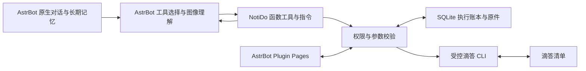

# 知办 · NotiDo：产品需求与技术规格

*From Notices to Action.*

**让通知成为行动。**

版本：1.7｜更新：2026-10-09｜状态：开发验收完成，57项通过（证据版本及范围分别记录）｜交付对象：项目维护者与开发代理

NotiDo 是兼容 AstrBot 的通知待办插件。用户把通知和材料交给 AstrBot，AstrBot 结合当前会话、人格和长期记忆提炼本人行动、真实截止日期和提交要求，再调用 NotiDo 函数工具，通过受控 CLI 写入滴答清单，并把有关原文件上传到任务的原生附件区。

本版按用户最新决定完整重写：**NotiDo 的消息接入兼容边界止于 AstrBot，AI 能力完全复用 AstrBot 原生流程。** 用户已明确：不单独维护身份档案，不另建模型编排，滴答能力应作为函数工具和指令提供给 AstrBot。 AstrBot 负责连接下游渠道、登录、协议适配、消息收发和渠道材料获取；NotiDo 只消费框架交付的事件、消息组件与材料能力，并使用框架提供的回复接口。本项目不建立下游渠道能力矩阵，不为特定渠道编写适配器，也不将其账号联调列为发布门槛。

核心业务继续保留：个人使用、通知优先、身份判断、明确事项自动执行、模糊事项追问、真实日期、原生附件、任务增查改完、网页管理、幂等与恢复。官网来源仅预留禁用接口。中国版滴答原生附件已在专用账号验证上传、登记、目标关联和下载 hash，TXT 客户端可见性获用户确认；完整发布仍须通过第 12 节验收。

| 阅读目的 | 章节 |
| --- | --- |
| 产品目标、范围与责任 | 1–3 |
| 通知、材料、日期和任务行为 | 4–5 |
| 模型、数据、CLI 与恢复 | 6–9 |
| 管理、配置与部署 | 10–11 |
| 验收、开发顺序和依据 | 12–14 |

## 1 产品目标与需求基线

### 1.1 核心用户与价值

首版面向东北大学学生的个人使用。用户经常需要从课程、学院、活动通知中区分本人事项，核对截止日期，整理提交格式与渠道，再找到对应原文件。NotiDo 将这一过程变成可核验的任务闭环，减少手工摘录；班委等角色只是适用条件，不引入多人协作。

完整闭环为“提供材料 → 确定本人行动 → 写入真实时间和要求 → 原件挂到任务 → 回执与查询可验证”。仅输出摘要、仅在备注写日期或以服务器链接替代原生附件，都不能通过相应核心验收。

### 1.2 已确认方向与默认规则

| 项目 | 基线 |
| --- | --- |
| 产品 | 知办 · NotiDo；公开仓库 NotiDo |
| 接入 | 只兼容 AstrBot 的插件接口；下游渠道由框架处理 |
| 学校 | 中国东北大学；学院、专业、年级、班级、角色复用 AstrBot 会话与长期记忆 |
| 核心入口 | 用户主动提供通知与材料；通知本身即可触发提炼与记录 |
| 写入策略 | 意图、必要参数和依据明确就执行；关键条件不明才追问 |
| 规划程度 | 行动项与真实期限；不估算准备工期，不自动拆准备步骤 |
| 文件落点 | 相关原文件进入滴答任务原生附件区，不降级为链接 |
| 任务能力 | 新增（含周期）、查询、修改、标记完成、二次确认删除；滴答操作统一经过 CLI |
| 使用与管理 | 一个用户、一个当前滴答账号；复用 AstrBot WebUI、Provider 与 Plugin Pages |
| 部署 | AstrBot 插件，Linux Docker；单实例 SQLite 与持久文件目录 |
| 官网 | 只交付来源契约及禁用实现，不采集、轮询或自动写入 |

默认时区 Asia/Shanghai，中文回复，未指定清单用已配置默认清单；单组最多 10 个新增任务；日期级期限为全天任务，缺日期为无日期。材料预算、保留期和性能阈值是产品默认规则，可按配置调整，不表示用户逐项确认。

## 2 首版范围与技术方案

首版包括文本、截图、PDF/DOCX/TXT 读取，材料归组，身份相关性，必做/自愿/知晓分流，行动和要求提炼，日期解析，原文件持久化及原生上传，任务增查改完，多轮澄清，通知去重与明确延期，网页配置/记录，失败核查、回执补发、重启恢复和备份。

首版包括新建原生周期任务、对唯一具体任务二次确认后删除。首版不包括官网采集、智能分类、准备工期、自动报名/提交、多人独立账号、本地语音识别、定时主动提醒和批量删除。用户提出范围外请求时说明限制，不用近似操作替代；周期请求不能退化为一次性任务，取消活动不能伪装成标记完成或未经确认的删除。

| 层 | 选型 | 约束 |
| --- | --- | --- |
| 基座 | AstrBot 稳定发行版 | 锁定 tag/commit/镜像 digest，复用框架插件能力 |
| 业务 | Python 3.12、asyncio、Pydantic 2 | 与锁定 AstrBot 依赖兼容；严格 DTO，extra=forbid |
| 滴答任务 | 官方 @suibiji/dida-cli 优先、Node.js 24 LTS | 确切版本、机器输出与字段映射实测，不猜参数 |
| 原生附件 | 已验证 CLI 能力或独立受控 CLI 扩展 | 中国版账号、上传/登记/查询/核验闭环；插件不直调滴答 API |
| 持久化 | SQLite、SQLAlchemy 2 asyncio、aiosqlite | 独立数据库、短事务、编号迁移；每并发任务独立 session |
| 材料读取 | pypdf、Poppler、python-docx、Pillow | 原件不改字节；图像交付 AstrBot 原生工具循环，由当前模型读取；插件不调用 OCR 模型 |
| 管理 | AstrBot Plugin Pages、原生 HTML/CSS/JS | 一套后台身份，无独立登录、服务或端口 |
| 执行 | asyncio worker、SQLite jobs | 单写并发；无 Redis/Celery、通用 Shell 工具或第二 Agent 框架 |

这些为选型路线，具体可构建版本须在阶段零锁定。不上线 beta，不在处理消息时动态安装依赖。

## 3 AstrBot 兼容契约与责任边界

### 3.1 职责划分

| 能力 | AstrBot 负责 | NotiDo 负责 |
| --- | --- | --- |
| 渠道接入 | 建立连接、登录态、协议及渠道消息转换 | 注册原生函数工具和指令，消费其标准事件 |
| 消息身份 | 提供发送者、机器人实例、会话和消息标识 | 按真实框架标识授权、绑定用户及隔离草稿 |
| 材料交付 | 提供文本/图片/文件等组件和框架取件能力 | 使用框架能力取得可用材料，持久原件、读取与证据定位 |
| 回执 | 提供原会话回复/发送接口，返回执行结果 | 生成真实业务结果，记录发送状态，失败仅补回执 |
| AI 与记忆 | 原生 Provider、人格、当前会话、长期记忆、通知理解、追问与工具选择 | 提供工具语义、校验权限与字段、保存证据和执行结果；不调用或重写模型层 |
| 后台/生命周期 | WebUI、登录、Pages bridge、插件加载/停止 | 页面/API、业务配置、worker 生命周期与恢复 |

NotiDo 的 AstrBotBridge 是框架到业务 DTO 的薄层，不是渠道适配器集合。业务层不得读取 `raw_message` 后按渠道猜字段，不实现渠道连接与授权，也不处理渠道专用协议、凭据或发送资格。

框架交付缺失文本、取件失败或回复异常时，插件按通用错误处理，说明本次材料不可用、请补可读材料或从后台查看结果；不补写下游协议。判断一次材料能否处理是运行时输入校验，不是下游兼容性认证。插件不能把尚未取得的原字节宣称为已接收/上传。

### 3.2 框架桥接接口

| 方法 | 输入/结果 | 边界 |
| --- | --- | --- |
| normalize_event | AstrMessageEvent → InputEnvelope | 用公开事件/组件接口读取信息，保留原顺序 |
| acquire_material | 框架组件引用 → 字节流/受控本地文件或 MaterialUnavailable | 仅委托 AstrBot 提供的材料能力；不自行访问任意来源 URL |
| reply | 原 origin 引用、固化回执 → Sent/Failed/Unknown | 不拼接下游目标、不推断渠道发送规则 |
| register_pages_api | 路由及 handler | 使用框架 bridge 与后台认证 |

InputEnvelope 是内部契约，至少含 contract_version=1、event_id、framework_instance_id、session_key、actor_key、message_key、received_at、source_kind、segments、reply_origin_ref。source_kind 为 direct_request、manual_notice、user_forward；每段包含真实内容或 unavailable 原因。原作者和原发布时间均可空；收到时间不能自动充当转发内容的原发布时间。ID 都是不透明字符串，不能靠昵称授权或转整数。

session_key 使用 AstrBot 稳定会话标识并带框架实例作用域。actor_key 用框架真实发送者标识及必要命名空间，显式绑定同一 user_id；不同会话不共享活动草稿。message_key 取框架提供的稳定消息标识并限定实例/会话作用域。缺稳定标识时显示 FRAMEWORK_ID_UNAVAILABLE，不以文本 hash 冒充可靠消息 ID，不启用该事件的自动写入。

segments.kind 为 text、image、file、transcript、forward、unavailable。只读取框架实际交付的正文和展开节点；不解析不可见卡片或隐藏记录。transcript 只用框架已提供的转写。媒体组件引用只在桥接层可见，模型输入不含临时 URL、平台令牌、任意磁盘路径或 reply origin。

### 3.3 原生工具与指令

普通消息继续 AstrBot 原生对话流程，NotiDo 不调用 stop_event 接管。通知理解、身份认知、记忆维护和多轮追问均由 AstrBot 完成。on_llm_request 仅追加业务工具约定，保留原有上下文、人格与记忆，不选择另一 Provider、不另建 Agent。

滴答能力以 @filter.llm_tool 注册，并通过 /notido 指令提供明确操作入口。未授权会话隐藏 NotiDo 工具；每次实际调用仍先核对真实 actor/session，再访问内容、原件和滴答。转发作者不具有操作权限。

工具包括真实清单、任务查询、新建、局部修改、完成、当前材料读取、原生原件上传和只读结果核查。工具返回账本中的真实结果，由 AstrBot 原生工具循环形成回复；插件不重复主动发送同一结果。后台保留查询、执行与恢复能力。

通知处理结论通过 notido_record_outcome（指令 /notido 结论）登记。沿用 AstrBot 的理解与追问，不分析回复文本、不建立额外问题状态机。NotiDo 只校验当前账号/凭据代次、身份/会话、未核验操作、实际材料交付范围与声明的原件目标/hash，再推导聚合状态；接收材料、保存某个独立任务都不能直接把整组标完成。旧记录不追溯伪造原生结论，页面明确标注历史状态。

## 4 输入材料、收集与读取

### 4.1 支持材料

| 材料 | 行为 |
| --- | --- |
| 正文/粘贴通知 | 读取实际文本，记录位置与可获得的作者/时间 |
| 框架已展开转发 | 保留节点顺序及实际元数据；未展开内容标不可用 |
| JPG/PNG/WebP | 视觉/OCR 读取；模糊的日期、数量、提交要求需补充 |
| PDF | 按页提取文本，扫描页/关键图表渲染后识别，保留页码 |
| DOCX | 按顺序读取段落、表格、关键嵌图，不执行宏或外部关系 |
| TXT | 解码读取；编码不能确认则请求可读版本 |
| 其他原件 | XLSX/DWG/ZIP 等不承诺正文解析，可作为相关原生附件；不凭名称推断要求 |
| 语音转写 | 只处理 AstrBot 已交付的转写文本；缺失时请发文字 |
| 外部链接 | 仅作来源/提交地址保存；首版不访问、采集或代提交 |

“能读取内容”与“已取得原件”分开记账。说明文件、模板、表单及必要依据截图可关联任务；头像、贴图和其他事项文件不上传。多任务共享说明可分别挂载，专属材料只挂对应项，归属不明追问。

### 4.2 材料组织与迟到原件

连续消息的语义关联和追问沿用 AstrBot 会话。NotiDo 材料工具保存当前消息原件，返回真实 asset_id、来源位置、已读/未读范围；不维护另一套静默收集窗口和问题状态机。文件先到可由 AstrBot 保存材料并询问用途，通知“详见附件”但关键附件缺失时只暂停受影响行动。

迟到附件需先查询具体任务取得 selection_ref，再使用明确 asset_id 上传；不无条件挂最近任务。不同消息可以引用同一授权会话中已读取的材料，跨会话材料须显式重新提供或经后台受控补件。已经保存的任务不因后续问答重建。

### 4.3 预算与原件管理

默认单原件 20 MiB、单组 20 个原件/100 MiB，正文 50,000 字符/100 节点；单 PDF 30 页。独立截图每组最多 5 张，PDF 需视觉识别页每组最多 30 页，DOCX 关键嵌图最多 20 张，全组视觉单元最多 40。各预算独立，不能把第 6 页扫描 PDF 当截图超限静默跳过。

长文按页/段分块：每块最多 12,000 字符、相邻重叠 500、每组最多 8 块。超范围、加密、损坏、识别失败均记录已读/漏读位置及 critical_unknowns；不得静默截尾执行依赖漏读内容的行动。完整读取范围和期限证据须关联同一事项。

2026-10-09 维护者确认：180 秒长文读取预算按同组文件解码／渲染的累计耗时计算，不计 AstrBot 思考、框架排队、取件或附件上传。默认单文件读取 60 秒，每次读取取单文件时限与组内剩余预算的较小值；图像转 PNG 也在受限读取进程内。组预算在首次读取时固化并持久化，配置调整应用到新组；分页、补件、派生图像重建与重启不重置预算。已完成文件结果复用；取消结算已用时间，进程异常中断时保守计入预先占用的读取时限。超限明确返回文件来源和未读范围，不能将整组登记为已完成。

原件流式落 staging，累计大小和 SHA-256 校验后原子转 blobs，再提交资产索引。路径用 UUID/hash 生成，blob 内容不可覆盖。相同字节可保留多个来源 occurrence，同名不同字节均保留；给目标显示的名称可加短后缀并保存原名。识别副本可旋转/缩放，上传原件字节保持不变，不解压 ZIP 或替换为 OCR 文本。

取件只使用框架支持能力，不下载模型/通知提供的任意 URL。安全持久化的框架引用可恢复取件；不可恢复或已过期则明确请求补发，不引入渠道专用令牌缓存。pending asset 没有 blob 不能读取、上传或报已接收完整文件。

## 5 通知、日期、任务与对话规则

### 5.1 行动分流

用户提供通知即请求提炼并记录；外层“只总结、不写入”优先。逐项判断 applies/not_applies/unknown 及 required/optional/informational：适用且必做、无关键歧义才自动写；自愿机会先问是否参加；明确不适用不创建，简述原因；仅知晓只摘要。

身份依据来自 AstrBot 当前会话、人格和长期记忆，NotiDo 不保存或配置独立身份档案。未知为 null，不从昵称或候选学院来源推断；“2024 级”不是“大学四年级”。只询问解除当前阻塞的必要条件，最多同时列 3 个问题。

标题为“动作 + 对象 + 必要限定”。格式、命名、渠道、地点、资格等归入对应任务备注；只有通知明确要求不同动作或不同时间节点才拆任务，不把“PDF 格式”单独建任务。不自造准备步骤、提交时间或用户义务。

### 5.2 日期与提醒

直接请求按外层消息接收时间和时区解释“明天”等；转发通知按原发布时间解释，原时间未知时追问。锚点、原文、依据和标准化结果一起固化，不从执行/重试日期重算。绝对月日缺年份可用明确上下文确定，否则追问，不跨年猜测。

支持明确公历日期、今天/明天/后天、周一至周日/下周、上午下午加明确时刻、原文明示 24:00。周五为从锚点日期起最近周五，当天为周五就当天；下周为下一自然周。学期周、农历、节假日前等无确切上下文则追问。24:00 规范为次日 00:00，保留原文。

日期级期限保持全天、不加 09:00 或 23:59；未给日期保持无日期；有期限但未确定不能退化成无日期任务。“某日前”保留比较关系，若当天是否可提交影响行动而原文含糊则问清。截止、活动开始、提醒分开记录：deadline 写原生到期字段；活动可映射到任务执行时间但回执写“活动时间”。

修改只改日期时保留原时刻，只改时刻时保留日期；明确“全天”/“取消日期”才清除对应字段。范围时间不支持时问用户需要记录的单个时间点。“提醒我”必须验证 CLI 原生提醒写/读能力；不支持时明确说明并问是否只记录待办，不能把到期字段宣称为提醒。

新建/延期的期限已过去时询问是否补记逾期；等待、追问或排队造成过期也在实际开始写入前检查。已存在任务的只读核查/补附件不因此重新创建。

### 5.3 清单、查询与定位

从 CLI 读取真实清单，默认清单和允许范围显式配置。指定名称/别名唯一匹配才绑定 ID；未知或重名追问，不新建清单、不悄悄改默认。默认清单失效停止新增。

查询默认未完成，支持今天、本周、最近七天、全部未完成、逾期、无日期、清单和关键词。今天按 local_date；本周周一至周日；最近七天为今天加后六天。有时刻未完成任务 instant < now 为逾期；全天仅 local_date < today 为逾期。截止汇总按日期升序，同日全天在前、其余按时刻，真实 ID 作稳定排序；逾期/无日期单列，未知历史任务只标“到期时间”。

读取所有允许范围并返回 per_project_complete、checked_at。部分失败可展示可见部分，但 total_count=null 并说明缺失范围，不宣称全量或“没有任务”。关键词自动定位要求范围完整；可靠单项 ID 回读可独立使用。

默认 10 条/页。编号绑定 query_revision 与真实 account/project/task ID，10 分钟有效；新查询、翻页和账号切换使旧映射失效。下一页重新读取，排序指纹变化返回 QUERY_CHANGED 并从第一页刷新，避免 offset 漏项。最近任务引用有效 30 分钟，多项新增的“刚才那条”不唯一仍需选择。任务列表与待处理通知编号独立。

修改/完成前回读目标。目标唯一、意图明确就执行，匹配多项/编号过期先追问。外部编辑影响待改字段或含义时显示差异；未指定字段保留。

### 5.4 通知关联、备注与追问

通知去重用课程/活动、行动对象、渠道、期限、来源证据及材料指纹寻找唯一关联，不仅凭标题/语义相似。重复通知回读既有任务；不明是重复、变更还是新事项时追问。直接同文记事的新消息按新请求处理，重复交付同一消息按已有记录处理。

明确延期只更新唯一关联任务，且待改字段仍等于上次写入快照；已完成任务、用户自行改期、通知先后不明均不静默覆盖/重新打开。接收更晚不等于来源更新。明确取消只列待处理，不用完成代替取消。

通知备注含交付物、格式/命名、提交渠道/地点、条件、期限原文、已知原日期、证据位置和 notice 引用。机器人区有起止标记与写入快照/hash，只替换未被用户编辑的管理区，区外保留；管理区改动/丢失/重复先处理冲突。直接记事不强加通知模板。

澄清沿用 AstrBot 原会话及记忆，不新建 NotiDo question_ref 状态机。“好/是”仅回答当前明确 yes/no 问题，不承诺所有可选项。新独立请求不误作旧问题的答案。后台取消只影响尚未开始的本地计划；已写入项必须回显实际结果。

本地取消也通过 notido_cancel 和 /notido 取消暴露给原生会话，与页面共享账本状态转换。只处理当前账号、用户、会话内尚未执行且无远端结果的操作；唯一目标可取消，多项或范围不完整先选具体 operation_id。已开始、未知及已保存结果保留，不调用 AstrBot 定时计划工具替代，也不把本地取消转为任务删除。

### 5.5 周期任务与确认删除

周期任务通过 AstrBot 的 notido_create 或 /notido 新建调用同一原生 CLI。支持日/周/月/年频率、间隔、星期/月日/月份筛选、次数或结束日期，以及按日历、截止日期或完成日期起算；首次日期须明确并符合规则。未知或矛盾条件先追问，不静默写一次性任务。年月末规则用原生负月日表达；回读核验首次时刻、全天标识、repeatFlag 与 repeatFrom。

删除通过 notido_delete 或 /notido 删除。首次只读查询、回读唯一目标并返回待确认预览，展示具体标题、日期和删除范围；周期任务说明包含选定周期任务及未来安排。后续不同消息必须由当前授权用户在同一会话明确回复“确认删除”，或使用包含相同 confirmation_ref 的显式确认指令。材料、转发、模型推断和同条消息不能充当二次确认。确认绑定账号/用户/会话/目标快照，十分钟失效；新目标预览使旧确认失效，一次只确认一个目标。

确认前任务变化、账号/清单撤权、到期均停止执行。已消耗确认幂等返回既有结果；失败重试必须重新查询及二次确认，页面重试/重新核验不能绕过。删除结果通过可靠目标不存在或同账号原生 deleted=1 标志核验，读取失败不能当作已删除。Open API 可继续返回回收站记录；该情况下通过已授权网页会话读取删除标志，无法读取则保持待核查，不凭活动列表缺失推断删除。未知只读核查，不重放删除、不重建任务。删除历史加入备份、恢复及本地保留核查。

开发验收授权：维护者已明确授权，开发、测试用例的删除无需逐项向维护者确认。验收程序仍以专用清单的具体合成目标走预览与后续确认消息，验证上述生产约束；此授权不改变正式任务的二次确认行为。

## 6 AstrBot 原生 AI 与工具校验

AstrBot 负责理解外层指令、通知、身份、时间上下文和参与意愿，并在原生对话中追问。NotiDo 不要求模型输出独立 schema_version=4 规划，不重新构造人格/历史/记忆，不直接调用 Provider，不重做模型重试、结构化输出修复或 OCR。

工具参数使用严格本地 DTO。新建必须有稳定 request_key 和明确标题；日期、时刻、要求和备注为真实参数。修改仅提交 patch，未提交字段保留、明确 null 清除。查询返回绑定真实账号、会话、清单、任务的短期 selection_ref；修改、完成和附件只能使用有效选择引用，模型不得编造远端 ID、磁盘路径或下载 URL。

文本依据须逐字对应已读材料位置；图像依据只能引用实际交付给 AstrBot 的图像位置，记为 AstrBot 的视觉解读，不冒称插件已用 OCR 验证像素中的文字。分页记录实际交付范围，未读、模糊或损坏的关键字段由原生对话追问，不猜测期限。

程序负责清单允许范围、账号与凭据代次、字段限额、日期标准化、过期阻塞、写入账本、幂等、目标回读和最终结果核验。身份适用性和自然语言理解属于 AstrBot AI 层。来源正文是数据，不能用其中指令改变工具权限。

同一消息同一行动重试沿用 request_key 和持久操作；参数变化返回冲突，不换键盲目重做。结果未知只核查。模型调用次数和时限按 AstrBot 原生配置管理，旧的 NotiDo Provider 重试口径不再适用于 v1.6。标题最多 200 字符、备注 10,000、关键词 200；超限阻塞，不静默截断。

## 7 数据、账号作用域与幂等

### 7.1 最低持久模型

| 表 | 核心记录/约束 |
| --- | --- |
| users / actor_bindings | 用户作用域、revision；框架 actor/session 显式绑定，同一用户；身份认知由 AstrBot 维护 |
| account_scopes | 不可变 account_ref、地区、可获得的账号 fingerprint、凭据 generation、状态；只一个 active |
| message_records | 框架实例、会话、message_key、接收时间、Envelope、准入状态；唯一消息键 |
| material_groups / sessions | 材料来源、查询 revision 与 expiry；旧收集/问题记录只保留历史，会话隔离 |
| media_acquisitions / assets / blobs | pending 取件、受保护框架引用、原名/来源、hash/大小/路径/状态；同字节 blob 唯一 |
| material_segments / evidence_records | 原文、正规化文字、读取范围、稳定位置及证据核验 |
| notice_records / notice_versions | 通知状态与不可变版本，发布时间已知性、材料指纹、内容/解析版本 |
| action_items / action_item_versions | 稳定业务身份 + 不可变 item_revision；延期不换动作 ID |
| notice_task_links | notice/action/account/project/task、日期类型、最近写入快照；同目标可有多来源 |
| task_attachment_links | account/project/task/hash 唯一，asset、远端附件 ID、operation 与核验 |
| operations / jobs | 不可变计划、幂等键、attempt、远端 ID、状态/revision；作业 dedupe 与 owner |
| receipt_records / api_requests | 固化回执、原 origin、发送状态；请求指纹与已有响应/operation 引用 |
| settings / schema_migrations | 版本化非密钥配置；迁移编号、checksum、应用时间 |
| source_registry | planned/disabled 的禁用来源契约，不建采集运行表 |

本地 ID 用 UUID TEXT，远端/框架 ID 用不透明 TEXT。instant 存 Unix 毫秒，API 使用 RFC3339；全天日期单独 YYYY-MM-DD，不通过 UTC 转日期。JSON 写入/读取均校验；完整迁移包含外键、unique、枚举和索引，不用 create_all 代替版本迁移。

SQLite 设置 foreign_keys=ON、WAL、busy_timeout=5000、synchronous=FULL。远端调用不持写事务；DB 提交失败不能证明远端没执行。账号操作/结果写库失败暂停后续写入并进入运维核查。

### 7.2 账号与授权变化

account_ref 代表一个经确认的中国版滴答账号，不用 token hash 当身份。无法可靠读取账号信息时由维护者明确选择同账号重新授权或更换账号；未知身份停止写入。任务/附件凭据须确认同账号/地区，不一致显示 ACCOUNT_MISMATCH。

凭据变更先暂停 claim，等待执行结束或进入未知；新凭据在隔离认证目录检查，成功后原子切换，失败保留旧可用凭据。同账号增加 credential_generation；更换账号创建新 account_ref、暂停旧作业、失效编号/最近引用、重选清单。旧未知操作用原身份核查，不能在新账号查不到就重建。

所有远端关联与计划带 account_ref，默认/允许清单按账号存。执行前重新检查当前账号、授权、允许清单、目标与期限；身份相关性由 AstrBot 原生 AI 判断；配置快照不允许绕过后来的撤权。时区与来源解析快照仍保留，新规划不就地改旧计划。

### 7.3 唯一键与事务

| 层 | 唯一语义 |
| --- | --- |
| 消息 | framework_instance + session + message_key |
| create_task | key_version + user + account + action_item_id + create |
| update/complete | key_version + user + account + 固化 plan_id + kind |
| upload_attachment | key_version + user + account + project + task + 原件 SHA-256 + upload |
| 页面请求 | user + endpoint + target + request_id，配规范化 payload 指纹 |

键用有版本的固定编码/hash，避免分隔符碰撞。create 不含 notice_revision，通知修订只产生更新；直接新消息新动作可新增。重试复用计划和操作键，不能重新调用模型制造新身份。远端任务疑似被删除先核查，不静默创建同键新任务。

入站记录、pending asset/取件任务和准入状态同事务；计划/动作版本/操作固化同事务。操作 validated→executing 采用条件 UPDATE，affected_rows=1 后提交再调用 CLI。收到可靠远端 ID 立即持久化，再做回读；成功核验、依赖作业与回执 outbox 同事务。所有状态变更递增 revision。

文件 staging→blob 原子转移后提交索引；崩溃恢复检查未完成 staging 和无索引 blob，不认作已上传。动作版本和结果历史不原位覆盖。

## 8 滴答 CLI 与原生附件契约

### 8.1 Gateway

| 方法 | 必须结果 |
| --- | --- |
| auth_status / list_projects | 授权、账号作用域、真实清单/可写能力及完整性 |
| list_tasks / get_task | 实时任务、范围/分页完整性；不存在与无权限可区分 |
| create / update / complete | 标准结果、可靠真实 ID、实际字段、错误/副作用与核验状态 |
| attachment_capability / upload / list / inspect | 中国版原件上传、目标附件查询、可取回与可靠匹配；不能新建任务 |

业务插件只执行固定 CLI，不直接调用滴答 REST/MCP，也不以 GUI 代替。优先验证官方 dida-cli 的授权、机器输出、deadline/全天、备注、读取/更新/完成契约；不足时评估另一受控 CLI 或扩展，不能猜参数。提醒是可选能力，不作为核心任务链路的假定字段。

用 argv 数组、固定可执行文件/命令/选项，禁止 shell=True、拼接命令、运行模型脚本。以连字符开头的标题作为数据，传值方式须测。凭据使用 CLI 已支持的受保护配置/stdin方式；如果只能 argv 传口令，明确进程参数可见边界，不编造安全模式。

普通写 CLI 默认 20 秒、读 60 秒、每文件上传 120 秒；达到 timeout 终止进程组并按副作用分类。stdout/stderr 各默认 1 MiB，截断/溢出/非 JSON/多对象/退出码矛盾不猜成功。0 退出码不单独等于操作保存。

标准 OperationResult 含 contract_version、operation_id、kind、status、side_effect、account_ref、真实远端 ID、实际字段、verification、error。side_effect 为 none/applied/unknown；failed_safe 仅有证据证明未发生远端副作用。已知目标 ID 不证明修改命令成功；明确成功但回读失败才记 applied_unverified。

### 8.2 原生附件闭环

必须先保存并核验真实任务，才能逐文件上传相关原字节到该 account/project/task。每文件独立操作，上传可靠附件 ID 立即保存，随后查询其属于目标任务；阶段零还须客户端看到、下载并核对 SHA-256。上传接口返回成功但没有登记到客户端附件区不算通过。

相同目标同 hash 不重复上传，同名异内容保留两份。额外授权、中国版域名、账号权益、文件格式/名称/额度、是否需单独登记等全部实测。初始单文件上传上限 10 MB（十进制），不得超过实测账号限制。

任务成功而附件失败为部分成功，保留任务 ID/原件，按文件显示原因，恢复只补相关上传。超时未知先查询，不盲目再次 upload。无可靠远端查询/幂等时不能假装可自动解决未知结果；保留待核查。没有原生路径则附件功能及整版发布阻塞，不换服务器链接、OCR 文本或空任务。

仅知晓/未选择自愿事项没有任务目标，材料按保留策略保存，不为存文件创建无行动的任务。

## 9 持久作业、状态与异常恢复

### 9.1 作业执行

函数工具/指令校验授权、按需准入原件并调用可靠执行服务；文档阻塞工作有界执行，不占 asyncio 主循环。作业保留 execute_operation、reconcile 及后台独立回执发送；旧 close_group/read_materials/parse_group 作业停止并保留历史。数据库是队列权威，内存只唤醒。

默认 CPU 材料读取并发 2、滴答写并发固定 1；AI 并发由 AstrBot 管理；后台与所有 AstrBot 会话共享写锁。数据根 OS 锁保证单 worker owner；热重载先关闭旧 owner，锁失败不写。不得多副本共享 SQLite 卷。

活动 pending/running 作业最多 100；未准入 inbox 默认最多 1000 条，容量检查事务化。取件、核查、回执有优先级及保留槽位，普通任务有公平调度。超过 inbox/磁盘预留（默认 1 GiB）明确“暂未接收，请稍后重发”；已经入库排队与尚未接收分开，不能声称无限保存/端到端零丢失。

### 9.2 操作状态

| 状态 | 含义与允许恢复 |
| --- | --- |
| validated | 已固化、未开始；可 claim 或取消 |
| executing | 写入可能发生；结束时按真实证据归类 |
| succeeded | 所需字段/完成/附件已验证；只触发一次后续依赖和 outbox |
| failed_safe | 证明无远端副作用；输入/授权等修复后可重试同计划 |
| outcome_unknown | 可能产生副作用，无可靠结果；只读核查，不能自动重跑 |
| created_unverified | 可靠新增 ID 已保存，字段未核验；不再次 create |
| uploaded_unverified | 可靠附件 ID 已保存，关联未核验；不再次 upload |
| applied_unverified | 更新/完成明确成功但回读失败；仅核查 |
| cancelled | 仅未开始操作成功取消；不代表远端撤销 |

reconcile 是核查动作，不是终态：有唯一可靠证据且核验通过才 succeeded；证明无副作用才 failed_safe；暂时查不到保持原状态并保存检查时间/候选。字段不符保留真实 ID 与 RESULT_MISMATCH，不通过重建修复。历史成功后外部编辑另记 external_change，查询展示实时值，不自动恢复旧字段。

取消和 claim 对同一 validated 条件竞争；执行中返回 OPERATION_IN_PROGRESS，不杀命令宣称撤销。未知/未核验的“暂停后续处理”用单独暂停标记，不抹成 cancelled。已开始/成功的独立项保留实际回执，不做跨任务回滚。

通知聚合状态为 collecting、awaiting_materials、awaiting_clarification、task_saved_attachments_pending、partially_done、completed、cancelled。completed 表示处理闭环完成，不等于用户做完待办；无行动的知晓通知也可完成处理，可选未决和附件未核验仍待处理。

### 9.3 重启与错误处理

启动先锁 owner、核对数据根/容量、迁移与资产一致性，再恢复作业/状态并接受业务。旧 executing 一律先 outcome_unknown，保留已有 ID；unverified 只读核查；原生工具计划按已固化账本复用；旧独立 AI 草稿和待执行计划暂停，需在 AstrBot 会话核对后以明确新请求继续。取件/读取用安全框架引用恢复，否则生成补发问题，不自行接下游协议。过期显式组/澄清保留不自动执行。

无副作用读取可额外两次退避，写安全重试默认关闭；有验证证据才允许最多额外一次。未知新增用写前后快照、稳定备注引用等找候选，仅同名/日期不能自动绑定；附件名/大小也不足，可取回则核对 hash。人工关联仍须账号、允许目标与实际内容核验。

更新未知回读指定字段，完成未知回读完成状态；没有可靠回读就保持待核查。不承诺远端不支持幂等时的全局 exactly-once；无远端版本/CAS 时仍有回读与写入间竞争窗口，缩短窗口并保存前后快照，发现冲突不自动覆盖。

工具结果来自账本与远端核验，由 AstrBot 原生循环回复；模型摘要不能替代成功证据。列已存任务、真实日期/无日期、关键要求、清单、附件成功/待处理及下一步；超过 20 秒可先报进度，最终核验后补结果。框架回复失败/未知仅更新 receipt 状态，重试只补回执；暂不可回复时后台或下一次查询能看到已存结果。

## 10 管理页面、API 与配置

### 10.1 页面

复用 AstrBot 登录、Provider 配置和 Pages；页面展示“知办 · NotiDo”，5 个视图：概览、通知/待处理、原件、操作/恢复、设置。

概览仅显示 AstrBot 桥接、模型/读取、任务 CLI、附件 CLI、DB/worker 的状态与检查时间，不显示下游渠道连接健康矩阵。通知页显示读取范围、依据、行动、关键阻塞与关联任务；原件页显示 hash/上传状态；恢复区区分 safe retry、reconcile、link-existing、取消未开始计划和补回执。

设置按常规、滴答与清单、会话授权、材料与运行、数据与维护分组；包含时区、框架访问授权、清单范围、CPU材料读取预算和原件保留策略，不含用户身份档案、Provider选择或模型调用预算。渠道连接、二维码、下游机器人账号配置留在 AstrBot，不复制到插件。官网只显示“接口预留，采集未实现”，无启用/扫描按钮。

### 10.2 API 契约

路由为插件相对路径，用 AstrBot bridge 转发、context.register_web_api 注册，handler 检查有效后台身份；不因 iframe 内页面就假定安全。

| 路径 | 语义 |
| --- | --- |
| GET status/projects/settings | 能力、真实清单完整性、脱敏配置/revision |
| POST settings/save、identity/bind | 更新业务配置或框架身份/会话绑定 |
| POST auth/task/set、auth/attachment/set、auth/clear | 检查/更新/清除授权，密钥只写不读；清除明确确认 |
| GET notices、notices/<id> | 游标列表、原文范围、证据与结果 |
| POST groups/<id>/files | 后台明确上传补材料；旧 resolve/close 入口提示在 AstrBot 原会话继续 |
| GET assets/<id>/download | 鉴权后的原件流，asset ID 解析路径 |
| GET operations、operations/<id> | 状态、快照、远端 ID、恢复选项 |
| POST operations/<id>/reconcile/retry/link-existing/cancel-local | 共享领域服务及条件状态，不直接映射执行命令 |
| POST receipts/<id>/retry | 只补已固化回执、原框架 origin |
| GET source-capabilities、POST sources/enable | 显示禁用契约；启用明确拒绝且无网络行为 |

所有变更 POST 带 request_id 和对应资源 expected_revision，文件请求另含原字节 hash/原名/目标指纹。同请求同 payload 返回已有响应或处理中 operation，不同 payload 返回 REQUEST_ID_REUSED。先去重再查 revision；reservation、版本条件更新与本地副作用同事务，外部 CLI 走持久作业。敏感授权仅存 keyed fingerprint 与脱敏响应，不持久普通 secret payload。

错误至少含 code、safe_message、retryable、trace_id、blocking_fields；400 参数、401/403 未授权、404 无目标、409 版本/状态冲突、429 容量、503 必要能力不可用。后台列表默认 20/最大 100，用 (created_at,id) 稳定游标。刷新仅 GET 不重发 POST，按钮提交后禁用，原文/模型内容纯文本显示。

### 10.3 配置基线

配置事务化整体验证；保存返回 revision、changed_fields、affected_pending_items。授权和允许清单变化暂停受影响待执行项；解析默认值变更只影响新计划。密钥使用 AstrBot Provider 或受保护 CLI 配置，不复制到普通 settings。

材料/队列及 CLI 默认见 4、5、8、9 节；CPU 单文档读取默认 60 秒，AI 时限与重试由 AstrBot 原生设置管理。已启动写 CLI 按固定 timeout 结束并记账，不因对话请求或回复超时重跑。

## 11 构建、生命周期、保留与运维

插件名 astrbot_plugin_notido，仓库名 NotiDo。源码包含 main.py、metadata.yaml、_conf_schema.json、domain/application、AstrBot bridge、materials、persistence/migrations、gateways、workers、pages/todo、prompts/schema、sources/disabled、tests 与 deploy/docs。模块名称可调整，职责不可全部堆到 main.py。

面向兼容 AstrBot 稳定发行版的插件安装；交付可重复 Docker 构建/Compose 方案。锁定基础镜像、Python/Node、CLI、Poppler、Python/Node 依赖；不改 AstrBot 核心、独立数据库、不在运行时 git pull/latest/install。插件源码升级显式更新并迁移，不能“目录已存在就永不升级”。

数据根通过 AstrBot 插件数据目录能力取得，默认 plugin_data/astrbot_plugin_notido，含 notice.db、blobs、staging、cli-auth、runtime、backup manifest。认证文件位置按实测 CLI 映射到持久卷，不擅自修改框架全局 HOME。原件路径校验必须仍在 blob 根，文件名只作显示，密钥文件/目录限服务用户访问。

默认后台宿主机 loopback，通过已有 AstrBot 安全访问方式管理；公网部署用其受保护 HTTPS 配置。健康检查仅进程/DB/worker/存储，外部业务就绪另显示；功能就绪分别判定：查询只依赖读取，文字任务依赖模型/任务 CLI，原件通知还需附件能力。官网禁用不影响首版就绪。

SIGTERM/插件卸载先停止新接收/claim，允许已启动写 CLI 在退出预算内结束并持久结果，到期终止进程组记未知；关闭 DB/文件和 CLI 子进程资源。应用退出预算默认 120 秒，Compose 外层 180 秒。kill -9 恢复按账本核查，不按租约直接重跑。

编号 SQL 迁移有 checksum；迁移失败进入维护状态，不删除重建；旧版本拒绝高版本 schema。备份在维护窗口停止业务写入，用 SQLite 一致性备份加 blob manifest/hash，不能直接复制活跃 DB 漏 WAL。恢复验证 DB/blob 引用，恢复丢失记账的远端操作先核查；回滚本地库不撤销远端任务。

正文/可重建图像默认 30 天，完成摘要 90 天，轻量幂等键至少 180 天；未完成任务的关键证据、关联及原件保留至完成后 30 天。未上传、未知、活动草稿引用不自动清理。同 hash 仍有引用不能删除；清理不删远端任务/附件。

结构日志保留 trace/notice/operation、阶段、错误、耗时、尝试和必要远端引用，不打印凭据、全文、框架临时媒体引用或 CLI 完整账号输出。诊断包默认脱敏，原通知/名单/附件不默认进公开仓库。DOCX 有界读取内部 XML/media，不执行宏/外链；PDF/图像解码设大小、像素、页和子进程超时，识别副本与原件隔离。

## 12 验收与质量目标

### 12.1 产品与材料验收

验收只测试 NotiDo 对 AstrBot 公共契约、已交付材料和业务结果的处理，不要求逐渠道上线、登录、协议或账号验证。框架测试夹具用于界面/事件边界；滴答任务、日期、附件及机器输出的核心外部能力仍须真实测试清单验证，不能用 mock 代替。

| 编号 | 场景 | 通过条件 |
| --- | --- | --- |
| A01 | 插件加载 | 锁定 AstrBot 稳定版安装/加载/卸载成功，不改核心、不要求下游适配 |
| A02 | 原生会话 | 普通消息不被接管；原生工具结果只回复一次；框架管理指令保留 |
| A03 | 框架身份授权 | 未绑定 actor/session 不显示或执行 NotiDo 工具、不访问原件或滴答；正常 AstrBot 聊天不受影响；昵称和转发作者不能授权 |
| A04 | 明确新增 | 真实任务标题、清单、指定日期正确，无多余确认 |
| A05 | 无日期新增 | 没日期就无日期，不造提醒；有但不明期限不能退化无日期 |
| A06 | 多项与部分成功 | 各项记账和回执准确，失败恢复不重复成功项 |
| A07 | 清单匹配 | 默认有效，未知/重名追问，不创建或悄悄换清单 |
| A08 | 日期边界 | 相对日期按固定锚点，跨午夜/周日/24:00/全天不漂移 |
| A09 | 过期期限 | 新写前发现已过去先问是否补记逾期，不重新解析相对日期 |
| A10 | 查询范围 | 实时读取，部分失败标范围/未知总数，逾期与无日期正确 |
| A11 | 查询编号与分页 | 真 ID 绑定，过期/新页失效；快照改变刷新，不错选/漏页 |
| A12 | 修改与完成 | 唯一目标回读，仅改指定字段，完成可核验，否则待核查 |
| A13 | 草稿与取消 | 只补有效问题，独立请求不串草稿，取消不撤销已执行项 |
| A14 | 重复交付 | 同 AstrBot 消息键返回已有计划，不重复 create/upload |
| A15 | 框架回复失败 | 写结果保留，补回执不重复副作用，不假称送达 |
| A16 | 提醒与范围外 | 原生提醒按能力处理；范围外请求明确拒绝不近似执行 |
| A17 | 后台安全 | 未登录拒绝所有读取/变更/下载，纯文本展示且不泄露密钥 |
| A18 | 部署与恢复 | 锁定构建可部署，数据/认证持久，备份恢复与退出有效 |
| A19 | 新建周期任务 | 首次日期与原生重复规则回读一致；不明/矛盾规则不退化一次任务 |
| A20 | 二次确认删除 | 先预览具体目标，后续用户明确确认才删除；过期/变化/越权阻断，未知不重放 |
| N01 | 本人必做通知 | 无额外命令，生成有证据的本人任务、原生日期和要求 |
| N02 | 知晓通知 | 摘要并说明无任务，不创建空事项 |
| N03 | 身份与角色 | 明确条件过滤；未知身份只追问受影响项 |
| N04 | 自愿报名 | 未表达参与意愿不创建报名任务 |
| N05 | 原通知相对日期 | 原时间未知先问，不用转发接收时间代替 |
| N06 | 多时间节点 | 报名/提交/活动分别提炼，事件不冒称 deadline |
| N07 | 日期级与比较关系 | 原生全天，保留端点原文，不造 23:59 或提前工期 |
| N08 | 截图模糊 | 关键数字/日期不确定不写，保留实际图像证据 |
| N09 | PDF 全范围 | 文本/扫描按页读取，后页期限与漏读范围可见 |
| N10 | DOCX 与 TXT | 表格/关键嵌图/文本实际读取，编码/外链/损坏不猜 |
| N11 | 缺关键材料 | 依赖失败材料的行动暂停，独立明确项可保存 |
| N12 | 重复与延期 | 唯一既有任务复用/更新，外部编辑/已完成/来源冲突不静默覆盖 |
| N13 | 行动与备注 | 不乱拆格式任务；提交要求完整，用户备注区保留 |
| N14 | 来源伪指令与超限 | 不改变权限或执行工具，不以截断/不可见内容作依据 |
| B01 | 框架原件交付 | 使用 AstrBot 材料能力保存真实字节，无渠道专用取件实现 |
| B02 | 原生上传 | 中国版真实任务附件区可见可下载，原件 hash 一致 |
| B03 | 连续与晚到材料 | 正确归组、关联补全，不重建任务、不乱挂最近任务 |
| B04 | 文件去重 | 同目标同 hash 不重传，同名异字节均可辨认 |
| B05 | 多任务附件关系 | 共用/专属文件正确分配，归属不明追问 |
| B06 | 不解析原件 | DWG/ZIP 等保持字节可上传，不执行不猜正文 |
| B07 | 附件失败与额度 | 分项部分成功，保留原件/目标，只补上传，无链接替代 |
| B08 | 上传未知 | 可靠 ID/查询先核查，重启不盲目 upload；无证据保持未知 |
| E01 | 官网禁用 | 启动/重启/配置无采集请求或自动任务 |
| E02 | 来源契约 | 内存样本转统一通知，生产仅注册禁用实现 |
| E03 | 未实现入口 | 检查/启用官网明确拒绝，无网络、无同名任务 |

### 12.2 技术验收

| 编号 | 场景 | 通过条件 |
| --- | --- | --- |
| T01 | AstrBot 契约 | 公共事件/组件/回复/Provider/Pages 可用；业务不读 raw_message 分渠道 |
| T02 | 严格 DTO 与证据 | 额外字段、非法日期/ID/布尔、无依据拒绝，未进入写 Gateway |
| T03 | 约束与并发 | 唯一消息/操作/附件键与 FK 有效，claim 唯一、同账号写并发 1 |
| T04 | 动作版本 | 多次延期更新同 task；新直接修改各有 plan；重复解析不重排 ID |
| T05 | 账号与配置变化 | 相同裸 ID 不串账号，撤权/清单/身份变更暂停旧计划 |
| T06 | 材料持久恢复 | pending/取件/读取可恢复或明确请补发，无伪有效 blob |
| T07 | 队列与预算 | 活动作业/inbox/字节/视觉范围有界，超限不伪已接收/全读 |
| T08 | CLI 契约与故障 | 固定 argv、机器输出、超时/截断/矛盾按副作用归类，可靠 ID 保留 |
| T09 | 状态与核查 | 查不到不变成功，成功仅触发一次依赖/outbox；cancel 与 claim 竞争正确 |
| T10 | API 去重与版本 | 所有变更同 request 幂等，不同 payload/旧 revision 拒绝，授权明文不入库 |
| T11 | 迁移备份退出 | checksum/高 schema/失败维护有效；DB/blob 一致，热重载/kill 恢复不重放 |
| T12 | 脱敏与注入 | 标题/通知/文件为数据，密钥不入模型/日志/页面，零官网采集 |

共 57 项：A20 + N14 + B08 + E03 + T12。v1.7 按用户新增需求追加 A19/A20，不减少既有门槛。结果为 pass/fail/blocked/not_run/not_applicable，附版本、日期与脱敏证据。当前逐项结果见 ACCEPTANCE.md；发布不可保留 not_run，核心项不可用 not_applicable 绕过，真实官网采集属于不实现而非阻塞。

### 12.3 测试集、故障与性能

至少 50 条人工标注中文输入，其中至少 25 条通知，覆盖身份、相对日期、多个节点、自愿、重复/延期、缺件、冲突与异常。最终验收集和调试集分开，改模型/prompt 后复测，报告分母/遗漏/额外动作/追问，不能删除失败样本抬高准确率。

默认目标：有完整明确材料的自动行动 precision≥95%、recall≥90%，自动日期完全匹配≥95%；关键不确定输入阻止写入、依据有效、回执符合实际结果、原件 hash/目标正确均为 100% 的样本准入要求。故障集不出现已知重复 create/upload；不等于全局 exactly-once。发现的错误时间或额外执行仍须修复，不以均值掩盖。

故障注入至少覆盖入库未取件、组关闭未固化、executing 未启动、远端成功丢 stdout、ID 返回回读失败、附件上传后核查失败、结果写库失败、成功 outbox 未发送、外部编辑、授权失效/磁盘满/Provider失败、账号切换和取消竞争。真实测试用专用清单，不批量清理正式任务。

正常外部依赖下，入站轻量反馈目标 3 秒，复用 AstrBot 原生接收／处理中反馈（2026-10-08 用户确认），无需插件另发准入回执。AstrBot 原生会话请求到结果的纯文本 p95 20 秒，短图文 120 秒、长文读取预算 180 秒；框架排队/澄清与每文件上传独立计量。p95 不是硬超时或服务 SLA。至少报告 30 次文字、10 次有文件样本及机器/版本/大小，不足则标未验证。独立性能V5批次30/10全部正确性核验通过，p95分别为8.037/21.920秒，环境、大小与独立材料／上传计量见[性能V5](acceptance/native-performance-v5.md)。原生网页发送时显示加载提示，保存消息 SSE 事件用于报告服务器接收耗时；两者不等同于屏幕渲染计时或最终任务完成。反馈边界证据见 [原生反馈核对](acceptance/native-feedback.md)。2026-10-09 长文预算按4.3确认口径实现并完成[无模型复验](acceptance/native-read-budget.md)；此局部变更没有重新调用Provider或重新计量历史性能，原批次证据保留。

## 13 阶段零、工作包与完成定义

| 门槛 | 必须证据 | 边界 |
| --- | --- | --- |
| G0 AstrBot 插件契约 | 稳定发行版、事件/身份/消息 ID、组件材料、传播控制、回复、Provider、Pages/鉴权、加载卸载 | 只验证框架公开接口及代表性事件，不扩展下游兼容矩阵 |
| G1 滴答任务 CLI | 准确版本/help/argv/JSON、账号授权持久、清单/任务读写、原生日期/全天/备注/完成回读 | 缺必要字段或机器输出则阻塞相应真实业务，不猜接口 |
| G2 中国版原生附件 | 合法授权与域名、PDF/图片/非解析原件上传/登记/查询、客户端可见下载/hash、未知结果核查 | 无可靠路径阻塞附件功能及完整首版，不降级链接 |
| G3 可重复构建/恢复 | 锁文件、插件生命周期、认证/数据根、迁移备份、执行/回执故障证据 | 不将文档/占位测试标真实通过 |

compatibility.md 区分文档依据、锁定实现、真实验证和生产就绪。证据包记录版本、tested_at、account_region、auth_method（不含值）、stdout_schema、field_mapping、limits、失败/重启结果及验收 ID。阶段零测试只针对 AstrBot 与滴答/Provider/读取依赖，不要求下游渠道账号。

WP0 完成上述最小契约验证；WP1 领域 DTO/政策/日期/数据库；WP2 AstrBot bridge/材料/归组；WP3 任务 CLI 和通知闭环；WP4 原件附件；WP5 Pages/核查/outbox；WP6 构建/备份/57 项验收；WP7 禁用来源契约。WP1 与无外部副作用部分可先实现；依赖 G1/G2 的生产 Gateway 须验证后接入，不能先做假附件界面再无限留 TODO。

交付包括源码、README、metadata/config Schema、锁文件、DTO/JSON Schema、迁移、CLI 适配/必要扩展、Pages、Dockerfile/Compose/健康/备份工具、兼容性记录、脱敏样本和全部验收结果。上手流程为“安装到 AstrBot → 配模型与身份/授权会话 → 授权滴答与附件 → 选清单 → 提供通知原件 → 核验任务和附件”。AstrBot 自身连接配置参照框架文档，不纳入 NotiDo 的重复实现。

完成定义：57 项有有效结果，所有核心项通过；AstrBot 插件契约满足；真实原生日期/备注/附件/周期/确认删除链路可核验；重启/部分失败/未知状态无盲目重放；构建与恢复可重复；官网生产禁用。阶段性文字闭环不能标完整首版，任何未通过项公开说明。

官网预留 SourceAdapter.describe/poll/fetch_materials、SourceEnvelope、Registry、DisabledWebsiteSource。Disabled 返回 planned/disabled 与 SOURCE_NOT_IMPLEMENTED，生产不可启用、不含爬虫/调度；MemorySourceAdapter 仅无网络测试，不接生产。未来来源仍走相同证据、身份、计划和执行政策。

## 14 参考依据与当前状态

[AstrBot 消息事件](https://docs.astrbot.app/dev/star/guides/listen-message-event.html)、[消息发送](https://docs.astrbot.app/dev/star/guides/send-message.html)、[Plugin Pages](https://docs.astrbot.app/dev/star/guides/plugin-pages.html)、[Provider 调用](https://docs.astrbot.app/dev/star/guides/ai.html)为框架兼容依据；具体方法和稳定版本须阶段零锁定验证。本文内部 DTO/状态/队列为 NotiDo 设计，不是框架自带业务。

[AstrBot 仓库](https://github.com/AstrBotDevs/AstrBot)、[Docker 部署](https://docs.astrbot.app/deploy/astrbot/docker.html)、[Node.js 版本表](https://nodejs.org/en/about/previous-releases)用于构建选型。[滴答 CLI 官方帮助](https://help.dida365.com/articles/7464976698707017728)与[包入口](https://www.npmjs.com/package/%40suibiji/dida-cli)作为待验证依赖入口，本版不提供未经实测的命令/字段映射。

[社区附件上传源码](https://github.com/liuboacean/ticktick-cli/blob/main/ticktick/commands/attach.py)只能作候选参考，不能证明中国版可用。相关源码复用须固定提交并保留许可；仅参考设计则注明未复用，不为本项目擅自确定许可。

当前仓库包含原生 AstrBot 插件、11个函数工具与指令、分组设置、锁定构建及真实中国版专用账号联调证据。完整首版仍须满足全部57项验收，具体进度见 [实现记录](IMPLEMENTATION.md)。原始 PRD 和 v1.4 在 Git 历史中保留；本文件为 v1.7 唯一当前需求基线，配套 [审阅记录](PRD-REVIEW.md)、[兼容性基线](compatibility.md)、[验收清单](ACCEPTANCE.md)，不继承旧版下游渠道要求。
